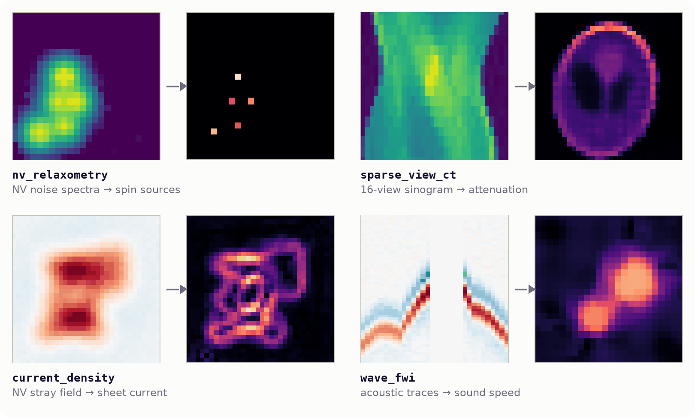
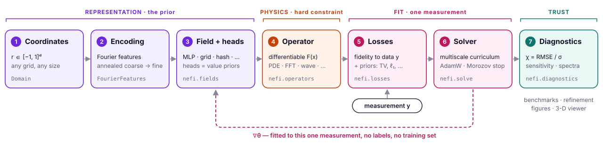
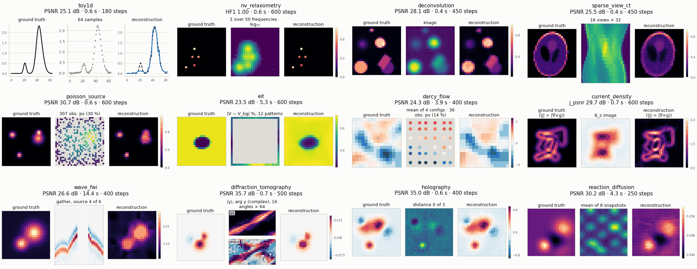
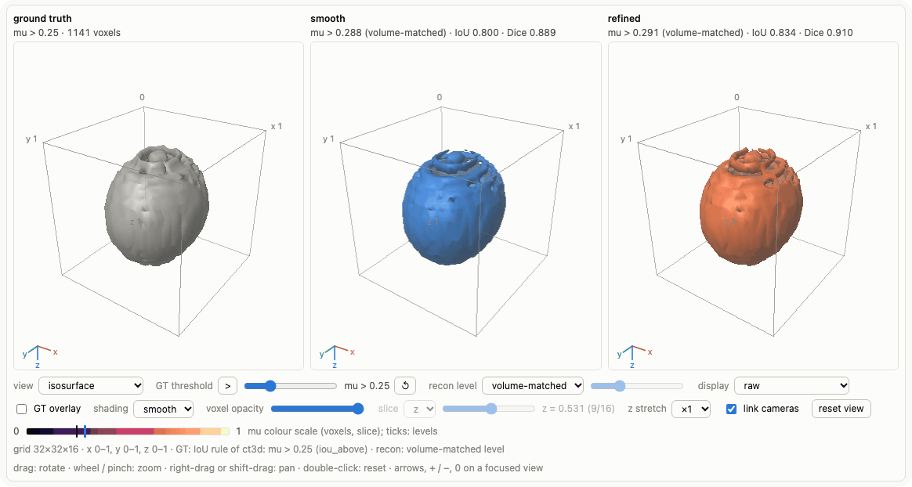

<p align="center">
  <picture>
    <source media="(prefers-color-scheme: dark)" srcset="docs/assets/brand/nefi-wordmark-dark.svg">
    
  </picture>
</p>

<p align="center">
  <b>Neural-Field Inversion</b> recovers hidden physical fields from a single measurement and a differentiable model of the instrument.<br>
  The physics is enforced exactly, a coordinate neural field represents the unknown, and no training data is needed.
</p>

<p align="center">
  <a href="https://github.com/ContinuumCoder/NEFI/actions/workflows/ci.yml"></a>
  <a href="https://github.com/ContinuumCoder/NEFI/actions/workflows/pages.yml"></a>
  <a href="https://continuumcoder.github.io/NEFI/"></a>
  <a href="LICENSE"></a>
  
  
  <a href="https://arxiv.org/abs/2605.13988"></a>
  <a href="https://arxiv.org/abs/2603.11045"></a>
</p>

<p align="center">
  <a href="https://continuumcoder.github.io/NEFI/"><b>Documentation</b></a> ·
  <a href="https://continuumcoder.github.io/NEFI/getting-started/">Get started</a> ·
  <a href="https://continuumcoder.github.io/NEFI/gallery/">Gallery</a> ·
  <a href="https://continuumcoder.github.io/NEFI/gallery/3d/">Interactive 3-D</a> ·
  <a href="https://continuumcoder.github.io/NEFI/research/papers/">Papers</a>
</p>

<p align="center">
  
</p>

## Why nefi

- **The physics stays exact.** Every candidate field passes through a differentiable model of
  your instrument, whether FFT optics, PDE solvers with exact adjoints, wave propagation or
  scattering, so the answer is always consistent with the physics rather than a soft penalty
  away from it.
- **No training data.** The unknown is optimized for the measurement at hand with a
  coarse-to-fine, frequency-annealed schedule. There is nothing to collect, nothing to amortize
  and nothing to go stale.
- **It adapts itself.** Noise level, budget, learning rate, regularization strength and even the
  representation can be chosen automatically, and gauge freedoms that the data cannot resolve
  are detected and fixed.
- **The representation is the prior.** Neural fields, grids, level sets, layered media and
  coordinate warps are interchangeable, and the library measures which one matches your
  operator.
- **It tells you how far to trust the result.** Noise-floor verdicts, ill-posedness
  diagnostics, a benchmark protocol with confidence intervals and an inverse-crime guard, and
  refinements that are refused when the data do not support them.

<picture>
  <source media="(prefers-color-scheme: dark)" srcset="docs/assets/recipe-dark.svg">
  
</picture>

## Quickstart

```bash
pip install nefi                             # torch, numpy, scipy, pyyaml, tqdm ("nefi[viz]": + matplotlib)
nefi run toy1d                               # generate → invert → evaluate → runs/toy1d-<hash>/
nefi bench toy1d --methods neural,grid --n 4 --seeds 0,1
nefi diagnose toy1d                          # sensitivity, iter-0 gradient, filter rows, spectrum
```

```python
import nefi
from nefi.instances.toy1d import make_problem

problem, gt, meas = make_problem(n=128, seed=0)      # 1-D deblurring, seconds on a CPU
result = nefi.invert(problem)                        # neural field + annealed two-stage curriculum
print(nefi.metrics.psnr(result.fields["x"], gt["x"]))
```

**Bring your own problem** — any measurement process you can write in PyTorch, no subclassing:

```python
import torch
import nefi

k = torch.tensor([1.0, 4.0, 6.0, 4.0, 1.0])
k = (k[:, None] * k[None]) / 256

def forward(x):                                   # your physics: a blurred, saturating camera
    blurred = torch.nn.functional.conv2d(x[None, None], k[None, None], padding=2)[0, 0]
    return torch.tanh(1.5 * blurred)

x_true = torch.zeros(64, 64); x_true[20:44, 16:40] = 1.0
y = forward(x_true) + 0.01 * torch.randn(64, 64)  # your data

problem = nefi.from_forward(forward, y, shape=(64, 64),
                            prior="nonnegative + piecewise_constant")   # what you know
result = nefi.invert(problem)
print(nefi.quick_report(result, problem, gt=x_true))   # did the fit reach the noise floor?
```

`from_forward` chooses the representation, initialization, noise level, loss weights, learning
rate and curriculum; every decision is logged and overridable
([guide](https://continuumcoder.github.io/NEFI/byop/)).

## Gallery

<p align="center">
  
</p>
<p align="center"><sub>Twelve of the 17 registered systems as ground truth · measurement · reconstruction — one gallery run on a CPU. <a href="https://continuumcoder.github.io/NEFI/gallery/">Browse the gallery →</a></sub></p>

## What's inside

| | |
|---|---|
| **Representations** | neural fields with annealed Fourier features, grids, hash grids, low-rank, level sets, Gaussian splats, Deep Decoder; geometric fields (layered media, anomalies, star shapes, warps) with adaptive annealing, capacity growth and held-out selection — [geometry](https://continuumcoder.github.io/NEFI/geometry/) |
| **Operators & physics** | FFT convolution, NV dipolar spectra, magnetostatics, Radon, Poisson, elliptic PDEs with implicit-function adjoints, implicit-Euler heat with a discrete adjoint, waves with PML and checkpointing, Born and Lippmann–Schwinger scattering, angular-spectrum optics, Gray–Scott — [physics](https://continuumcoder.github.io/NEFI/physics/) |
| **Losses & priors** | MSE, log-MSE, Poisson NLL, Huber, TV, ℓ1, Laplacian, physics penalties; value heads as hard priors; a prior DSL (`"nonnegative + sparse"`) — [zoo](https://continuumcoder.github.io/NEFI/zoo/) |
| **Curriculum & solver** | multiscale stages, annealing resets, LR schedules, discrepancy stopping, NaN guard with rollback, EMA, restarts, time budgets, checkpoints |
| **Diagnostics** | sensitivity maps, iter-0 gradient and center bias, filter-kernel rows G<sub>θ</sub>e<sub>i</sub>, singular values, energy barriers, the data-fit paradox — [diagnostics](https://continuumcoder.github.io/NEFI/tutorials/05_diagnostics/) |
| **Benchmarking** | paired samples × seeds, 95 % confidence intervals, runtime and memory, ablations, sweeps, inverse-crime guard, sharded cluster campaigns — [benchmarking](https://continuumcoder.github.io/NEFI/tutorials/06_benchmarking/) |
| **Auto-tuning** | gauges, budgets and learning rates against the noise floor, Morozov regularization, an acquisition report — [auto-tuning](https://continuumcoder.github.io/NEFI/autotune/) |
| **Edge refinement** | multi-phase level sets, phase fields, TV sharpening, with a data-fit acceptance test and a control run — [refinement](https://continuumcoder.github.io/NEFI/refinement/) |
| **Visualization** | comparison figures, measurement viewers, training dynamics, 3-D slices and isosurfaces, a dependency-free interactive 3-D viewer — [visualization](https://continuumcoder.github.io/NEFI/visualization/) |
| **Performance** | batched multi-measurement solving (`vmap`), whole-step `torch.compile`, CUDA graphs, mixed precision, a fast heat stencil — [performance](https://continuumcoder.github.io/NEFI/performance/) |
| **CLI** | `nefi list · run · bench · bench-merge · diagnose · autotune · ablate · sweep` — [reference](https://continuumcoder.github.io/NEFI/reference/cli/) |

## Instances

Seventeen registered problems, each runnable end to end with `nefi run <name> --smoke` and
documented on its own [page](https://continuumcoder.github.io/NEFI/instances/).

| group | instance | problem | physics |
|---|---|---|---|
| papers | `nv_relaxometry` | spin sources + Larmor field from NV noise spectra (**NeTMY**) | dipolar tensor kernel × Lorentzian |
| | `thermal_tomography` | 3-D diffusivity from pulsed-thermography frames (**NeFTY**) | implicit-Euler heat, discrete adjoint |
| classic imaging | `toy1d` | 1-D deblurring (tutorial, CI) | FFT blur |
| | `deconvolution` | image deblurring, Gaussian or Poisson noise | FFT convolution |
| | `sparse_view_ct` | sparse-view and limited-angle CT | differentiable Radon transform |
| elliptic | `poisson_source` | sources from sparse potentials | spectral Poisson solver |
| | `eit` | conductivity from boundary voltages | elliptic PDE, implicit-function adjoint |
| | `darcy_flow` | log-permeability from well pressures | elliptic PDE, implicit-function adjoint |
| | `current_density` | sheet current from its NV stray field | planar magnetostatics |
| wave · optics · reaction | `wave_fwi` | sound speed from acoustic traces | wave equation, leapfrog + PML |
| | `diffraction_tomography` | scattering contrast from scattered fields | Born / Rytov |
| | `holography` | phase from multi-distance intensities | angular-spectrum propagation |
| | `reaction_diffusion` | Gray–Scott feed rate from snapshots | reaction–diffusion time stepping |
| volumetric | `ct3d` | 3-D sparse-view CT | slice-stacked Radon transform |
| | `deconvolution3d` | fluorescence z-stack deconvolution | 3-D FFT convolution |
| | `dot3d` | diffuse optical tomography | diffusion equation, Robin boundaries |
| | `photoacoustic3d` | photoacoustic tomography, planar array | 3-D wave equation |

## Interactive 3-D

<p align="center">
  <a href="https://continuumcoder.github.io/NEFI/gallery/3d/"></a>
</p>
<p align="center"><sub>Ground truth · smooth · edge-refined, one camera, IoU and Dice computed in the browser — a self-contained HTML file written by <code>nefi.viz.save_volume_viewer</code>. <a href="https://continuumcoder.github.io/NEFI/gallery/3d/">Rotate it live →</a></sub></p>

## Reproducing the papers

`configs/nv_relaxometry_paper.yaml` and `configs/thermal_tomography_paper.yaml` hold the papers'
settings table by table. The [server runbook](https://continuumcoder.github.io/NEFI/reproduce_papers/)
lists the exact commands for the headline tables, their GPU cost and the caveats to check
first, and the [paper → code map](https://continuumcoder.github.io/NEFI/paper_mapping/) traces
every equation to the code.

```bash
nefi bench configs/nv_relaxometry_paper.yaml --methods netmy,f1,grid,grid_f1 \
     --classes all --by-class --n 64 --seeds 0,1,2 --device cuda        # NeTMY Tab. 1
nefi run configs/thermal_tomography_paper.yaml --device cuda             # one NeFTY specimen
```

## Development

```bash
git clone https://github.com/ContinuumCoder/NEFI.git && cd NEFI
pip install -e ".[dev]"      # + pytest, ruff, mypy, scikit-image, matplotlib, typer, rich
make test                    # fast CPU suite; make lint, make smoke
```

The latest development version installs with
`pip install git+https://github.com/ContinuumCoder/NEFI.git`; see [CONTRIBUTING.md](CONTRIBUTING.md).

## Documentation

[Get started](https://continuumcoder.github.io/NEFI/getting-started/) ·
[Tutorials](https://continuumcoder.github.io/NEFI/getting-started/#the-tutorials) ·
[Guides](https://continuumcoder.github.io/NEFI/guides/) ·
[Gallery](https://continuumcoder.github.io/NEFI/gallery/) ·
[Physics](https://continuumcoder.github.io/NEFI/physics/) ·
[Instances](https://continuumcoder.github.io/NEFI/instances/) ·
[Research](https://continuumcoder.github.io/NEFI/research/) ·
[API](https://continuumcoder.github.io/NEFI/api/) ·
[CLI](https://continuumcoder.github.io/NEFI/reference/cli/) ·
[Contributing](CONTRIBUTING.md) · [Changelog](CHANGELOG.md)

Every page is also readable as markdown under [`docs/`](docs/).

## Citation

If you use nefi, please cite the papers it implements:

```bibtex
@article{zhao2026netmy,
  title   = {Neural Fields for {NV}-Center Inverse Sensing},
  author  = {Zhao, Zhixuan and Zhong, Tao and Hu, Yixun and de Leon, Nathalie P. and
             Allen-Blanchette, Christine},
  journal = {arXiv preprint arXiv:2605.13988},
  year    = {2026}
}

@article{zhong2026nefty,
  title   = {Neural Field Thermal Tomography: A Differentiable Physics Framework for
             Non-Destructive Evaluation},
  author  = {Zhong, Tao and Hu, Yixun and Zheng, Dongzhe and Sood, Aditya and
             Allen-Blanchette, Christine},
  journal = {arXiv preprint arXiv:2603.11045},
  year    = {2026}
}
```

## License

MIT © 2026 [CAB Lab, Princeton University](https://cablab.scholar.princeton.edu). See [LICENSE](LICENSE).

## Acknowledgements

nefi is developed and maintained by the [CAB Lab at Princeton University](https://cablab.scholar.princeton.edu). It generalizes the
lab's NeTMY and NeFTY papers into one library, and we thank the authors of both papers.
