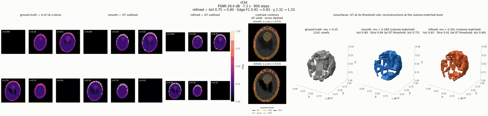
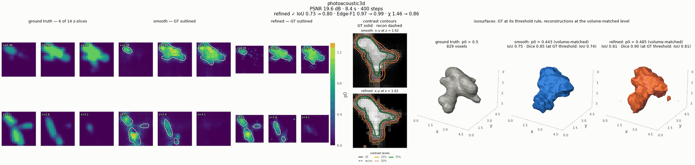
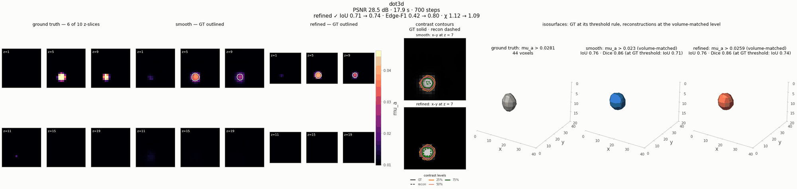
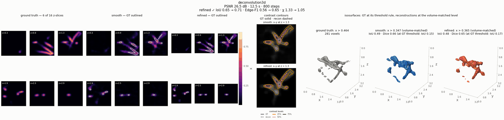
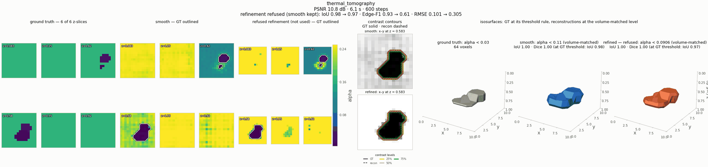

---
hide:
  - toc
description: Volumetric reconstructions — isosurfaces of ground truth, smooth and edge-refined fields, and interactive drag-to-rotate viewers that run in the browser.
---

# 3-D showcase

Five of the registered problems are volumetric: pulsed thermography (NeFTY), sparse-view CT,
fluorescence z-stack deconvolution, diffuse optical tomography and photoacoustic tomography. For
each, the gallery shows the smooth neural-field reconstruction next to its
[edge-refined](refinement.md) version, and the viewers below let you rotate them against the
ground truth.

## Interactive viewers

Each viewer is one self-contained HTML file written by
[`nefi.viz.save_volume_viewer`](../visualization.md#23-interactive-3-d-viewer-nefivizinteractive):
plain JavaScript on a canvas, no libraries, no network. Drag to rotate, scroll or pinch to zoom,
right-drag or shift-drag to pan, double-click to reset; the cameras of the three panels are
linked.

=== "3-D sparse-view CT"

    <div class="nf-viewer">
      <iframe src="../../assets/viewers/ct3d.html" loading="lazy" title="Interactive 3-D viewer: sparse-view CT, ground truth vs smooth vs refined"></iframe>
      <div class="nf-viewer__bar">
        <span><code>ct3d</code> · 32×32×16 voxels, 12 views · GT: μ > 0.25 · smooth IoU 0.80, refined IoU 0.83 (volume-matched)</span>
        <a href="../../assets/viewers/ct3d.html" target="_blank" rel="noopener">Open full page ↗</a>
      </div>
    </div>

    A 3-D Shepp–Logan-like head from 12 parallel-beam projections of every slice. The
    refinement keeps a crisp air/object boundary around a free multi-tissue interior
    ([instance page](../instances/ct3d.md)).

=== "Photoacoustic tomography"

    <div class="nf-viewer">
      <iframe src="../../assets/viewers/photoacoustic3d.html" loading="lazy" title="Interactive 3-D viewer: photoacoustic tomography, ground truth vs smooth vs refined"></iframe>
      <div class="nf-viewer__bar">
        <span><code>photoacoustic3d</code> · 20×20×14 voxels, 8×8 sensors on the top face · GT: p₀ > 0.5 · smooth IoU 0.75, refined IoU 0.81</span>
        <a href="../../assets/viewers/photoacoustic3d.html" target="_blank" rel="noopener">Open full page ↗</a>
      </div>
    </div>

    A vessel network seen from one side by a planar sensor array (limited view), through a
    3-D wave solver ([instance page](../instances/photoacoustic3d.md)).

=== "Diffuse optical tomography"

    <div class="nf-viewer">
      <iframe src="../../assets/viewers/dot3d.html" loading="lazy" title="Interactive 3-D viewer: diffuse optical tomography, ground truth vs smooth vs refined"></iframe>
      <div class="nf-viewer__bar">
        <span><code>dot3d</code> · 20×20×10 voxels, 3×3 sources · GT: excess μₐ beyond half its peak · smooth and refined IoU 0.76</span>
        <a href="../../assets/viewers/dot3d.html" target="_blank" rel="noopener">Open full page ↗</a>
      </div>
    </div>

    An absorbing inclusion in a scattering slab, recovered from surface reflectance through an
    elliptic diffusion solver with an implicit-function adjoint
    ([instance page](../instances/dot3d.md)).

### How to read a viewer

* **Panels.** Ground truth (grey), the smooth reconstruction (blue) and the edge-refined one
  (orange), always on the ground truth's grid.
* **Levels.** The ground truth is thresholded with the instance's own IoU rule (the same rule as
  the benchmark metric). Each reconstruction is drawn at the **volume-matched** level by default —
  the level whose isosurface encloses as many voxels as the ground truth's — so shapes are
  compared independently of contrast calibration. The *recon level* menu switches to the ground
  truth's threshold, Otsu or a manual level; IoU and Dice update in the browser.
* **Views.** Isosurface, thresholded voxels, a movable slice, or isosurface + slice; *GT overlay*
  draws the ground-truth surface over each reconstruction; *display* applies a smoothing or
  sharpening transform to the reconstructions only, and says so.
* **Numbers.** At the ground truth's threshold the in-browser IoU equals the instance's IoU
  metric: the quantized volumes are nudged so that the rule selects exactly the voxels it selects
  in full precision (these grids are small enough to need no downsampling).

## Isosurfaces of all five systems

<figure markdown>

<figcaption>Depth slices, contrast contours and isosurfaces of the five volumetric systems (gallery
run, smoke presets, CPU). Ground truth at its threshold rule; reconstructions at the
volume-matched level, with the IoU at the ground truth's own threshold in brackets. The thermal
refinement is refused — the data do not support a crisper field — and shown only for
inspection.</figcaption>
</figure>

| system | refinement | IoU (smooth → refined) | Edge-F1 | data fit χ |
|---|---|---|---|---|
| `thermal_tomography` | refused (smooth kept) | 0.98 → 0.97 | 0.93 → 0.61 | RMSE 0.101 → 0.305 |
| `ct3d` | accepted | 0.75 → 0.80 | 0.91 → 0.93 | 2.32 → 1.33 |
| `deconvolution3d` | accepted | 0.65 → 0.71 | 0.56 → 0.65 | 1.33 → 1.05 |
| `dot3d` | accepted | 0.71 → 0.74 | 0.42 → 0.80 | 1.12 → 1.09 |
| `photoacoustic3d` | accepted | 0.73 → 0.80 | 0.97 → 0.99 | 1.46 → 0.86 |

A refinement is accepted only when the refined field explains the data within tolerance and
its interfaces stay inside the smooth solution's transition band; the thermal case shows the
refusal at work. See [Edge refinement](refinement.md) for the controls and the full benchmark.

## One system at a time

=== "ct3d"

    

=== "photoacoustic3d"

    

=== "dot3d"

    

=== "deconvolution3d"

    

=== "thermal_tomography"

    

## Make your own viewer

```python
from nefi import viz

viz.save_volume_viewer(
    "runs/my_run/viewer.html",
    {"ground truth": gt, "reconstruction": rec},     # tensors or arrays, first = reference
    extent=inst.domain(),                            # physical axes and aspect ratio
    threshold=viz.voxel_rule(inst, gt),              # the instance's IoU rule
    mode="iso",                                      # "iso" | "voxels" | "slice" | "iso+slice"
)
```

Volumes are area-averaged to at most 64 voxels per axis and quantized (16-bit up to 48³
voxels); the viewers on this page weigh 108 kB (`dot3d`), 184 kB (`photoacoustic3d`) and
448 kB (`ct3d`). `examples/gallery.py --html` embeds one viewer per volumetric system in its
report. Details: [Visualization § 2.3](../visualization.md#23-interactive-3-d-viewer-nefivizinteractive).
