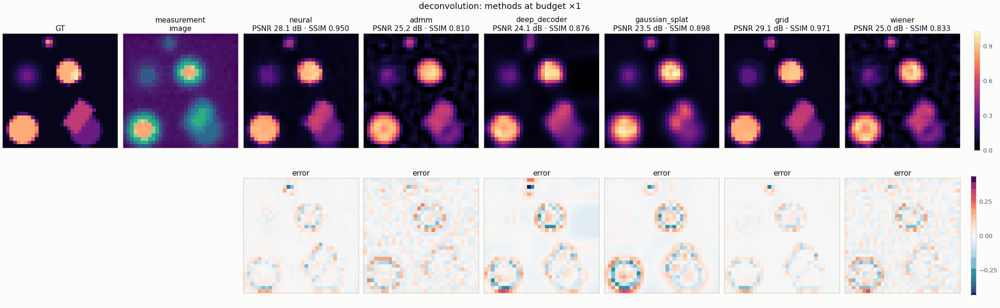
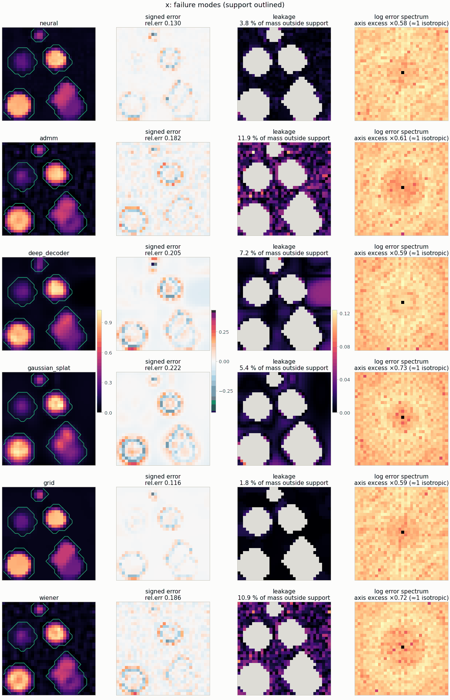

---
hide:
  - toc
description: The neural field against grid (Tikhonov / TV), ADMM, Deep Decoder, Gaussian splats and closed-form references, on the same objective and data.
---

# Baselines

A baseline in nefi changes **only** the parameterization or the optimizer: the domain, the
forward operator, the losses, the measurement and the post-processing stay identical, so a
comparison isolates the prior. Every instance can run every baseline through
`nefi.baselines.baseline_problem`; see [Baselines](../baselines.md) for what each one means and
when a comparison is fair.

## Same data, six methods

<figure markdown>

<figcaption><code>deconvolution</code>, phantom scene, 32², Gaussian PSF, 1 % noise, the same
objective and budget for every iterative method (gallery run, CPU). The TV-regularized
grid — the MAP estimate of this objective — is the strongest method on this well-conditioned
linear problem; the neural field is close behind and well ahead of Wiener, the Deep Decoder, the
Gaussian splats and ADMM.</figcaption>
</figure>

| method | PSNR [dB] | SSIM | parameterization |
|---|---:|---:|---|
| neural field | 28.1 | 0.950 | coordinate MLP + annealed Fourier features |
| grid + TV | **29.1** | **0.971** | free pixels (NeTMY "Tikhonov", NeFTY "Grid Opt.") |
| ADMM (ℓ1 + box) | 25.2 | 0.810 | splitting solver on pixels |
| Deep Decoder | 24.1 | 0.876 | untrained convolutional decoder |
| Gaussian splats | 23.5 | 0.898 | adaptive Gaussian primitives |
| Wiener | 25.0 | 0.833 | closed form |

## How each method fails

<figure markdown>
{ width="640" }
<figcaption>The same six reconstructions seen through their failure modes: signed error and
relative error, the fraction of mass that leaks outside the true support (3.8 % for the neural
field, 1.8 % for the grid, 7–12 % for ADMM, Wiener and the Deep Decoder), and the error spectrum
(a cross-shaped excess would flag anisotropic artifacts).</figcaption>
</figure>

## When does the representation matter?

The ranking depends on the regime, and the documentation reports it either way:

* **Well-conditioned linear problems with an explicit prior** (deconvolution, sparse-view CT
  with enough views, Poisson source): the TV grid is the MAP estimate of the objective and a
  very strong baseline; the neural field is competitive
  ([deconvolution](../instances/deconvolution.md#validation), [sparse-view CT](../instances/sparse_view_ct.md)).
* **No explicit prior**: the parameterization becomes the only regularizer. On deconvolution
  with 3 % noise and no TV, the neural field reaches 29.4 dB where the free grid fits the noise
  (23.0 dB) ([Baselines § 4](../baselines.md#4-when-is-a-comparison-fair)).
* **Missing data**: in limited-angle 3-D CT the neural field wins on PSNR and structure
  (90° wedge: 24.9 dB / SSIM 0.78 against 23.7 dB / 0.62 for the grid)
  ([ct3d](../instances/ct3d.md)).
* **Biased raw gradients**: under NeTMY's tensor operator a free density collapses toward the
  center; the filtering kernel of the neural field is decisive
  ([The representation is the prior](../research/thesis.md)).
* **Surface-only heat data**: the voxel grid finds no defect (IoU 0) where NeFTY's neural field
  reaches IoU 0.97 on the same measurement ([thermal tomography](../instances/thermal_tomography.md)).

```bash
nefi run deconvolution --smoke --baseline grid                       # any baseline, one run
nefi bench deconvolution --smoke --methods neural,grid,admm,deep_decoder,gaussian_splat,wiener
python examples/baselines_comparison.py                              # the table in docs/baselines.md
```
