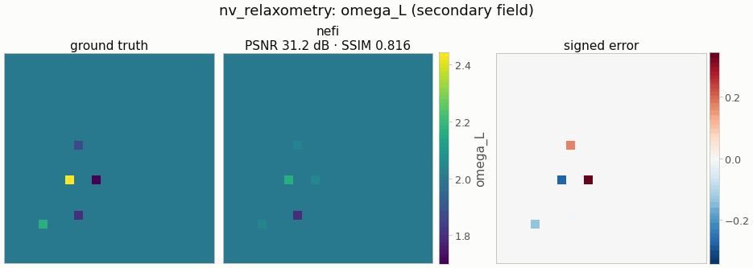
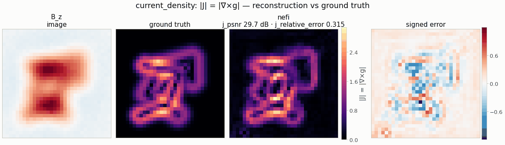
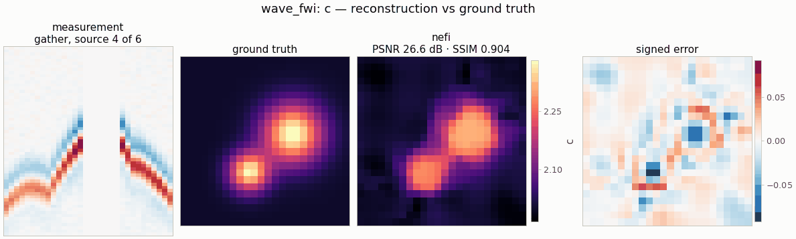
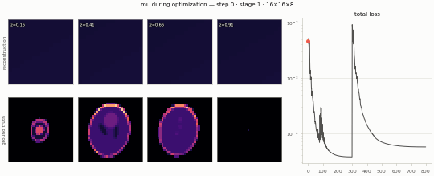
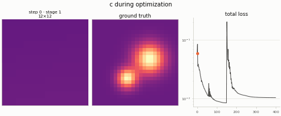
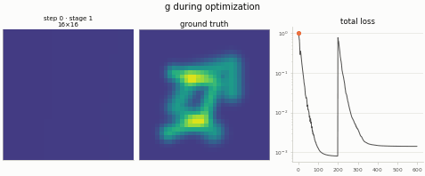
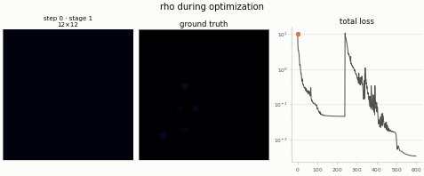

---
hide:
  - toc
description: Seventeen physical systems reconstructed by the same recipe — overview figure, per-system comparisons and optimization animations from one gallery run on a CPU.
---

# Gallery

Seventeen inverse problems — 1-D, 2-D and volumetric, linear and nonlinear, elliptic,
hyperbolic, parabolic and spectral — solved by the same recipe: a coordinate neural field, the
instrument's physics as a hard constraint, a coarse-to-fine curriculum. Every measurement is
simulated with an **independent, finer model** than the one being inverted (no inverse crime),
so each reconstruction has to cope with model error as well as noise.

<figure markdown>

<figcaption markdown="span">The twelve 1-D and 2-D systems as ground truth · measurement ·
reconstruction, from one run of `examples/gallery.py` (smoke presets at 0.2 × the default
budgets, CPU, 182 s for all 17 systems). The five volumetric systems are on the
[3-D showcase](3d.md); the [full overview of all 17](../assets/gallery/overview.png) opens at
full resolution. Click any figure to zoom.</figcaption>
</figure>

## Legend

Numbers from the run's manifest (`runs/gallery/physics/manifest.json`): smoke preset, one seed,
0.2 × the default step budget (× 2 for the volumetric systems), CPU with 4 threads, torch
2.11. They show what a few seconds of CPU buy; the instance pages report converged and
paper-scale numbers.

| system | recovered from | grid · steps · solve | result |
|---|---|---|---|
| [toy1d](../instances/toy1d.md) | a 1-D signal from 64 blurred samples | 64 · 180 · 0.6 s | PSNR 25.1 dB |
| [NV relaxometry](../instances/nv_relaxometry.md) · NeTMY | spin sources from noise spectra at 50 frequencies | 24² · 600 · 0.6 s | Hungarian F1 1.00 |
| [Thermal tomography](../instances/thermal_tomography.md) · NeFTY | 3-D diffusivity from 30 surface frames | 16²×6 · 600 · 6.1 s | IoU 0.98 · PSNR 10.8 dB |
| [Deconvolution](../instances/deconvolution.md) | an image from its blurred copy | 32² · 450 · 0.4 s | PSNR 28.1 dB |
| [Sparse-view CT](../instances/sparse_view_ct.md) | attenuation from 16 projections | 32² · 450 · 0.4 s | PSNR 25.5 dB |
| [Poisson source](../instances/poisson_source.md) | sources from 30 % of the potential | 32² · 600 · 0.6 s | PSNR 30.7 dB |
| [EIT](../instances/eit.md) | conductivity from boundary voltages, 12 patterns | 24² · 600 · 5.3 s | PSNR 23.5 dB · IoU 0.94 |
| [Darcy flow](../instances/darcy_flow.md) | log-permeability from well gauges, 4 configurations | 16² · 400 · 3.9 s | PSNR 24.3 dB |
| [Current density](../instances/current_density.md) | a sheet current from its stray field | 32² · 600 · 0.7 s | current PSNR 29.7 dB |
| [Full-waveform inversion](../instances/wave_fwi.md) | sound speed from 6 × 32 acoustic traces | 24² · 400 · 14.4 s | PSNR 26.6 dB |
| [Diffraction tomography](../instances/diffraction_tomography.md) | contrast from complex fields, 16 angles | 32² · 500 · 0.7 s | PSNR 35.7 dB |
| [Holography](../instances/holography.md) | phase from intensities at 3 distances | 32² · 400 · 0.6 s | PSNR 35.0 dB |
| [Reaction–diffusion](../instances/reaction_diffusion.md) | the feed rate from 4 snapshots of 2 species | 32² · 250 · 4.3 s | PSNR 30.2 dB |
| [3-D CT](../instances/ct3d.md) | attenuation from 12 views of every slice | 32²×16 · 800 · 7.3 s | PSNR 29.4 dB · refined IoU 0.75 → 0.80 |
| [3-D deconvolution](../instances/deconvolution3d.md) | fluorophores from a blurred z-stack | 32²×16 · 800 · 12.5 s | PSNR 26.5 dB · refined IoU 0.65 → 0.71 |
| [Diffuse optical tomography](../instances/dot3d.md) | absorption from surface reflectance, 9 sources | 20²×10 · 700 · 17.9 s | PSNR 28.5 dB · refined IoU 0.71 → 0.74 |
| [Photoacoustic tomography](../instances/photoacoustic3d.md) | initial pressure from 64 sensor traces | 20²×14 · 400 · 8.4 s | PSNR 19.6 dB · refined IoU 0.73 → 0.80 |

The PSNR of thermal tomography is low because the bulk diffusivity is biased: with the smoke
preset's coarse implicit time step the inversion compensates model error by raising α (the
model-error floor, see [Limitations and caveats](../guides/limitations.md#the-model-error-floor-thermal-tomography)). The
defect itself is recovered (IoU 0.98).

## System by system

Each figure shows the measurement, the ground truth, the reconstruction (with its metrics) and
the signed error; the volumetric systems show depth slices, cross-sections through the anomaly
and a projection. The same figures open every [instance page](../instances/index.md).

=== "The papers"

    

    

    

=== "Classic imaging"

    

    

    

=== "Elliptic"

    

    

    

    

=== "Wave & optics"

    

    

    

    

=== "Volumetric"

    

    

    

    

    The [3-D showcase](3d.md) adds isosurfaces and interactive viewers for these systems.

## Optimization in motion

The field during optimization — the coarse stage finds the structure, the fine stage adds detail
after the annealed frequency bands reopen (the red dot marks the step on the loss curve).

<div class="nf-gifs" markdown>

{ loading=lazy }
{ loading=lazy }
{ loading=lazy }
{ loading=lazy }

</div>

## Reproduce the gallery

```bash
python examples/gallery.py --budget 0.2 --out runs/gallery --html    # CPU, about 3 minutes
python examples/gallery.py --budget 1.0 --device cuda --out runs/gallery --html   # full budgets
```

`--html` writes a self-contained `index.html` report with every figure and the interactive
viewers. See [Visualization](../visualization.md) for the figure types and the options.
