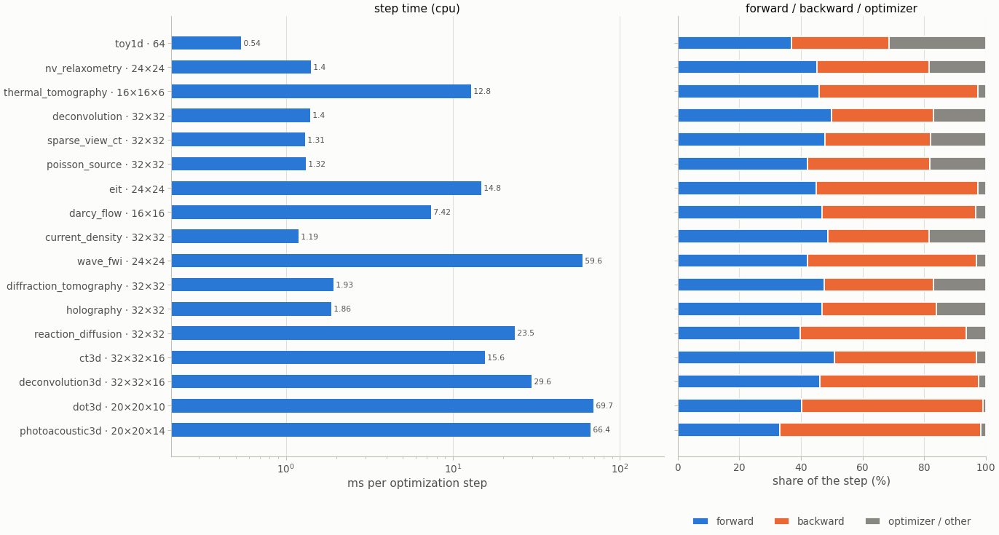
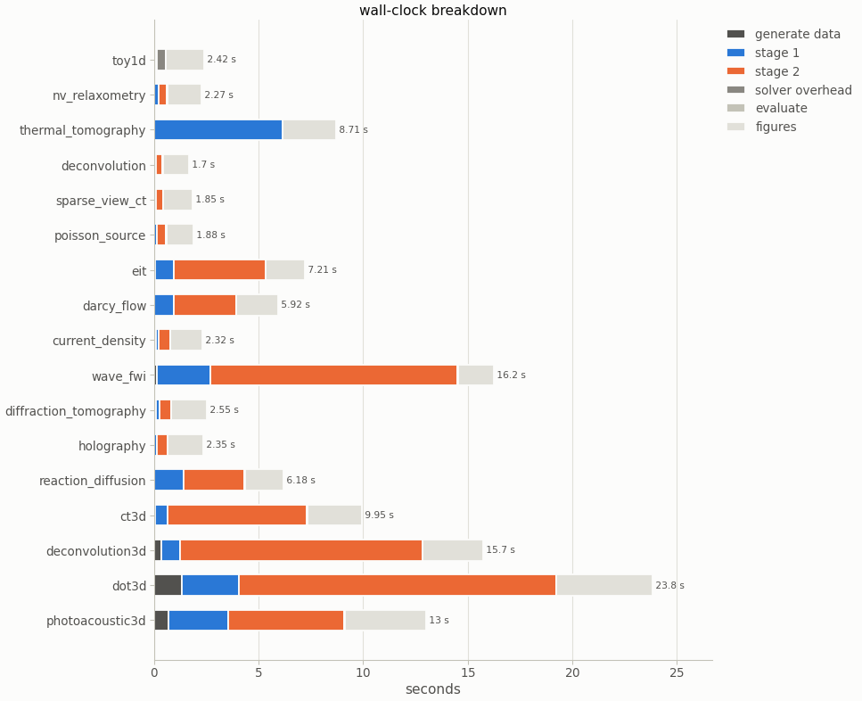
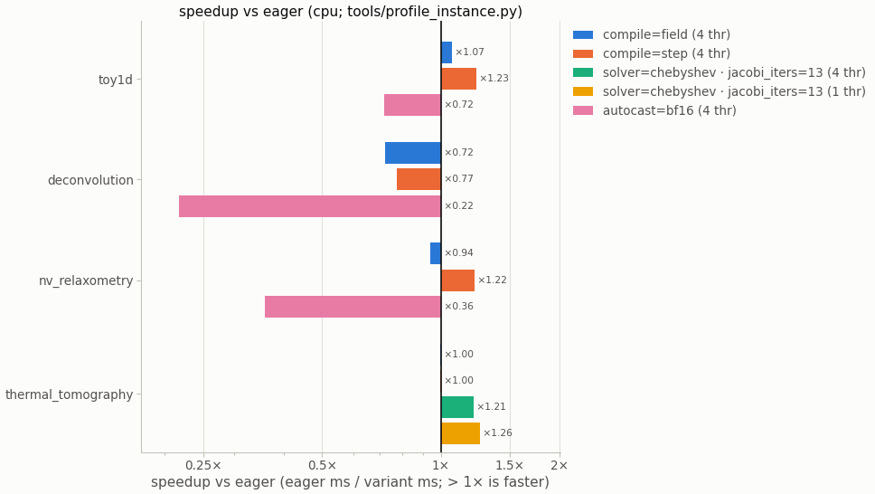
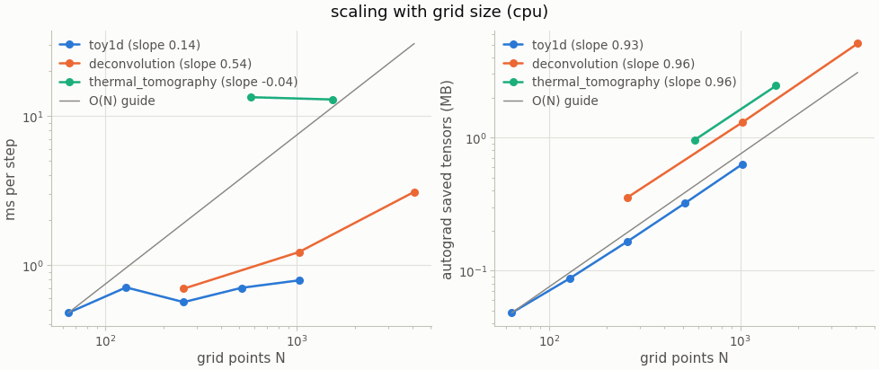
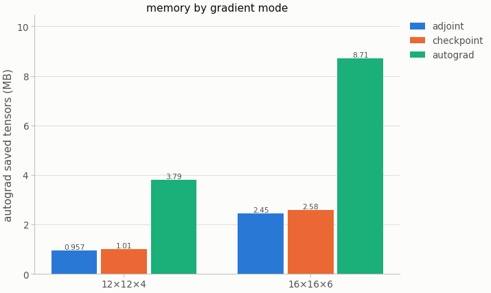
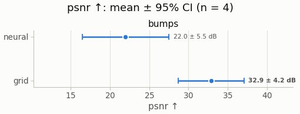

---
hide:
  - toc
description: Where the time goes — step times of all 17 systems, wall-clock breakdowns, compile and solver variants, scaling with the grid and memory by gradient mode.
---

# Performance

A nefi solve is a few thousand small optimization steps. On problems of 10³–10⁵ cells a step is
limited by per-operator overhead rather than arithmetic, so nefi optimizes ops per step, sweeps
per solve and problems per launch. The dashboards below come from the gallery run (CPU,
torch 2.11); the measurements, switches and CUDA estimates are in [Performance](../performance.md).

!!! note "What is measured and what is estimated"
    Every number on this page was measured on a CPU. Expected CUDA
    speed-ups in the performance guide are **estimates** from launch counts and still have to be
    validated on a GPU.

## Step time of every system

<figure markdown>

<figcaption>Milliseconds per optimization step at each system's smoke size, and the share of
forward, backward and optimizer. FFT-based problems take about a millisecond; PDE solves (heat,
elliptic, wave, reaction–diffusion) dominate their own steps.</figcaption>
</figure>

<figure markdown>
{ width="720" }
<figcaption>Where the seconds of each gallery entry go: generating the data with the
independent simulator, the two curriculum stages, evaluation and the figures.</figcaption>
</figure>

## Switches

<figure markdown>
{ width="720" }
<figcaption>Opt-in switches against eager execution on the CPU: whole-step compilation helps the
small MLP problems (×1.22–1.23), Chebyshev sweeps speed up the heat solver (×1.21–1.26), and
bf16 autocast is slower on a CPU (no fast bf16 GEMM) — it is meant for CUDA tensor cores.</figcaption>
</figure>

| heat solver (NeFTY), CPU | before | after |
|---|---|---|
| kernels per Jacobi sweep | 12 (`torch.roll`) | **7** (flat padded layout) |
| thermal smoke step | 21.2 ms | **9.4 ms** (7.7 ms with Chebyshev, same accuracy) |
| sweeps at the paper step for equal accuracy | 50 Jacobi | **20** Chebyshev |

| batched solving (`nefi.batch_invert`), per-problem step on CPU | sequential | batch 64 |
|---|---:|---:|
| toy1d | 0.41 ms | **0.048 ms (8.4×)** |
| nv_relaxometry | 0.90 ms | 0.37 ms (2.5×) |
| deconvolution | 1.31 ms | 0.66 ms (2.0×) |

## Scaling and memory

<figure markdown>
{ width="720" }
<figcaption>Step time grows far slower than the grid at these sizes (overhead-bound); saved
autograd memory grows linearly.</figcaption>
</figure>

<figure markdown>
{ width="560" }
<figcaption markdown="span">Memory of the heat solver by gradient mode (smoke grids): the
discrete adjoint stores only the trajectory — 2.45 MB against 8.71 MB for unrolled autograd at
16×16×6. At the paper grid (64×64×16, 100 frames) it is 26.5 MB against 15.7 GB
([thermal tomography](../instances/thermal_tomography.md#discrete-adjoint-nefty-43-app-d3--nefioperatorspdeadjointpy)).</figcaption>
</figure>

## Benchmark in one command

<figure markdown>
{ width="480" }
<figcaption markdown="span">`nefi bench toy1d --methods neural,grid` at the gallery budget (2
samples × 2 seeds): on this smooth 1-D linear problem the free grid wins (32.9 ± 4.2 dB against
22.0 ± 5.5 dB). Benchmarks report such results as they are — see
[Limitations and caveats](../guides/limitations.md).</figcaption>
</figure>

```bash
python tools/profile_instance.py thermal_tomography --config configs/thermal_tomography_smoke.yaml
nefi bench configs/deconvolution_full.yaml --n 32 --seeds 0,1,2 --batched --shard 0/8 --out runs/dc
nefi bench-merge runs/dc                      # identical to the unsharded table (tested)
```
