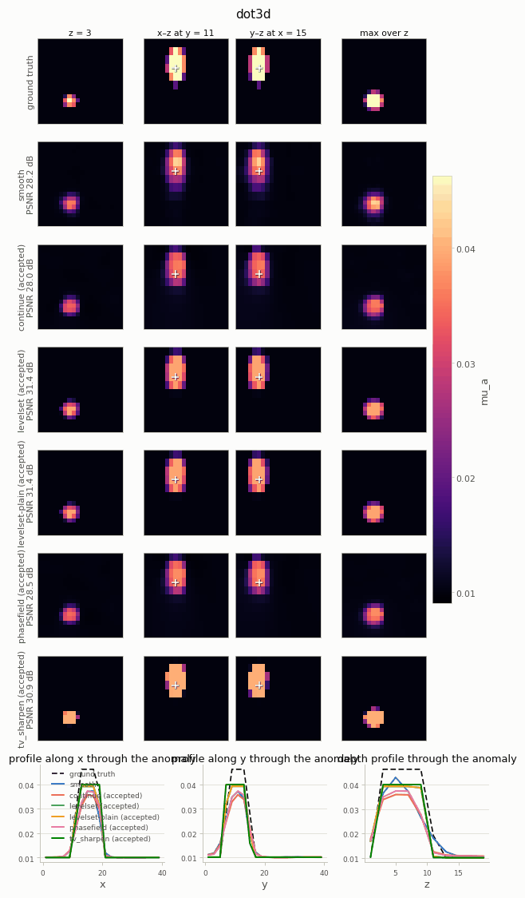
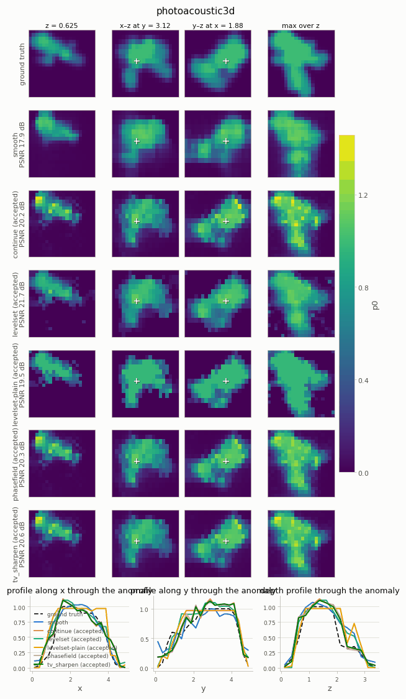
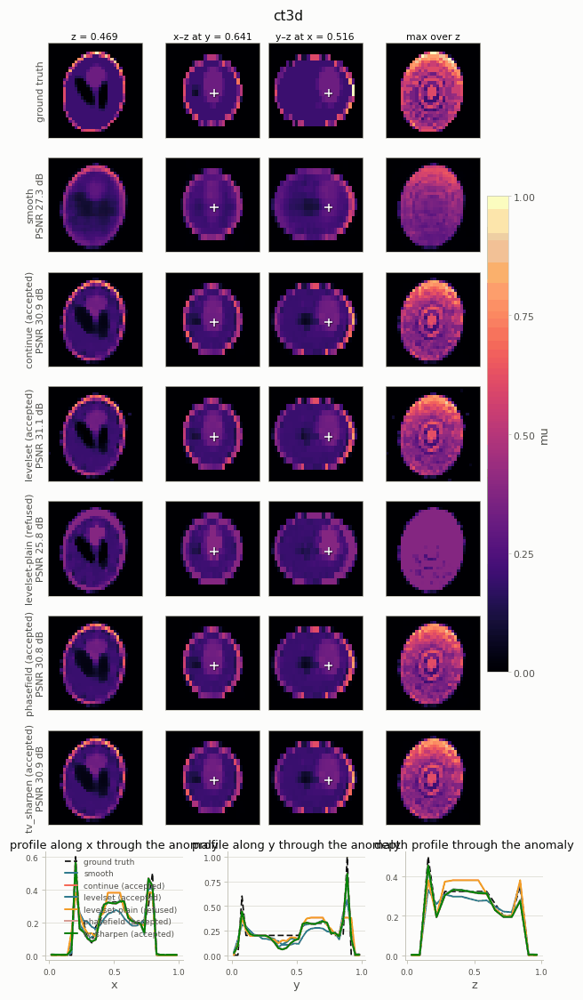
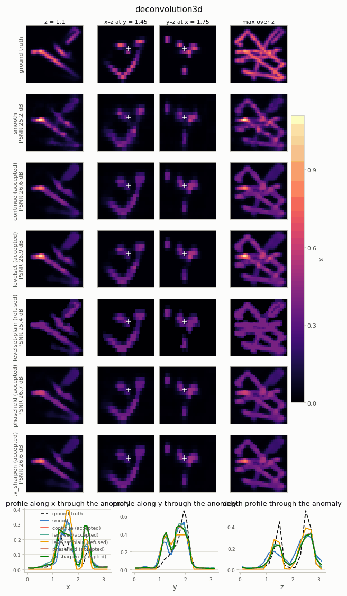
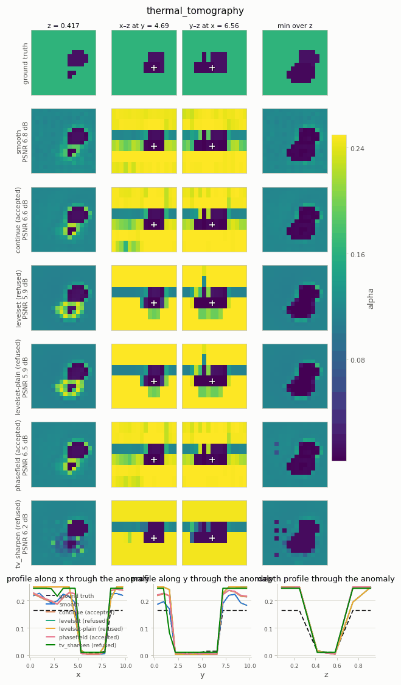
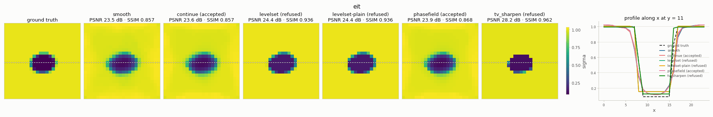
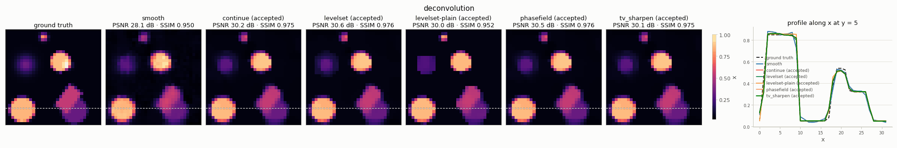

---
hide:
  - toc
description: Edge refinement in pictures — smooth reconstructions sharpened under the same physics and data, with the acceptance test deciding what the data support.
---

# Edge refinement

A neural-field reconstruction of a piecewise-constant unknown finds the structures but draws
them with soft edges. [`refine_edges`](../refinement.md) runs a short second stage that sharpens
the interfaces **under the same operator and the same data**, and accepts the result only if it
still explains the measurement. Every figure below shows the ground truth, the smooth result,
the `continue` control (the same extra budget without a sharpening prior) and each refinement
mode, with line profiles through the anomaly.

## What the numbers say

Smoke presets at the gallery budget, seeds 0 / 1, CPU (`python examples/refine_edges.py
--budget 0.1 --include-2d --seeds 0,1`); full tables in [Edge refinement § 6](../refinement.md#6-results-on-the-volumetric-instances).

| instance | verdict of the default mode | what changed |
|---|---|---|
| `dot3d` | accepted | **+3.2 / +2.8 dB**, Edge-F1 0.42 / 0 → **1.0** at an unchanged data fit (χ 1.15 → 1.10); the control gains nothing |
| `photoacoustic3d` | accepted | +1.5 / +2.1 dB and +0.03 / +0.06 IoU over the control |
| `deconvolution3d` | accepted | +0.3 dB and +0.1–0.2 Edge-F1 over the control; the constant-phase variant is refused |
| `ct3d` | accepted | +3.7 / +3.9 dB, almost all of it from continuation (the control alone: +3.6 / +3.8 dB) |
| `deconvolution` | accepted | ties the control (+0.4 / −0.1 dB) |
| `eit` | **refused** | the level set would add +0.9 / +3.5 dB, but χ rises 1.01 → 1.24 / 1.06 → 1.33 — the default rule is conservative here |
| `thermal_tomography` | **refused** | the ground truth itself misfits the smoke data 14× / 5× worse than the smooth field: the data cannot certify a crisper answer |

Accepted is not the same as better, and refused is not the same as worse: the test certifies
consistency with the data, not accuracy. That is why every figure carries the `continue`
control, and why the refusals are shown. [Limitations and caveats](../guides/limitations.md#refused-and-accepted-refinements)
discusses both cases.

## Volumetric systems

=== "dot3d"

    { width="560" }

    The textbook case: a homogeneous inclusion in a known background behind a strongly
    smoothing forward map. The level set recovers a crisp sphere at the same data fit.

=== "photoacoustic3d"

    { width="560" }

    Absorbers of different amplitudes on a zero background: the default keeps phase 1 free, so
    each vessel keeps its own brightness inside a sharp outline.

=== "ct3d"

    { width="560" }

    Most of the gain is continuation — compare the `continue` row. A two-phase level set cannot
    hold the multi-tissue phantom and is refused.

=== "deconvolution3d"

    { width="560" }

    Filaments are not piecewise constant; with a free foreground the level set still sharpens
    them, while the constant-phase variant is refused.

=== "thermal_tomography"

    { width="560" }

    Refused on both scenes: the smooth field absorbs the model error of the coarse implicit
    time step, and any two-phase field fits the data 2–3× worse.

## 2-D systems





## Try it

```python
from nefi.solve.refine import refine_edges

result = nefi.invert(problem)                               # the smooth reconstruction
refined, report = refine_edges(problem, result, gt=gt)      # mode="levelset" by default
print(report.to_markdown())                                 # fit before → after, verdict, metrics

refined, report = inst.refine(result, measurement, gt=gt)   # instances pick the phase values
```
