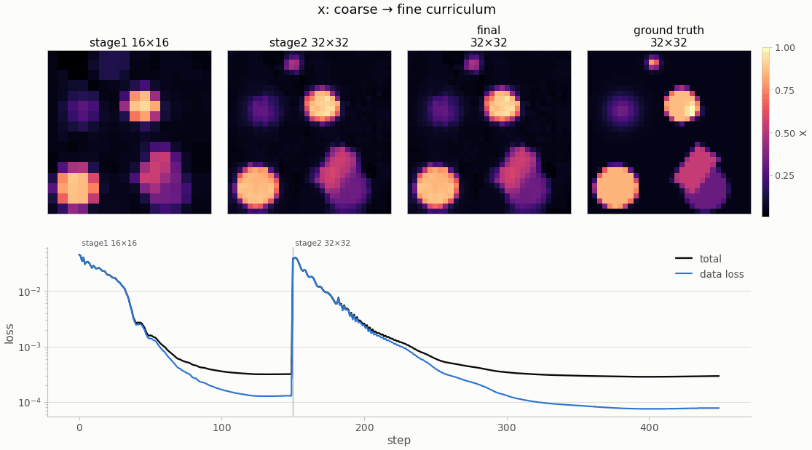
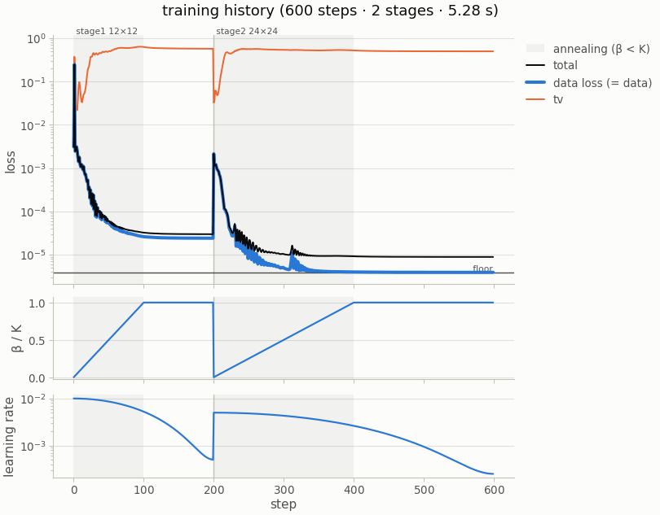

# Core concepts

nefi solves one kind of problem: an instrument produced a measurement `y` of a hidden field `x`
through a known physical process `F`, and there is **no paired training data** — only this
measurement and the physics.

$$
y \;=\; F(x^\star) + \varepsilon, \qquad
\hat x \;=\; f_{\hat\theta}, \quad
\hat\theta \;=\; \arg\min_\theta \; \mathcal L_{\text{data}}\big(F(f_\theta),\, y\big) + \textstyle\sum_j \lambda_j \mathcal R_j(f_\theta)
$$

The unknown is represented by a parameterized field $f_\theta$ (usually a coordinate neural
network), pushed through the differentiable forward model $F$ at every step, and optimized for
this one measurement. Nothing is learned across measurements: every solve starts fresh, which is
what makes the method label-free and amortization-free.

## The seven pieces

| piece | what it is | where it lives | the key idea |
|---|---|---|---|
| **Domain** | a physical box on a cell-centered grid; coordinates normalized to $[-1, 1]^d$ | `nefi.Domain` | the same field can be evaluated at any resolution |
| **Field** | the representation $x = f_\theta(r)$: MLP, grid, hash grid, level set, layered medium, … | `nefi.fields` | the representation *is* the prior |
| **Heads** | value constraints on the raw outputs: softplus, bounded sigmoid, gated, masked | `nefi.fields.heads` | hard knowledge (non-negativity, bounds, support) never needs a penalty |
| **Operator** | the physics $F$: a differentiable map from fields to a prediction of the measurement | `nefi.operators`, `nefi.physics` | a *hard* constraint, rebuilt at every curriculum resolution |
| **Losses** | data fidelity against `y` plus regularizers on the fields | `nefi.losses` | means, not sums: weights do not depend on the grid |
| **Curriculum** | stages of resolution, steps, learning rate and frequency annealing | `nefi.solve.Curriculum` | coarse → fine, low → high frequencies |
| **Solver** | the optimization loop with its safety features | `nefi.Solver`, `nefi.invert` | per measurement, deterministic, observable |

[Anatomy of a problem](../tutorials/02_anatomy_of_a_problem.md) builds each piece by hand;
[Bring your own problem](../byop.md) builds all of them automatically from a forward function.

## How a solve proceeds

At the start of every curriculum **stage** the solver rebuilds the coordinates for the stage's
grid, asks the operator for its version at that resolution (`operator.at_resolution`), resamples
the measurement consistently, lets the field adapt (a grid resamples itself) and resets the
annealing progress $\beta$. Every **step** then evaluates *field → heads → operator → losses*,
back-propagates to the field parameters, clips the gradient and takes an optimizer step.

<figure markdown>

<figcaption>A two-stage curriculum on <code>deconvolution</code> (gallery run, CPU): the coarse
stage finds the objects, the fine stage adds the edges; the loss jumps when the resolution and
the annealed frequency bands are reset at the stage boundary.</figcaption>
</figure>

**Annealed Fourier features.** The encoding multiplies frequency band $k$ by a weight that
rises from 0 to 1 as $\beta = \text{progress}\cdot K$ passes $k$ (NeTMY Eq. 27, NeFTY Eq. 21).
Early in a stage only low frequencies can change, so the field is smooth; detail is unlocked
gradually. The same idea — let the data *earn* the frequencies — drives the residual- and
operator-aware annealing of the [geometric representations](../geometry.md).

**Stopping at the noise floor.** When the noise level $\sigma$ is known or estimated, the
Morozov discrepancy principle ends a stage once the data misfit reaches it, instead of fitting
noise. The single most useful number of a run is

$$
\chi \;=\; \frac{\mathrm{RMSE}\big(F(\hat x),\, y\big)}{\sigma}:
\qquad \chi \approx 1 \text{ — explained to the noise}, \quad
\chi \gg 1 \text{ — not converged or mis-modelled}, \quad \chi < 1 \text{ — fitting noise}.
$$

<figure markdown>
{ width="620" }
<figcaption>Training dynamics of <code>eit</code> (gallery run): the data loss descends to the
noise floor in the second stage; shaded bands mark annealing, the lower panels the annealing
progress and the cosine learning-rate schedule.</figcaption>
</figure>

## Instances: complete, reproducible problems

An **instance** packages a full problem behind one protocol: a config dataclass (every paper
number is a field), a domain, a scene generator with difficulty classes, an *independent* data
generator, the problem builder, a default curriculum, metrics and baselines. The command line,
the benchmark harness, the auto-tuner, the diagnostics and the gallery all drive instances
through that protocol, so a new instance gets all of them for free.
There are [17 registered instances](../instances/index.md); [tutorial 4](../tutorials/04_new_instance.md)
writes a new one.

## Vocabulary

Inverse crime
:   Simulating the benchmark data with the very operator used for the inversion. Errors of the
    discretization cancel, and results look better than they will on real data. Every nefi
    instance generates data with an independent model — a finer grid, float64, a different
    scheme (for example an explicit substepped heat simulator against the implicit inversion
    solver).

Fidelity tag
:   A string on every operator and data generator (`"blur-2x-float64"` vs `"blur-1x-float32"`).
    The benchmark refuses to run when the two are equal, unless the *matched-operator* regime is
    requested explicitly — and then every report labels it.

Cross-fidelity
:   The default benchmark regime: data from the high-fidelity generator, inversion with the
    working operator. It exposes the **model-error floor**: even the ground truth does not fit
    the data exactly.

Filtering view
:   A gradient step on the parameters realizes the image-space update
    $\Delta x \approx -\eta\, G_\theta \nabla_x \mathcal L$ with
    $G_\theta = J_\theta J_\theta^\top$ (NeTMY Lemma 2). The representation filters every update;
    a free grid ($G_\theta = I$) executes the raw gradient, center bias and all.
    See [The representation is the prior](../research/thesis.md).

Gauge
:   A direction of the unknown that the data cannot see — an additive constant under a
    mean-free fidelity, a global scale under a normalized one, a global phase in holography.
    The [auto-tuner](../autotune.md) detects gauges and fixes them in the model.

Data-fit paradox
:   A reconstruction can fit the data *better* than the ground truth by absorbing model error
    into spurious structure (NeFTY App. G.2). A good data fit certifies consistency with the
    measurement, not accuracy; the [diagnostics](../tutorials/05_diagnostics.md) report it.

Homogeneity
:   An operator is homogeneous of degree $p$ if $F(c\,x) = c^p F(x)$. It enables the
    energy-anchored scale correction of normalized fidelities (NeTMY Eq. 30) and the automatic
    data-matched initialization of `from_forward`.

Smoke preset
:   The small configuration of an instance (`nefi run <name> --smoke`,
    `configs/<name>_smoke.yaml`) that finishes in seconds on a CPU. Numbers in the gallery come
    from smoke presets at reduced budgets; the `*_full.yaml` / `*_paper.yaml` configs are sized
    for a GPU.
