<p class="nf-kicker">The recipe</p>

## One workflow for many instruments

<p class="nf-intro">Every problem in nefi is built from the same seven pieces. Change any one of
them, such as the representation, the physics, a loss or the schedule, and the rest keeps
working: the command line, the benchmark protocol, the diagnostics and the figures.</p>

<div class="nf-recipe" markdown>

{ .off-glb }
{ .off-glb }

</div>

=== "Python"

    ```python
    import nefi
    from nefi.instances.toy1d import make_problem

    problem, gt, meas = make_problem(n=128, seed=0)   # 1-D deblurring: runs in seconds on a CPU
    result = nefi.invert(problem)                     # neural field + two-stage annealed curriculum
    print(nefi.metrics.psnr(result.fields["x"], gt["x"]))
    ```

=== "Command line"

    ```bash
    nefi run toy1d --plot                   # generate → invert → evaluate → runs/toy1d-<hash>/
    nefi bench toy1d --methods neural,grid --n 4 --seeds 0,1
    nefi diagnose toy1d                     # sensitivity, iter-0 gradient, filter rows, spectrum
    ```

=== "Your own physics"

    ```python
    import nefi

    def forward(x):                         # any differentiable PyTorch function of the unknown
        return my_instrument(x)

    problem = nefi.from_forward(forward, y, shape=(128, 128),
                                prior="nonnegative + piecewise_constant")
    result = nefi.invert(problem)
    print(nefi.quick_report(result, problem))   # did the fit reach the noise floor?
    ```

<p class="nf-kicker">What's inside</p>

## Everything a per-measurement inversion needs

<div class="grid cards nf-features" markdown>

-   :material-lock-check-outline:{ .lg } __Physics as a hard constraint__

    ---

    Every candidate field passes through a differentiable forward operator: FFT convolutions,
    PDE solvers with exact adjoints, wave propagation, scattering, optics. The physics is never
    a soft residual — except in the PINN baseline, on purpose.

    [:octicons-arrow-right-24: Anatomy of a problem](tutorials/02_anatomy_of_a_problem.md){ .nf-more }

-   :material-shape-outline:{ .lg } __Representations as geometric priors__

    ---

    Neural fields, grids, hash grids, level sets, layered media, star shapes, warps. A
    parameterized update is the raw gradient filtered by $G_\theta = J_\theta J_\theta^\top$,
    so choosing the representation *is* choosing the prior — and the measurement can choose.

    [:octicons-arrow-right-24: Geometric representations](geometry.md){ .nf-more }

-   :material-puzzle-outline:{ .lg } __Bring your own problem in 20 lines__

    ---

    `nefi.from_forward` wraps any differentiable PyTorch function. Representation,
    initialization, noise level, loss weights, learning rate and curriculum are chosen
    automatically, logged, and overridable by a keyword.

    [:octicons-arrow-right-24: Bring your own problem](byop.md){ .nf-more }

-   :material-atom-variant:{ .lg } __A physics zoo, 1-D to 3-D__

    ---

    17 registered problems: NV magnetometry, thermography, CT, microscopy, EIT, Darcy flow,
    full-waveform inversion, diffraction tomography, holography, reaction–diffusion, diffuse
    optics and photoacoustics — each runnable with `nefi run <name> --smoke`.

    [:octicons-arrow-right-24: Instance catalogue](instances/index.md){ .nf-more }

-   :material-stethoscope:{ .lg } __Diagnostics that explain__

    ---

    Sensitivity maps, iter-0 gradients and center bias, filter-kernel rows $G_\theta e_i$,
    singular-value spectra, energy barriers and the data-fit paradox: the papers' explanations,
    as functions that work on any problem.

    [:octicons-arrow-right-24: Diagnostics](tutorials/05_diagnostics.md){ .nf-more }

-   :material-scale-balance:{ .lg } __Benchmarks with an inverse-crime guard__

    ---

    Paired samples × seeds, Student-t 95 % confidence intervals, runtime and memory columns,
    cumulative ablations and sweeps. Data come from an independent, finer simulator unless you
    explicitly — and visibly — opt out.

    [:octicons-arrow-right-24: Benchmarking](tutorials/06_benchmarking.md){ .nf-more }

-   :material-tune-variant:{ .lg } __Auto-tuning__

    ---

    Detects gauges the data cannot see, budgets that stop short of the noise floor and
    mis-weighted priors; fixes what the data can fix, and reports what only a better
    acquisition could.

    [:octicons-arrow-right-24: Auto-tuning](autotune.md){ .nf-more }

-   :material-vector-difference:{ .lg } __Edge refinement__

    ---

    A short second stage turns soft reconstructions into crisp interfaces under the same
    physics and data — and refuses, with the reason, when the data fit would degrade.

    [:octicons-arrow-right-24: Edge refinement](refinement.md){ .nf-more }

-   :material-rotate-3d-variant:{ .lg } __Interactive 3-D__

    ---

    Drag-to-rotate isosurfaces, voxels and slices of ground truth against reconstruction, with
    IoU and Dice computed in the browser — one self-contained HTML file, no libraries, no CDN.

    [:octicons-arrow-right-24: 3-D showcase](gallery/3d.md){ .nf-more }

-   :material-speedometer:{ .lg } __Fast where it matters__

    ---

    Batched multi-measurement solving under `vmap`, whole-step `torch.compile`, a 7-kernel heat
    stencil with Chebyshev sweeps, and discrete adjoints at trajectory-sized memory.

    [:octicons-arrow-right-24: Performance](performance.md){ .nf-more }

-   :material-console-line:{ .lg } __A command line for everything__

    ---

    `nefi run · bench · diagnose · autotune · ablate · sweep` on any registered instance or YAML
    config, with sharded benchmark campaigns and SLURM templates for GPU clusters.

    [:octicons-arrow-right-24: Command line](reference/cli.md){ .nf-more }

-   :material-repeat:{ .lg } __Reproducible by design__

    ---

    Every paper number is a config field; every run writes its effective config, metrics and
    history; seeds are deterministic. Paper-scale configs and a server runbook are included.

    [:octicons-arrow-right-24: Reproducing the papers](reproduce_papers.md){ .nf-more }

</div>

<p class="nf-kicker">Gallery</p>

## Seventeen systems, one library

<p class="nf-intro">Reconstructions from single simulated measurements. The data always come
from an independent, finer simulator than the one being inverted. Open a tile for the physics,
the measurement and the numbers.</p>

<div class="nf-strip" markdown>

[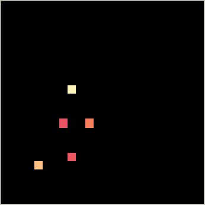{ .off-glb loading=lazy }<span>NV relaxometry<small>spin sources · NeTMY</small></span>](instances/nv_relaxometry.md)
[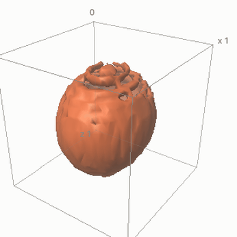{ .off-glb loading=lazy }<span>3-D sparse-view CT<small>isosurface, edge-refined</small></span>](gallery/3d.md)
[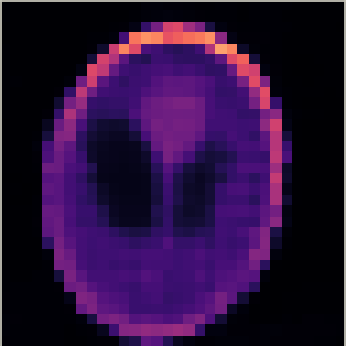{ .off-glb loading=lazy }<span>Sparse-view CT<small>16 views</small></span>](instances/sparse_view_ct.md)
[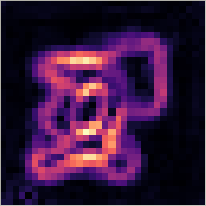{ .off-glb loading=lazy }<span>Current density<small>NV magnetometry</small></span>](instances/current_density.md)
[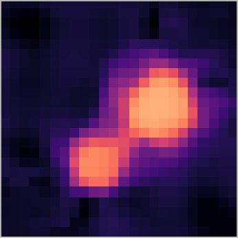{ .off-glb loading=lazy }<span>Full-waveform inversion<small>sound speed</small></span>](instances/wave_fwi.md)
[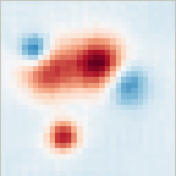{ .off-glb loading=lazy }<span>Holography<small>phase retrieval</small></span>](instances/holography.md)
[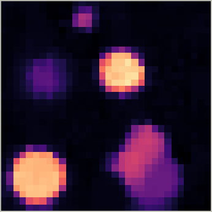{ .off-glb loading=lazy }<span>Deconvolution<small>image deblurring</small></span>](instances/deconvolution.md)
[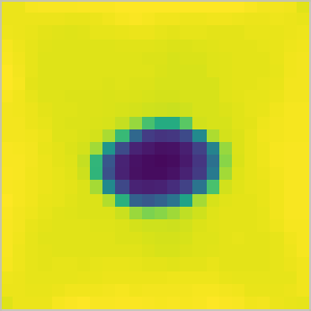{ .off-glb loading=lazy }<span>EIT<small>conductivity</small></span>](instances/eit.md)
[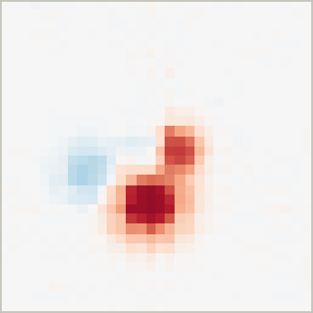{ .off-glb loading=lazy }<span>Diffraction tomography<small>Born scattering</small></span>](instances/diffraction_tomography.md)
[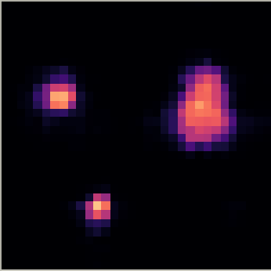{ .off-glb loading=lazy }<span>Poisson source<small>30 % observed</small></span>](instances/poisson_source.md)
[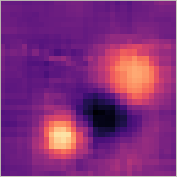{ .off-glb loading=lazy }<span>Reaction–diffusion<small>Gray–Scott feed rate</small></span>](instances/reaction_diffusion.md)
[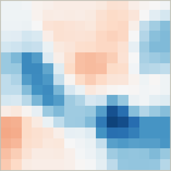{ .off-glb loading=lazy }<span>Darcy flow<small>log-permeability</small></span>](instances/darcy_flow.md)

</div>

<p class="nf-center" markdown>[Open the gallery](gallery/index.md){ .md-button .md-button--primary } [3-D showcase](gallery/3d.md){ .md-button }</p>

<p class="nf-kicker">Interactive</p>

## Rotate a reconstruction

<p class="nf-intro">Photoacoustic tomography of a vessel network from a planar sensor array:
ground truth, the smooth neural-field reconstruction and its edge-refined version, on one camera.
Drag to rotate, scroll to zoom; levels, IoU and Dice are recomputed in your browser.</p>

<div class="nf-viewer">
  <iframe src="assets/viewers/photoacoustic3d.html" loading="lazy" title="Interactive 3-D viewer: photoacoustic tomography, ground truth vs reconstruction"></iframe>
  <div class="nf-viewer__bar">
    <span>photoacoustic3d · 20×20×14 voxels · smoke preset, CPU run</span>
    <a href="assets/viewers/photoacoustic3d.html" target="_blank" rel="noopener">Open full page ↗</a>
  </div>
</div>

<p class="nf-kicker">Who it is for</p>

## Built for people with a forward model and no training set

<div class="nf-cols" markdown>

<div class="nf-col" markdown>

### Imaging scientists

You have an instrument such as a quantum sensor, a thermal camera, a CT scanner, a microscope or
a sensor array, and a model of how it measures. Write the model in PyTorch, declare what you know
about the unknown, and get a reconstruction together with a report on how well it explains your
data. [Bring your own problem →](byop.md)

</div>

<div class="nf-col" markdown>

### Method developers

Compare representations, priors, schedules and optimizers on 17 problems under one fair
protocol: shared objectives, paired seeds, confidence intervals, an inverse-crime guard, and
diagnostics that explain *why* a method wins. [Benchmarking →](tutorials/06_benchmarking.md)

</div>

<div class="nf-col" markdown>

### Academic labs

Adopt one inversion toolkit for every instrument in your group: each setup becomes a registered
problem with its own configuration, results stay reproducible from run to run, and the benchmark
protocol yields publication-ready comparisons. New members start with eight tutorials, from a
five-second toy to paper-scale runs on GPU servers, and a line-by-line map from the papers'
equations to the code. [Start the tutorials →](getting-started/index.md)

</div>

</div>

<p class="nf-kicker">Research</p>

## The research behind nefi

<p class="nf-intro">nefi grew out of research on neural-field inversion at the
<a href="https://cablab.scholar.princeton.edu">CAB Lab, Princeton University</a>: a series of papers that apply one idea to very
different instruments. Two are published so far, NeTMY and NeFTY, and both ship as instances with
paper-scale configurations. The recipe is written so that the papers that follow slot in the same
way.</p>

<div class="nf-cols two" markdown>

<div class="nf-col" markdown>

### NeTMY — Neural Fields for NV-Center Inverse Sensing

Zhao, Zhong, Hu, de Leon, Allen-Blanchette · [arXiv:2605.13988](https://arxiv.org/abs/2605.13988)

Sparse spin sources and their Larmor field from the magnetic-noise spectra of a widefield
NV-center array, through a tensor power-summed dipolar operator; explains the center collapse
of free-density solvers with the filtering view of a parameterized update.
[Instance: `nv_relaxometry` →](instances/nv_relaxometry.md)

??? quote "BibTeX"

    ```bibtex
    @article{zhao2026netmy,
      title   = {Neural Fields for {NV}-Center Inverse Sensing},
      author  = {Zhao, Zhixuan and Zhong, Tao and Hu, Yixun and de Leon, Nathalie P. and
                 Allen-Blanchette, Christine},
      journal = {arXiv preprint arXiv:2605.13988},
      year    = {2026}
    }
    ```

</div>

<div class="nf-col" markdown>

### NeFTY — Neural Field Thermal Tomography

Zhong, Hu, Zheng, Sood, Allen-Blanchette · [arXiv:2603.11045](https://arxiv.org/abs/2603.11045)

Volumetric thermal diffusivity from pulsed-thermography surface frames, through a
differentiable implicit-Euler heat solver with harmonic-mean interfaces and a discrete adjoint;
explains why soft-constrained PINNs fit the data but not the interior.
[Instance: `thermal_tomography` →](instances/thermal_tomography.md)

??? quote "BibTeX"

    ```bibtex
    @article{zhong2026nefty,
      title   = {Neural Field Thermal Tomography: A Differentiable Physics Framework for
                 Non-Destructive Evaluation},
      author  = {Zhong, Tao and Hu, Yixun and Zheng, Dongzhe and Sood, Aditya and
                 Allen-Blanchette, Christine},
      journal = {arXiv preprint arXiv:2603.11045},
      year    = {2026}
    }
    ```

</div>

</div>

<p class="nf-kicker">Install</p>

## Up and running in a minute

=== "pip"

    ```bash
    pip install nefi                  # torch, numpy, scipy, pyyaml, tqdm
    pip install "nefi[viz]"           # + matplotlib for figures (--plot)
    nefi list instances               # 17 registered problems
    nefi run toy1d --smoke            # a few seconds on a CPU
    ```

=== "Latest development version"

    ```bash
    pip install git+https://github.com/ContinuumCoder/NEFI.git
    ```

=== "From source (development)"

    ```bash
    git clone https://github.com/ContinuumCoder/NEFI.git && cd NEFI
    pip install -e ".[dev]"            # + pytest, ruff, matplotlib, typer, rich, scikit-image
    make test                          # fast CPU suite
    ```

=== "GPU server (conda)"

    ```bash
    git clone https://github.com/ContinuumCoder/NEFI.git && cd NEFI
    conda env create -f environment.yml && conda activate nefi   # python 3.11, torch, nefi[dev]
    nefi run configs/nv_relaxometry_paper.yaml --device cuda      # NeTMY at paper scale
    ```

Python ≥ 3.10 and PyTorch ≥ 2.1; CPU is enough for every tutorial and smoke run, CUDA for paper
scale. Next: [install notes and a first run](getting-started/index.md) · [the quickstart
tutorial](tutorials/01_quickstart.md) · [how to cite](reference/license.md).
