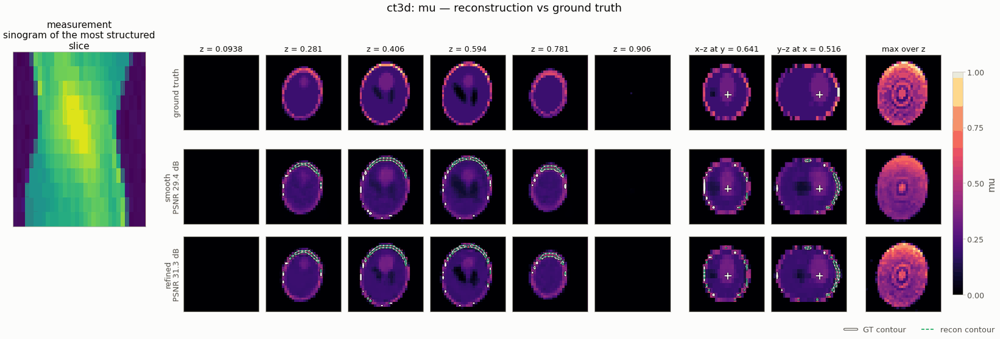

# `ct3d` — 3-D sparse-view parallel-beam CT

<!-- nf-summary:start -->
<div class="nf-summary volumetric" markdown>

| At a glance | |
|---|---|
| **Problem** | 3-D sparse-view parallel-beam CT of every axial slice (rotation about z) |
| **Unknown** | attenuation μ(x, y, z) ∈ [0, 1] (bounded head), 64 × 64 × 32 |
| **Physics** | slice-stacked differentiable Radon transform: all slices × views in one `grid_sample`, exact autograd adjoint |
| **Measurement** | sinogram stack (views × detectors × slices), 30 views over 180° + 1 % noise; data on a 2× grid with 4 sub-rays per bin, float64 |
| **Difficulty classes** | `ellipsoids`, `blobs`, `piecewise` |
| **Baselines** | `fbp3d`, `grid` (+ TV), `deep_decoder` |
| **Metrics** | PSNR · slice SSIM · MSE · IoU |
| **Run** | `nefi run ct3d --smoke` · full: `nefi run configs/ct3d_full.yaml --device cuda` |



Gallery run (32 × 32 × 16, 12 views; 800 steps, 7.3 s on a CPU): PSNR 29.4 dB; edge refinement accepted, IoU 0.75 → 0.80. Rotate it in the [3-D showcase](../gallery/3d.md).

</div>
<!-- nf-summary:end -->

Recover a volumetric attenuation map `μ(x, y, z) ∈ [0, 1]` from `n_views` noisy parallel-beam
projections of **every axial slice**: the source–detector pair rotates about the `z` axis, so the
measurement is a stack of sinograms `(n_views, n_det, n_z)`. With a few tens of views (a fraction of
the `≈ π/2 · n` an unregularized reconstruction needs) filtered back-projection streaks, and with a
limited angular range (`angle_range < 180°`, the "missing wedge") it smears — the regime where the
neural-field prior plus TV pays off.

```
CT3DScenes (ellipsoids | blobs | piecewise) ─► Radon3D on a 2× grid (4 sub-rays / bin, float64) ─► sinograms (V, n_det, n_z) + 1 % noise
coords ─► annealed Fourier PE (3-D) ─► MLP ─► Bounded(0, 1) ─► μ ─► Radon3D (all slices × views, one grid_sample)
       ─► MSE + λ·TV₃D(μ) ─► two-stage multiscale (½ res → native) ─► PSNR / slice-SSIM / MSE / feature IoU
```

```python
from nefi.instances.ct3d import CT3D

inst = CT3D(preset="smoke")                 # 32×32×16, 12 views, 150 + 250 steps (≈ 6 s, one core)
out = inst.run(seed=0, device="cpu")
print(out.metrics)                          # psnr, ssim, mse, iou
fbp = inst.fbp(out.measurement)             # slice-wise FBP of the same sinogram stack
```

CLI: `nefi run ct3d --smoke`, `nefi run configs/ct3d_full.yaml --device cuda`,
`nefi bench ct3d --smoke --methods neural,fbp3d,grid`. Example:
`python examples/ct3d.py [--set scene=piecewise --set angle_range=120]` writes `ct3d.png` (z-slices
and an x-z cut of GT / NF / FBP3D / |error|), `sinogram.png`, `metrics.json`, `result.pt` under
`runs/ct3d_smoke/`.

## Forward model (`nefi.instances.ct3d.radon3d`)

`Radon3DOperator(domain, n_views, field="mu", angles=None, angle_range=π, det_per_pixel=1,
samples_per_pixel=1, view_batch=None, max_samples=2**24)` applies the 2-D rotation-based Radon
transform of [`sparse_view_ct`](sparse_view_ct.md) (same conventions, physical line integrals
`Δt Σ μ`) to every slice — in **one** `F.grid_sample` call: the slices are the channels of a single
`(n_z, n, n)` image and the rotated `(n_t, n_det)` sampling lattices of all views are stacked along the
output height. There is no Python loop over slices or views; `view_batch` (automatic under
`max_samples` gathered samples) chunks the views to bound memory at paper scale. Linear
(`homogeneity = 1`), batchable, exact autograd adjoint (`op.adjoint(y)`), `at_resolution` keeps
`det_per_pixel` so `n_det` scales with the lateral grid while the slices follow `n_z`: coarse
curriculum data are area averages over detector bins **and** slices, which is exact for line
integrals, so no custom downsampling is needed.

* `fbp3d(sinogram, angles, filter="ramp", n=None, width=1, circle=False)` / `op.fbp(...)` —
  slice-wise filtered back-projection (Kak & Slaney ramp, optional apodization), batched like the
  forward (all rows filtered at once, one `grid_sample` for the smearing);
* `backproject3d(...)` / `op.backproject(y)` — pixel-driven back-projector (independent
  discretization of `Rᵀ`).

## Scenes and data

`CT3DScenes` (normalized coordinates, inside the scanner cylinder, cell-averaged with
`render_factor` sub-samples per voxel and axis so the native ground truth is the exact area average
of the 2× data-generation volume):

* `ellipsoids` — 3-D Shepp–Logan-like head: the 10-ellipsoid table of Kak & Slaney's 3-D phantom
  with the Toft contrasts (`SHEPP_LOGAN_3D`, ZXZ Euler angles), random global scale / rotation about
  `z` / shift and per-ellipsoid axes, centers, angles, intensities (the skull shell shares one
  perturbation so it stays closed);
* `blobs` — smooth sums of anisotropic Gaussian blobs, windowed to the field of view;
* `piecewise` — random constant ellipsoids / boxes / cylinders (bright inserts, dark cavities)
  painted inside a low-attenuation body ellipsoid — sharp 3-D edges.

Feature values are chosen so that the `iou_tau = 0.25` super-level set is the "feature" mask (skull
and bright lesions, blob cores, inserts). **Inverse-crime guard**: the data are projected on a 2×
grid (`2n × 2n × 2n_z`) with 2 detector bins per fine pixel (4 sub-rays per native bin), float64,
area-averaged onto the native detector and slices (`fidelity_tag = "radon3d-2x-float64"` vs
`"radon3d-32x32x16-1det-1spp"`).

## Prior, objective, curriculum

`NeuralField(3, {"mu": Bounded(0, 1)})` (tanh MLP, annealed Fourier features), sinogram MSE +
isotropic 3-D TV (physical spacing) + optional ℓ1, `Curriculum.multiscale` with two stages
(`16×16×8 → 32×32×16` in the smoke preset). Annealing over the first 30 % of each stage
(`anneal_fraction = 0.3`) matters in 3-D: annealing over the whole stage leaves the top octaves
switched off until the end and the smoke run under-fits (−1.5 dB).

## Configuration (`CT3DConfig`) and presets

| field | default | smoke | meaning |
|---|---|---|---|
| `n`, `n_z`, `extent`, `height` | 64, 32, 1.0, 1.0 | 32, 16 | lateral / axial grid, physical size |
| `n_views`, `angle_range` | 30, 180 | 12 | views, angular coverage (degrees) |
| `det_per_pixel`, `samples_per_pixel`, `view_batch` | 1, 1, null | | detector bins / ray samples per pixel, view chunking |
| `scene`, `render_factor` | ellipsoids, 2 | | phantom class, sub-samples per voxel and axis |
| `noise_std`, `supersample`, `data_det_per_pixel` | 0.01, 2, 2 | | relative noise, data grid factor, bins per fine pixel |
| `head`, `init_value` | bounded, 0.1 | | `Bounded(0, 1)` \| `softplus` |
| `tv`, `tv_eps`, `l1` | 1e-5, 1e-3, 0 | 2e-5 | regularizers |
| `hidden`, `depth`, `skip_at`, `n_octaves`, `activation` | 128, 4, 2, 6, tanh | 64, 3, 2, 5 | neural field |
| `steps`, `lr`, `lr_decay`, `anneal_fraction`, `min_coarse` | (600, 1200), 1e-2, 0.5, 0.3, 8 | (150, 250), 3e-2 | curriculum |
| `iou_tau` | 0.25 | | feature IoU threshold |
| `fbp_filter`, `fbp_clip`, `grid_lr`, `dd_*` | ramp, true, 5e-2, … | | baselines |

Presets (`CT3D(preset=...)`): `smoke`, `limited_angle` (`angle_range = 120`), `default`. Configs:
`configs/ct3d_smoke.yaml` (identical to the smoke preset), `configs/ct3d_full.yaml` (64³, 30 views,
1500 + 3000 steps, every field spelled out).

## Baselines (`CT3D.baselines()`)

`grid` (free voxels + the same objective), `fbp3d` (closed form through the `DirectSolver`,
reported with the same metrics) and `deep_decoder` (3-D). Any other kind via
`baseline_problem(inst.build_problem(m), "admm" | "lbfgs" | "gaussian_splat")`.

## Validation (`tests/test_ct3d.py`, ≈ 15 s)

| check | result |
|---|---|
| Radon3D vs the 2-D `RadonOperator` applied to every slice (float64) | max abs difference 0.0 |
| view chunking (`view_batch=3`) vs one call | ≤ 1e-12 |
| exact adjoint `⟨Rx, y⟩ = ⟨x, Rᵀy⟩` (autograd) | ≤ 1e-10 relative to ‖Rx‖‖y‖ |
| pixel-driven back-projector vs exact adjoint (smooth fields, 10 draws) | ≤ 6.7e-4 relative |
| `fbp3d` vs slice-wise 2-D `fbp` | ≤ 1e-10 |
| full-view FBP (90 / 180 views, 48²×8 ellipsoids, noiseless) | 29.4 / 29.4 dB |
| linearity `R(2.5a − 0.7b)` | ≤ 1e-12 |
| scenes: in the FOV cylinder, `avg_pool(2× render) = native` | ≤ 1e-5 |
| inverse-crime mismatch (native Radon of the native GT vs area-averaged 2× data, noise-free) | 1.4 % rms of max (ellipsoids: sub-voxel skull shell), 0.33 % (piecewise) |

Operator cost (one thread, CPU): 32×32×16 / 12 views: 0.6 ms forward, 2.5 ms forward + backward;
64×64×32 / 30 views: 14 / 62 ms; 128×128×64 / 30 views: 131 / 547 ms. The field MLP dominates the
step time (≈ 20 ms per step at 32×32×16).

Inversion (seed 0, 1 % noise, 32×32×16, smoke budget of 400 steps; PSNR dB / SSIM / feature IoU):

| setting | FBP3D | neural field | grid + TV |
|---|---|---|---|
| ellipsoids, 12 views over 180° (smoke preset) | 25.1 / 0.645 / 0.71 | **27.3 / 0.853** / 0.64 | 29.2 / 0.804 |
| ellipsoids, 8 views | 22.7 / 0.561 | 26.8 / **0.840** | 28.2 / 0.782 |
| piecewise, 12 views | 33.4 / 0.715 | 36.0 / **0.950** | 37.4 / 0.765 |
| ellipsoids, 120° (16 views) | 23.2 / 0.695 | 25.2 / **0.765** | 26.2 / 0.748 |
| ellipsoids, 90° (12 views) | 20.6 / 0.585 | **24.9 / 0.777** | 23.7 / 0.616 |
| piecewise, 90° (12 views) | 24.6 / 0.611 | 31.0 / **0.850** | 31.0 / 0.685 |

The neural field removes the streaks and wins clearly on **structure** (SSIM) everywhere and on
PSNR in the limited-angle regime; with the same TV objective the free voxel grid (1 s instead of
7 s) reaches a higher PSNR in the well-sampled cases — the same picture as the 2-D
[`sparse_view_ct`](sparse_view_ct.md): in linear problems with enough detector sampling the TV
objective does most of the work, and the representation prior matters when the data are
missing a wedge. The smoke budget under-fits (data loss ≈ 3× the model-error floor); the full config
runs 4500 steps.

## Notes and limitations

* Parallel-beam geometry with the rotation axis along `z` (no cone beam, no helical pitch): the
  slices decouple in the physics and are coupled only by the 3-D prior (field + 3-D TV).
* The rotation-based projector is bilinear; the thin Shepp–Logan skull shell is sub-voxel at 32²,
  which is where the 1.4 % model mismatch comes from (the data generator resolves it).
* Device note: PyTorch has no MPS kernel for `grid_sampler_2d_backward`; use CPU or CUDA.
