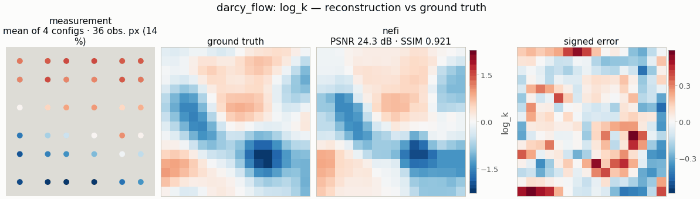

# `darcy_flow` — permeability from steady pressure data

<!-- nf-summary:start -->
<div class="nf-summary" markdown>

| At a glance | |
|---|---|
| **Problem** | Log-permeability of a closed reservoir from sparse pressure gauges under several well configurations (hydraulic tomography) |
| **Unknown** | Y = log k, 32² |
| **Physics** | −∇·(k∇p) = well sources with no-flow boundaries; harmonic-mean finite volumes, PCG, implicit-function-theorem adjoint |
| **Measurement** | gauge pressures on an 8 × 8 sensor lattice for 6 injector / producer configurations; data on a 2× grid in float64 |
| **Difficulty classes** | `smooth`, `channels` |
| **Baselines** | `grid` |
| **Metrics** | PSNR · SSIM · MSE · relative error · high-permeability IoU |
| **Run** | `nefi run darcy_flow --smoke` · full: `nefi run configs/darcy_flow_full.yaml --device cuda` |



Gallery run (smoke preset: 16², 4 well configurations; 400 steps, 3.9 s on a CPU): PSNR 24.3 dB.

</div>
<!-- nf-summary:end -->

Recover the log-permeability `Y = log k` of a closed 2-D reservoir from sparse pressure gauges
recorded for several injector/producer well configurations (hydraulic tomography / history
matching; Bear 1972, Yeh & Liu 2000, Oliver, Reynolds & Liu 2008):

```
q = −(k/μ)∇p,   ∇·q = f   ⇒   −∇·(k∇p) = μ Σ_w Q_w δ(x − x_w),   no-flow (Neumann) boundary
```

```python
from nefi.instances.darcy_flow import DarcyFlow
out = DarcyFlow(n=16, n_configs=4, n_sensors=6, steps=(50, 100), lr=1e-2, n_octaves=3).run(seed=0)
out.metrics      # {"psnr", "ssim", "mse", "relative_error", "high_k_iou"}  (on log k)
```
CLI: `nefi run darcy_flow --smoke`, `nefi run configs/darcy_flow_full.yaml --device cuda`.
Example: `python examples/darcy_flow.py --config configs/darcy_flow_smoke.yaml`.

## Physics and discretization (`nefi.instances.darcy_flow.operator`)

* `DarcyOperator(domain, wells, sensors=..., obs_shape=...)` — an `EllipticOperator` with
  `sigma_transform="exp"` (field `log_k`), harmonic-mean faces, pure-Neumann Jacobi-PCG (the
  balanced well rates satisfy the compatibility condition; the solver still projects and pins the
  mean pressure), implicit-function adjoint, warm starts, one right-hand side per configuration.
* **Wells** (`well_configurations`): configuration `c` has an injector (`+Q`) at angle
  `θ_c = well_angle + πc/n_configs` and a producer (`−Q`) opposite, at `well_radius × L` from the
  centre; point sources are cloud-in-cell spread (`point_source_rhs`), so the discrete rate is exact
  and the source moves smoothly with its position at every resolution.
* **Sensors** (`sensor_mask`): a regular `n_sensors × n_sensors` lattice snapped to cells; for each
  configuration gauges within `well_exclusion` cells of its wells are dropped (the well-cell
  pressure has a grid-dependent log singularity and is not a resolution-consistent observable).
* **Observable** — the pressure solved on the operator's grid is sampled on the native grid
  (bilinear from coarser curriculum grids, cell averages from finer ones) and referenced to the
  mean over the gauges (gauge pressure). Coarse stages therefore predict the native sensors
  directly: at 32² the coarse (16²) model misfit at the true field is 5.6 % of the signal (vs 19 %
  when the data were instead averaged onto coarse cells).

## Data (inverse-crime guard)

Same physics on a 2× finer grid in float64, gauge values = native cell averages, Gaussian noise
`noise_std × max|p|`; `fidelity_tag = "elliptic-fv-2x-float64"`. Scenes (`DarcyScenes`, closed-form
in position so fine and native grids agree):

| class | content |
|---|---|
| `smooth` | log-normal `Y = μ + s·G`, `G` a unit-variance Gaussian random field with squared-exponential covariance of length `corr_length` (random Fourier features) |
| `channels` | weaker background (`channel_bg_std`) + 1–3 sinuous high-permeability channels (`+channel_contrast` in `Y`) |

`channel_width` must span ≥ 2 native cells (smoke: 0.12–0.16 at 16²; full: 0.05–0.08 at 64²).

## Inversion

`NeuralField` (ReLU, few octaves) with `Bounded(log_k_min, log_k_max)` head → `k = exp(Y)`; masked
`MSE` + isotropic `TV(Y)`; two-stage curriculum (`n/2 → n` if `n/2 ≥ 12`, else both at `n`);
baseline `grid`.

## Metrics

`psnr`, `ssim`, `mse`, `relative_error` on `Y = log k`, and `high_k_iou`: IoU of
`Y > mean(Y_gt) + 1·std(Y_gt)` (the flow paths).

## Configuration (`DarcyConfig`)

| field | smoke | full | meaning |
|---|---|---|---|
| `n`, `length` | 16, 1 | 64, 1 | grid / side length |
| `n_configs`, `well_radius`, `well_rate`, `well_angle` | 4, 0.3, 1, 0.3 | 8, 0.3, 1, 0.3 | wells |
| `n_sensors`, `sensor_jitter`, `sensor_seed`, `well_exclusion` | 6, 0, 12345, 1.5 | 12, 0, 12345, 1.5 | gauges |
| `tol`, `grad_mode`, `warm_start`, `check_every` | 1e-6, ift, true, 1 | 1e-6, ift, true, 8 | PDE solver |
| `viscosity`, `bc`, `well_spread`, `face_mode` | 1, neumann, linear, harmonic | same | physics |
| `scene`, `log_k_mean`, `log_k_std`, `corr_length` | smooth, 0, 0.8, 0.15 | channels, 0, 0.8, 0.15 | scenes |
| `channel_contrast`, `channel_bg_std`, `n_channels`, `channel_width` | 2.5, 0.4, (1, 3), (0.12, 0.16) | 2.5, 0.4, (1, 3), (0.05, 0.08) | channels |
| `channel_amplitude`, `channel_wavelength`, `clip_margin` | (0.05, 0.12), (0.4, 0.8), 0.2 | same | channel meanders, scene clamp |
| `log_k_min`, `log_k_max` | −3, 4 | −3, 4 | head bounds |
| `noise_std`, `supersample` | 2e-3, 2 | 2e-3, 2 | data |
| `hidden`, `depth`, `n_octaves`, `activation` | 64, 3, 3, relu | 256, 6, 4, relu | field |
| `steps`, `lr`, `tv` | (50, 100), 1e-2, 1e-5 | (1000, 3000), 5e-3, 1e-5 | optimization |

Smoke result (seed 0, `smooth`, CPU ≈ 7 s): neural PSNR 20.8 dB / SSIM 0.83 vs uniform 12.8 dB /
0.00; grid 22.0 dB / 0.88. At 32² (6 configurations, 8×8 gauges, 450 steps, mean of both classes):
neural PSNR 24.1 dB / SSIM 0.77 / high-k IoU 0.64.
