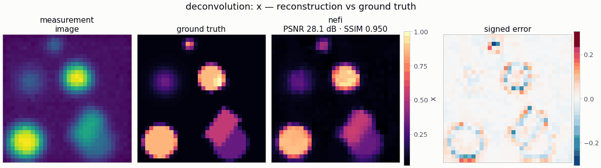

# `deconvolution` — 2-D image deblurring

<!-- nf-summary:start -->
<div class="nf-summary" markdown>

| At a glance | |
|---|---|
| **Problem** | 2-D image deblurring with a known Gaussian, linear-motion or out-of-focus PSF |
| **Unknown** | image x ≥ 0 (softplus head), 64² |
| **Physics** | zero-padded FFT convolution; the PSF is a function of the grid spacing, so every stage sees the same physical blur |
| **Measurement** | blurred image + Gaussian noise or Poisson photon counts; data from the PSF on a 2× grid in float64 |
| **Difficulty classes** | `phantom`, `smooth`, `sparse_dots` |
| **Baselines** | `grid` (+ TV), `admm`, `deep_decoder`, `gaussian_splat`, `wiener` |
| **Metrics** | PSNR · SSIM · MSE |
| **Run** | `nefi run deconvolution --smoke` · full: `nefi run configs/deconvolution_full.yaml` |



Gallery run (32², 450 steps, 0.4 s on a CPU): PSNR 28.1 dB, SSIM 0.95.

</div>
<!-- nf-summary:end -->

Recover a non-negative image `x` on `[0, extent]²` from a blurred, noisy observation

```
Gaussian noise:  y = k ∗ x + n,             n ~ N(0, (noise_std · max(k ∗ x))²)
Poisson noise:   y ~ Poisson(peak · (k ∗ x) + background)       (photon counts)
```

with a Gaussian (`psf_sigma`), linear-motion (`motion_length`, `motion_angle`) or out-of-focus
disk (`disk_radius`) point-spread function given in **physical units**.

```python
from nefi.instances.deconvolution import Deconvolution
inst = Deconvolution(n=64, scene="phantom", psf="motion", noise="poisson")
out = inst.run(seed=0)                  # generate -> invert -> evaluate (RunOutput)
out.metrics                             # {"psnr", "ssim", "mse"}
```
CLI: `nefi run deconvolution --smoke`, `nefi run configs/deconvolution_full.yaml`,
`nefi bench configs/deconvolution_full.yaml --n 8 --seeds 0,1,2`.
Example: `python examples/deconvolution.py [--config ...] [--set psf=disk]`.

## Physics and discretization

* **Operator** — `FFTConvolution(psf_fn, domain, periodic=False)`: zero-padded linear convolution
  (`"same"` output), FFT kernel cache per resolution. The PSF is a *kernel function of the grid
  spacing* (`nefi.instances.deconvolution.psf`): the Gaussian is sampled analytically, the motion
  segment is splatted bilinearly with 8 samples per cell, the disk is anti-aliased with 8×8
  sub-samples; all are normalized to unit sum. Every curriculum stage therefore sees the same
  physical PSF. Poisson mode wraps the blur in a fixed `Nuisance` gain/offset
  (`peak_counts`, `background_counts`) so the prediction is in expected counts.
* **Data generation (inverse-crime guard)** — `BlurDataGenerator`: the same PSF evaluated on a
  `supersample = 2`× finer grid in float64, the blurred image area-averaged onto the detector grid,
  then Gaussian or Poisson noise from the scene's numpy generator
  (`fidelity_tag = "blur-2x-float64"`; the inversion operator is tagged `"blur-1x-float32"`).
* **Scenes** (`DeconvolutionScenes`, values in `[0, 1]`, analytic and rendered as cell averages
  so every grid sees the same scene): `phantom` (piecewise-constant disks and rotated rectangles
  with random contrast, soft blobs, a few sparse dots), `smooth` (broad blobs + low-frequency
  texture), `sparse_dots` (6-15 near-point sources of width `dot_cells` native cells).

## Prior, objective and curriculum

Neural field (`hidden × depth` tanh MLP, skip at `skip_at`, annealed Fourier features with
`n_octaves`) with a `Softplus` (default) or `Bounded(0, 1)` head. Losses: `data` = MSE (Gaussian)
or Poisson NLL weighted by `1/peak_counts` (so regularizer weights are in image units),
`tv` = isotropic TV (NeFTY Eq. 22, physical-spacing differences, `tv_eps`), `l1` (off by default;
use it for `sparse_dots`). Two-stage multiscale curriculum `n/2 → n` with the NeTMY schedule
(cosine LR per stage, β reset per stage, second stage at `lr · lr_decay`).

## Configuration (`DeconvolutionConfig`)

| field | default | meaning |
|---|---|---|
| `n`, `extent` | 64, 1.0 | grid size, physical side length |
| `scene` | `phantom` | `phantom` \| `smooth` \| `sparse_dots` |
| `psf` | `gaussian` | `gaussian` \| `motion` \| `disk` |
| `psf_sigma` | 0.02 | Gaussian std (1.28 px at n = 64) |
| `motion_length`, `motion_angle` | 0.1, 30.0 | motion blur length, angle in degrees from axis 0 |
| `disk_radius` | 0.04 | defocus radius |
| `noise` | `gaussian` | `gaussian` \| `poisson` |
| `noise_std` | 0.01 | relative Gaussian noise std |
| `peak_counts`, `background_counts` | 200, 1 | Poisson exposure and dark counts |
| `supersample` | 2 | data-generation grid factor |
| `dot_cells` | 0.7 | width of `sparse_dots` sources in native cells |
| `head`, `init_value` | `softplus`, 0.05 | `softplus` \| `bounded` (`Bounded(0, 1)`) |
| `data_loss` | `auto` | `auto` (MSE / Poisson NLL by noise model) \| `mse` \| `poisson_nll` |
| `tv`, `tv_eps`, `l1` | 1e-4, 1e-3, 0 | regularizer weights |
| `hidden`, `depth`, `skip_at`, `n_octaves`, `activation` | 128, 4, 2, 7, tanh | neural field |
| `steps`, `lr`, `lr_decay`, `anneal_fraction` | (400, 800), 2e-2, 0.5, 1.0 | curriculum |
| `grid_lr`, `grid_l2` | 5e-2, 0 | grid baseline LR and optional extra ℓ2 (Tikhonov) weight |
| `dd_lr`, `dd_width`, `dd_stages` | 5e-3, 64, 5 | Deep Decoder baseline |
| `splat_lr`, `splat_primitives`, `splat_max_primitives` | 3e-2, 64, 128 | Gaussian-splat baseline |
| `admm_mu`, `admm_l1`, `admm_lr`, `admm_inner`, `admm_outer`, `admm_tol`, `admm_adaptive` | 0.1, 1e-3, 2e-2, 20, 60, 1e-3, true | ADMM baseline |
| `wiener_snr`, `wiener_tau` | 0 (auto), 1.0 | fixed Wiener SNR, or discrepancy factor for the automatic choice |

Configs: `configs/deconvolution_smoke.yaml` (32², ~5 s CPU), `configs/deconvolution_full.yaml`
(64², 1200 + 2400 steps, full-size baselines; GPU recommended).

## Baselines (`Deconvolution.baselines()`)

`grid` (free pixels with the same losses), `deep_decoder`, `gaussian_splat` (designed for
`sparse_dots`), `admm` (grid + ℓ1/box ADMM, box from the head range) and `wiener`: the classical
Wiener filter `X = H* Y / (|H|² + 1/snr)` with the zero-padding boundary handled by dividing by
the blurred domain indicator `k ∗ 1_Ω` and replicate padding, and the SNR chosen by Morozov's
discrepancy principle (`wiener_discrepancy`; within ~1-2 dB of the best fixed SNR in the checks).
See `docs/baselines.md` for what each baseline means and when the comparison is fair.

## Validation

`tests/test_deconvolution.py` (≈ 8 s): unit-sum, centered, physically scaled PSFs (a 2× finer grid
doubles the Gaussian width in pixels; motion at 90° is the transpose of 0°); scene values in
`[0, 1]` and exact fine→native area consistency; Poisson data are non-negative integers with the
expected mean; the Wiener filter inverts a circular blur exactly and deblurs instance data by
> 2 dB; inverse-crime tags differ; the smoke inversion beats the blurred input by > 2 dB; the
Poisson-NLL path runs; every baseline builds and solves.

Measured on a CPU (seed 0, `phantom`, Gaussian PSF, 1 % noise):

| setting | blurred | Wiener | neural field | grid + TV | Deep Decoder | Gaussian splat | ADMM (ℓ1) |
|---|---|---|---|---|---|---|---|
| 32², smoke (450 steps) | 21.03 / 0.805 | 24.96 / 0.833 | 28.05 / 0.950 (4.5 s) | 29.07 / 0.971 (0.7 s) | 24.12 / 0.876 | 23.45 / 0.898 | 25.16 / 0.810 |
| 64², 300 + 600 steps | 24.26 / — | 27.65 / 0.781 | 33.60 / 0.981 (22 s) | 35.13 / 0.987 (1.5 s) | 29.66 / 0.956 | 27.26 / 0.922 | 26.96 / 0.628 |

(PSNR dB / SSIM.) On this well-conditioned linear problem the TV-regularized free grid — the MAP
estimate of the same objective — is a very strong baseline and the neural field is competitive
with it, far ahead of Wiener, the Deep Decoder and the sparse priors (which lack TV and fit
piecewise-constant shapes poorly). On `sparse_dots` with an ℓ1 objective the ranking changes
(`docs/baselines.md`). These are single-seed numbers; use `nefi bench` for CIs.

## Notes and limitations

* The PSF is known; blind deconvolution would add the kernel as a nuisance parameter.
* Poisson NLL on area-averaged counts at the coarse stage is a slightly mis-specified likelihood
  (averaged counts are not Poisson); the minimizer is unaffected.
* The Wiener filter is a single global SNR (flat noise-to-signal ratio); boundary handling assumes
  the image is locally smooth at the border.
