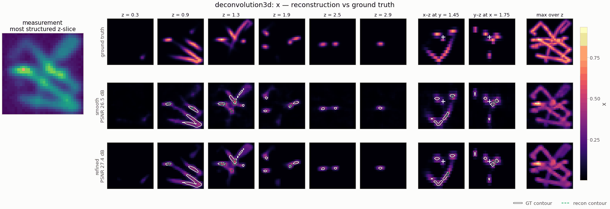

# `deconvolution3d` — fluorescence-microscopy z-stack deconvolution

<!-- nf-summary:start -->
<div class="nf-summary volumetric" markdown>

| At a glance | |
|---|---|
| **Problem** | Widefield fluorescence z-stack deconvolution with an axially elongated PSF |
| **Unknown** | fluorophore density x ≥ 0 (softplus head), 64 × 64 × 32 anisotropic voxels |
| **Physics** | 3-D FFT convolution with a Gaussian PSF, σ<sub>z</sub> = 3 σ<sub>xy</sub>, in physical µm |
| **Measurement** | blurred z-stack + Gaussian noise or Poisson photon counts; data on a 2× grid in float64 |
| **Difficulty classes** | `filaments`, `puncta`, `cells` |
| **Baselines** | `richardson_lucy`, `wiener3d`, `grid`, `deep_decoder` |
| **Metrics** | PSNR · slice SSIM · MSE |
| **Run** | `nefi run deconvolution3d --smoke` · full: `nefi run configs/deconvolution3d_full.yaml` |



Gallery run (32 × 32 × 16; 800 steps, 12.5 s on a CPU): PSNR 26.5 dB; edge refinement accepted, IoU 0.65 → 0.71.

</div>
<!-- nf-summary:end -->

Recover the non-negative fluorophore density `x(x, y, z)` from a widefield z-stack blurred by the
microscope's 3-D point-spread function:

```
y = h ∗ x + n              (Gaussian noise, relative std noise_std)
y ~ Poisson(peak · (h ∗ x) + background)      (photon counts, noise = "poisson")
```

The PSF is the Gaussian approximation of the widefield PSF (Zhang, Zerubia & Olivo-Marin, *Appl.
Opt.* 46, 2007) with the classic **axial elongation** `σ_z = psf_axial_ratio · σ_xy` (default 3) in
physical µm. Camera pixels (`pixel_size`, default 0.1 µm) and z-steps (`z_step`, default 0.2 µm)
are independent, so the voxels are anisotropic like a real stack.

```
Deconvolution3DScenes (filaments | puncta | cells) ─► PSF blur on a 2× grid (float64), area-averaged ─► stack + noise
coords ─► annealed Fourier PE (3-D) ─► MLP ─► Softplus ─► x ─► FFTConvolution(Gaussian PSF(spacing)) [× peak + bg]
       ─► MSE | Poisson NLL + λ·TV₃D + μ·ℓ1 ─► two-stage multiscale ─► PSNR / slice-SSIM / MSE
```

```python
from nefi.instances.deconvolution3d import Deconvolution3D

inst = Deconvolution3D(preset="smoke")         # 32×32×16 stack (3.2 µm cube), 150 + 250 steps
out = inst.run(seed=0, device="cpu")
rl = inst.richardson_lucy(out.measurement)     # the classical ML-EM reference
wiener, snr = inst.wiener_reconstruction(out.measurement)
```

CLI: `nefi run deconvolution3d --smoke`, `nefi run configs/deconvolution3d_full.yaml`,
`nefi bench deconvolution3d --smoke --methods neural,richardson_lucy,wiener3d,grid`. Example:
`python examples/deconvolution3d.py [--set scene=puncta --set l1=1e-3 | --set noise=poisson]` writes
`deconvolution3d.png` (z-slices, the max-intensity projection and an x-z MIP of GT / blurred / RL /
NF) under `runs/deconvolution3d_smoke/`.

## Forward model

`Deconvolution3D.blur()` is the N-D `nefi.operators.FFTConvolution` with the kernel *function*
`gaussian_kernel_fn((σ_xy, σ_xy, σ_z))` — sampled at the grid spacing of every curriculum stage and
of the data-generation grid, unit sum, zero-padded linear convolution (`psf_extent="full"`: exact
linear support `2n − 1`; `"same"`: kernel truncated to the stack, 3–4× cheaper, fine for compact
PSFs). For Poisson data the operator is `Nuisance(blur, init_gain=peak_counts,
init_offset=background_counts)` with frozen gain/offset, i.e. expected counts. The full-extent
Gaussian kernel is symmetric, so the zero-padded blur is self-adjoint (tested).

## Scenes (`Deconvolution3DScenes`, physical µm, cell-averaged)

* `filaments` — 3–6 persistent random walks (mostly in-plane, like cytoskeletal fibres) with a
  Gaussian cross-section of `filament_sigma` = 0.06–0.09 µm;
* `puncta` — 12–30 sub-voxel point sources of width `puncta_sigma` = 0.04–0.07 µm rendered as
  **exact erf cell averages** (no aliasing at any resolution) — the regime where ℓ1 helps
  (preset `puncta`: `l1 = 1e-3`);
* `cells` — 1–2 ellipsoidal cells with a bright membrane shell (`membrane_width` 0.06 µm), dim
  cytoplasm, a nucleus and a few vesicles.

**Inverse-crime guard**: the stack is blurred on a 2× finer grid in float64 (the PSF re-sampled at the
fine spacing) and area-averaged onto the camera voxels (`fidelity_tag = "blur3d-2x-float64"` vs
`"blur3d-1x-float32"`); the rendering sub-grid is shared, so the native ground truth is the exact
area average of the fine one.

## Classical references (`nefi.instances.deconvolution3d.classical`)

* `wiener3d(image, psf, snr, pad, clip, boundary="normalize")` — the N-D Wiener filter of the 2-D
  instance (boundary normalization by the blurred indicator, replicate padding of a quarter of each
  axis); `wiener3d_discrepancy` picks the SNR by Morozov's discrepancy principle;
* `richardson_lucy(counts, blur, n_iter, gain, background)` — ML-EM for Poisson data (Richardson
  1972; Lucy 1974) with the exact adjoint of the zero-padded blur (autograd), a known background,
  `rl_iters` iterations (early stopping is the regularizer). It preserves positivity and the
  predicted flux `Σ A x = Σ y`.

## Configuration (`Deconvolution3DConfig`) and presets

| field | default | smoke | meaning |
|---|---|---|---|
| `n`, `n_z`, `pixel_size`, `z_step` | 64, 32, 0.1, 0.2 | 32, 16 | stack size, voxel (µm) |
| `scene`, `render_factor`, `filament_sigma`, `puncta_sigma`, `membrane_width` | filaments, 2, … | | scenes |
| `psf_sigma_xy`, `psf_axial_ratio`, `psf_extent` | 0.12, 3.0, full | | PSF (µm) |
| `noise`, `noise_std`, `peak_counts`, `background_counts`, `supersample` | gaussian, 0.01, 200, 2, 2 | | data |
| `head`, `init_value`, `data_loss` | softplus, 0.05, auto | | `auto` = MSE / Poisson NLL |
| `tv`, `tv_eps`, `l1` | 1e-4, 1e-3, 0 | | regularizers |
| `hidden`, `depth`, `skip_at`, `n_octaves`, `activation` | 128, 4, 2, 6, tanh | 64, 3, 2, 5 | neural field |
| `steps`, `lr`, `lr_decay`, `anneal_fraction`, `min_coarse` | (600, 1200), 1e-2, 0.5, 0.3, 8 | (150, 250), 2e-2 | curriculum |
| `grid_lr`, `dd_*`, `wiener_snr`, `wiener_tau`, `rl_iters` | 5e-2, …, 0, 1, 30 | | baselines |

Presets: `smoke`, `poisson` (100 photons at unit intensity, background 2), `puncta` (scene + ℓ1),
`default`. Configs: `configs/deconvolution3d_smoke.yaml`, `configs/deconvolution3d_full.yaml`
(64×64×32, `psf_extent: same`, 1500 + 3000 steps).

## Baselines (`Deconvolution3D.baselines()`)

`grid` (free voxels, same objective), `wiener3d` and `richardson_lucy` (closed form through the
`DirectSolver`), `deep_decoder` (3-D).

## Validation (`tests/test_deconvolution3d.py`, ≈ 20 s)

| check | result |
|---|---|
| sampled PSF second moments vs `σ_xy`, `σ_z` | within 5 % (unit sum to 1e-10) |
| point source: axial vs lateral spread | σ_z / σ_xy = 3 |
| linearity; self-adjointness of the full-extent blur | ≤ 1e-10 relative |
| scenes: `avg_pool(2× render) = native` (all classes) | ≤ 1e-5 |
| model error of the native operator vs the 2× data (noise-free) | ≤ 5e-4 of the max (filaments), ≤ 1.3e-3 (puncta) — far below the noise |
| Wiener on a periodic blur of a band-limited field (SNR 1e8) | relative error ≤ 1e-3 |
| RL: positivity, predicted-flux conservation | ≥ 0, `Σ A x / Σ y − 1` ≤ 1 % |

Operator cost (one thread): 32×32×16 blur 5.9 ms forward / 17 ms forward + backward (`full`), 1.4 /
4.6 ms (`same`); 64×64×32: 48 / 138 ms (`full`), 16 / 46 ms (`same`).

Inversion (seed 0, 1 % Gaussian noise, 32×32×16; PSNR dB / SSIM):

| scene | blurred | Wiener (discrepancy) | Richardson–Lucy (30 it) | neural field, smoke (400 steps) | neural field, 900 steps |
|---|---|---|---|---|---|
| filaments | 22.0 / 0.658 | 24.4 / 0.696 | 25.7 / 0.810 | 25.2 / 0.789 | **26.8 / 0.868** |
| cells | 21.3 | 24.2 / 0.716 | 24.4 / 0.781 | 23.6 / 0.761 | **25.4 / 0.827** |
| puncta | 29.8 | 31.8 / 0.859 | **32.3 / 0.906** | 31.4 / 0.900 | — |

At the smoke budget the neural field is on par with Richardson–Lucy (the smoke run stops at ≈ 3× the
noise floor of the data loss); with 900 steps it beats RL by 1–1.1 dB / +0.05 SSIM on filaments and
cells. RL remains a strong reference for sparse puncta.

## Notes and limitations

* Gaussian PSF only (no Gibson–Lanni / Born–Wolf model, no depth-dependent aberrations, no
  missing-cone structure); swap `blur()` for a tabulated PSF (tensor kernel) to use a measured one.
* The anisotropic TV uses physical spacing (µm), so the axial and lateral gradients are weighted
  consistently; there is no separate axial weight.
* With `noise="poisson"` and `data_loss="mse"` the MSE weight is `1/peak²` (image units).
