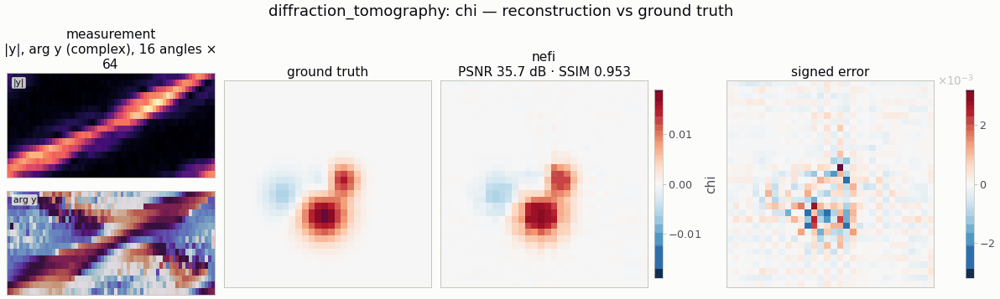

# `diffraction_tomography` — Born / Rytov inversion of a weak scattering contrast

<!-- nf-summary:start -->
<div class="nf-summary" markdown>

| At a glance | |
|---|---|
| **Problem** | The scattering contrast of a weakly scattering object from fields measured on a ring of receivers |
| **Unknown** | contrast χ = n²/n<sub>b</sub>² − 1 (bounded head), 32² |
| **Physics** | first-order Born (or Rytov) scattering with the 2-D Helmholtz Green's function |
| **Measurement** | complex scattered fields for 16 plane-wave illuminations × 64 receivers; data by iterated Lippmann–Schwinger (multiple scattering) on a 2× grid in float64 |
| **Difficulty classes** | `blobs`, `cells` |
| **Baselines** | `backpropagation` (filtered backpropagation), `grid` |
| **Metrics** | PSNR · SSIM · relative error |
| **Run** | `nefi run diffraction_tomography --smoke` · full: `nefi run configs/diffraction_tomography_full.yaml` |



Gallery run (32², 500 steps, 0.7 s on a CPU): PSNR 35.7 dB.

</div>
<!-- nf-summary:end -->

Recover the contrast `χ(x) = n(x)²/n_b² − 1` of a weakly scattering object on a square domain
(side `extent` μm, centered) from the complex scattered fields measured on a ring of receivers for
`n_angles` plane-wave illuminations (time dependence `e^{−iωt}`, `k0 = 2π n_b/λ`):

```
Born:   u_s(x_r; θ) = k0² Σ_j G(x_r − y_j) χ_j e^{i k0 d̂_θ·y_j} ΔA,    G = (i/4) H0⁽¹⁾(k0 r)
data:   (2, n_angles, n_receivers) = (Re u_s, Im u_s) + noise
```

```python
from nefi.instances.diffraction_tomography import DiffractionTomography
inst = DiffractionTomography(scene="cells", n_angles=8, rytov=True)
out = inst.run(seed=0)
out.metrics                                   # {"psnr", "ssim", "relative_error"}
fbp = inst.backpropagation(out.measurement)   # closed-form filtered backpropagation
```
CLI: `nefi run diffraction_tomography --smoke`,
`nefi bench configs/diffraction_tomography_full.yaml --methods neural,backpropagation,grid`.
Example: `python examples/diffraction_tomography.py`.

## Physics and discretization

* **Operator** — `nefi.physics.scattering.BornOperator` (linear, `homogeneity = 1`): receivers by
  quadrature with a precomputed Hankel matrix (receivers lie outside the domain → no singularity);
  `rytov=True` returns the first-order Rytov phase `u_s/u_inc`. Rebuilt per curriculum resolution.
* **Data generation (inverse-crime guard)** — `LippmannSchwingerOperator` on a 2× finer grid in
  float64: the total field solves `u = u_inc + G ∗ (k0² χ u)` by fixed-point (Born-series)
  iteration with FFT convolution against the Vico–Greengard–Ferrando truncated Green's function
  (point-source accuracy 0.16 % at λ/8); the scattered field of the *total* field is then measured.
  At the default contrast (χ_max = 0.02 over 4λ) the Born model differs from the data by ≈ 3 %.
  Tags: generator `lippmann-schwinger-iterated-2x-float64`, inversion `born-1x` (`rytov-1x`).
* **Scenes** (`DiffractionTomographyScenes`, analytic): `blobs` (2-4 Gaussian inclusions, mostly
  positive, one in four negative at half amplitude), `cells` (2-3 elliptical cells with smooth edges
  at `0.5·contrast` and nuclei at `contrast`).

## Prior, objective and curriculum

Neural field with a `Bounded(chi_min, chi_max)` head started at `χ = 0` (the homogeneous
background); `fit` = relative MSE on the stacked real/imaginary data, `tv` = isotropic TV. Two-stage
multiscale curriculum `n/2 → n` (NeTMY schedule). The Born operator is linear, so the neural field's
role is purely the prior: the implicit smoothing of the MLP plus TV against noise and the missing
spatial frequencies (only `|K| ≤ 2k0` is measured — the Ewald disk).

## Configuration (`DiffractionTomographyConfig`, defaults = smoke preset)

| field | default | meaning |
|---|---|---|
| `n`, `extent`, `wavelength`, `background_index` | 32, 4.0 μm, 1.0 μm, 1.0 | grid and optics |
| `scene`, `contrast` | blobs, 0.02 | phantom class, peak χ |
| `n_angles`, `n_receivers`, `receiver_radius` | 16, 64, 3.0 μm | illuminations, ring receivers |
| `rytov` | false | Rytov data model |
| `noise_std`, `supersample` | 0.01, 2 | noise (× max |data|), generator refinement |
| `ls_iterations`, `ls_tol`, `ls_relax` | 200, 1e-10, 1.0 | Lippmann–Schwinger solver |
| `chi_min`, `chi_max` | −0.05, 0.1 | head range |
| `hidden`, `depth`, `n_octaves` | 64, 4, 5 | neural field |
| `tv`, `steps`, `lr`, `lr_decay`, `grid_lr_mult` | 1e-3, (200, 300), 2e-2, 0.5, 1 | objective / optimization |

`PRESETS["full"]` / `configs/diffraction_tomography_full.yaml`: 96² over 8 μm, 64 illuminations ×
192 receivers, 256 × 6 MLP, 1500 + 3500 steps.

## Smoke results (CPU, seed 0)

| scene | zero field | filtered backprop. | grid | neural field |
|---|---|---|---|---|
| blobs (PSNR / SSIM) | 18.6 / 0.54 | 37.4 / 0.92 | 36.1 / 0.89 | 35.7 / 0.95 |
| cells | 13.8 / 0.50 | 26.3 / 0.66 | 27.5 / 0.79 | 27.7 / 0.87 |

(≈ 1 s per neural-field run on a CPU.)

With full-view, densely sampled data and smooth phantoms, filtered backpropagation is a strong
classical baseline (the data determine the Ewald disk almost completely); the neural field matches
it on smooth blobs and wins on piecewise-smooth cells (TV + MLP prior). Its advantage grows with
sparser angles (`n_angles: 4-8`), limited view, or higher noise, where FBP streaks.

## Baselines

`grid` (free pixels, same objective), `backpropagation` (Devaney's filtered backpropagation for
the circular full-view geometry, wrapped as a closed-form "direct" problem:
`problem.meta = {"solver": "direct", "reconstruct": fn}` for `nefi.baselines.solve`).
