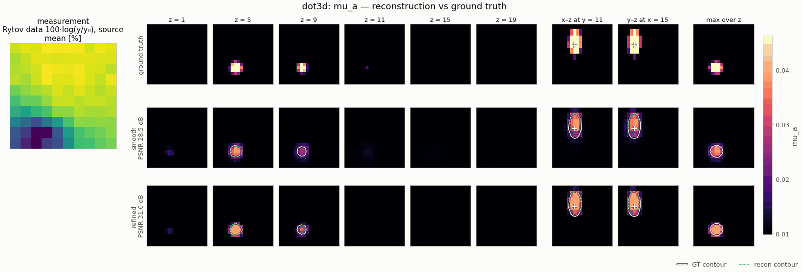

# `dot3d` — continuous-wave diffuse optical tomography

<!-- nf-summary:start -->
<div class="nf-summary volumetric" markdown>

| At a glance | |
|---|---|
| **Problem** | Continuous-wave diffuse optical tomography: the absorption of a scattering slab from surface reflectance |
| **Unknown** | absorption μ<sub>a</sub>(x, y, z) (bounded head), 32 × 32 × 16 voxels over 40 × 40 × 20 mm |
| **Physics** | diffusion approximation −∇·(D∇Φ) + μ<sub>a</sub>Φ = S with Robin boundaries; Jacobi-PCG, implicit-function-theorem adjoint |
| **Measurement** | top-face reflectance on a 12 × 12 detector grid for 3 × 3 sources, calibrated + 1 % noise; data on a 2× grid in float64 |
| **Difficulty classes** | `single`, `multi`, `deep` |
| **Baselines** | `grid`, `deep_decoder` |
| **Metrics** | PSNR · SSIM · MSE, plus inclusion IoU, depth error and contrast |
| **Run** | `nefi run dot3d --smoke` · full: `nefi run configs/dot3d_full.yaml` |



Gallery run (20 × 20 × 10; 700 steps, 17.9 s on a CPU): PSNR 28.5 dB; edge refinement accepted, IoU 0.71 → 0.74. Rotate it in the [3-D showcase](../gallery/3d.md).

</div>
<!-- nf-summary:end -->

Recover the absorption coefficient `μ_a(x, y, z)` (mm⁻¹) of a tissue-like scattering slab
(`μ_s' = 1 mm⁻¹`, background `μ_a = 0.01 mm⁻¹`) from the diffuse reflectance measured by a camera-like
grid of detector pixels on the **top face**, for 3×3 point sources on the same face. It is the
surface-to-volume elliptic inverse problem and NeFTY's structural twin: data on one face only, a
strongly smoothing forward map, and a sensitivity that decays by two orders of magnitude with depth.

```
DOT3DScenes (single | multi | deep inclusions) ─► diffusion FV on a 2× grid (float64), calibrated ─► (9, n_dx, n_dy) + 1 % noise
coords ─► annealed Fourier PE (3-D) ─► ReLU MLP ─► Bounded(0.8 μ_bg, μ_max) ─► μ_a
       ─► −∇·(D∇Φ) + (μ_a + κ_Robin) Φ = S  (Jacobi-PCG, IFT adjoint, warm starts) ─► top-face exitance / reference
       ─► masked relative MSE + λ·TV₃D ─► two-stage multiscale ─► PSNR / SSIM / inclusion IoU / depth error / contrast
```

```python
from nefi.instances.dot3d import DOT3D

inst = DOT3D(preset="smoke")              # 40×40×20 mm on 20×20×10 voxels, 150 + 200 steps
out = inst.run(seed=0, device="cpu")
print(out.metrics)                        # psnr, ssim, mse, iou, iou_2d, depth_error, depth_rmse, contrast
sens = inst.sensitivity(n_probes=64)      # ‖∂y/∂μ_a(x)‖ at the background (nefi.diagnostics)
```

CLI: `nefi run dot3d --smoke`, `nefi run configs/dot3d_full.yaml`, `nefi bench dot3d --smoke
--methods neural,grid --classes all`. Example: `python examples/dot3d.py [--set scene=deep]` writes
`dot3d.png` (depth slices and an x-z cut of GT / NF / voxel grid, the calibrated data and the
sensitivity maps / depth profile) and `metrics.json` under `runs/dot3d_smoke/`.

## Physics (`nefi.instances.dot3d.operator`)

Diffusion approximation of the radiative transfer equation (Arridge, *Inverse Problems* 15, 1999;
Durduran et al., *Rep. Prog. Phys.* 73, 2010) with the absorption-independent diffusion coefficient
`D = 1/(3μ_s')` (Furutsu & Yamada 1994), known and homogeneous:

```
−∇·(D∇Φ) + μ_a Φ = S,        Φ + 2AD ∂_nΦ = 0 on every face,       A = (1 + R_eff)/(1 − R_eff)
```

(`R_eff` from the Groenhuis fit of the refractive-index mismatch, `A ≈ 3.25` at `n = 1.4`; Haskell
et al. 1994). Sources: isotropic point sources one transport mean free path `1/μ_s'` below the top
face (cloud-in-cell, re-derived at every resolution). `DiffuseOpticalOperator` subclasses
`nefi.physics.elliptic.EllipticOperator` (cell-centered finite volumes, harmonic faces, Jacobi-PCG,
implicit-function adjoint, warm starts) and overrides three hooks:

* `coefficient()` — the known `D` on the grid (the field provides only `μ_a`);
* `kappa_value()` — `κ = μ_a + κ_b`: the **exact finite-volume Robin flux** as Neumann sides plus a
  boundary-cell sink `κ_b = K_b/h`, `K_b = 1/(2A + h/2D)` (the half-cell diffusion resistance in
  series with the boundary "film"); no ghost state, second order;
* `post()` — the top-face exitance `J = K_b Φ₀`, bilinearly interpolated and averaged over each
  detector's square footprint (3×3 sub-samples), then **calibrated** by the readings of the
  homogeneous reference slab (`reference_mua`, solved once per resolution/device/dtype and cached):
  the normalized data of difference DOT (O'Leary et al. 1995; Pogue et al. 1999). Unknown source /
  detector couplings and most of the systematic discretization error cancel in the ratio.

The output `(n_sources, n_dx, n_dy)` does not depend on the grid, so every curriculum stage fits the
same measurement. The map is monotone (more absorption, less light) and not homogeneous
(`homogeneity = None`).

## Data, scenes, losses

`DOT3DScenes` (physical mm, cell-averaged spheres of raised absorption): `single` (one inclusion,
center depth 5–8 mm), `multi` (2–3 laterally separated inclusions at 4–11 mm), `deep` (one at
10–13 mm), radius 3–5 mm, `μ_a` 0.03–0.05 mm⁻¹ (3–5× the background). `DOTDataGenerator` simulates
on a 2× finer grid in float64 (`fidelity_tag = "dot-fv-robin-2x-float64"` vs
`"dot-fv-robin-calibrated"`), masks source–detector pairs closer than `min_separation = 6 mm`
(diffusion theory fails there and they dominate the dynamic range) and applies 1 % multiplicative
Gaussian noise (per-entry `noise_std` tensor). Data term: `RelativeResidualMSE` —
`mean_obs [(pred − obs)/|obs|]²`, the weighted least squares of multiplicative noise; prior: isotropic
3-D TV (`tv = 1`).

The head `Bounded(μ_min = 0.008, μ_max = 0.1)` starts at the background; with `μ_min` just below
`μ_bg` the sigmoid's flat lower tail acts as an **absorbers-only prior** (inclusions add absorption).
It is the single most effective setting found: with `μ_min = 0.002` the half-max IoU of a single-
inclusion scene drops from 0.83 to 0.58 and the depth error rises from 0.5 to 1.2 mm (24×24×12
slab, TV 1, tanh field). TV had to be raised to `1`: at `1e-2` it is ~100× weaker than the data term and
the deep, unconstrained voxels drift (half-max IoU 0.24 at TV 0.1 vs 0.58 at TV 1, same setting).

## Sensitivity: why depth is hard (`nefi.diagnostics.sensitivity_map`)

```python
sens = inst.sensitivity(n_probes=64)       # column norms of the Jacobian at μ_a = μ_bg (masked data)
profile = sens.mean(dim=(0, 1))            # per depth slice
```

`DOT3D.sensitivity()` linearizes the calibrated operator at the homogeneous background and returns
`‖∂y/∂μ_a(x)‖` (stochastic output probes, i.e. one adjoint solve per probe; `exact=True` costs one
solve per voxel). On the smoke slab (2 mm voxels) the mean sensitivity falls **≈ 200× from the top
to the bottom slice** (205× with exact columns, 160× with the 64-probe estimate), monotonically,
and laterally it peaks under the sources: the data barely constrain the lower half of the slab. This is the reason
for the depth metrics below, for the depth-dependent contrast loss of every method, and for the
`deep` class. `tests/test_dot3d.py` asserts a > 10× top/bottom ratio and a monotone profile.

`nefi diagnose dot3d --smoke` runs the whole diagnostics report on this operator (≈ 2 s): the
sensitivity dynamic range is 1.4e5 (max/min over the voxels), the top singular values of
`dF/dμ_a` are 100, 57.5, 57.3, 44.2, and the neural-field filter kernel `G_θ e_i` has a 16-voxel main
lobe at `β = 0` (13 at `β = K`). The Jacobian-vector products behind these numbers are exact in
every mode: forward mode (`torch.func.jvp`, the diagnostics' default) uses the implicit-function
tangent rule of the elliptic core (`u̇ = A⁻¹(ḃ − (∂A/∂σ·σ̇)u − κ̇⊙u)`, one cold-started PCG solve, so
warm starts cannot truncate tangents), and double backward / Hessian-vector products work because
the detector readout is an index gather (twice differentiable, unlike `grid_sample`). The top
singular values agree across `jvp_mode` = forward / double_backward to 5e-5 (float32). The
operator keeps no `torch.func` wrapper in its caches (the calibration reference is solved on the
transform-safe implicit path when first requested inside a transform, and not cached then).

## Metrics (`DOT3D.evaluate`)

Contrast-independent, because DOT under-recovers the absorption contrast by design (the smoothing
forward map spreads a compact inclusion over a larger, weaker blob):

* `psnr`, `ssim` (slice-averaged), `mse` on `μ_a`;
* `iou` — volumetric IoU of the **half-maximum** masks `{e > ½ max e}` of the absorption excess
  `e = [μ_a − μ_bg]_+` (`iou_fraction`), `iou_2d` — the lateral footprint IoU;
* `depth_error` — `|z̄_pred − z̄_gt|` (mm) of the excess-weighted inclusion centroids;
* `depth_rmse` — RMSE (mm) of the 2.5-D excess-weighted depth maps over the columns detected in both
  (NeFTY App. H-style; NaN if none);
* `contrast` — recovered / true peak excess (1 = full contrast recovery).

## Configuration (`DOT3DConfig`) and presets

| field | default | smoke | meaning |
|---|---|---|---|
| `extent`, `grid` | (40, 40, 20) mm, (32, 32, 16) | (20, 20, 10) | slab, voxels (last axis = depth) |
| `musp`, `refractive_index`, `mua_background` | 1.0, 1.4, 0.01 | | optics (mm⁻¹) |
| `source_grid`, `source_span` | (3, 3), 0.6 | | sources on the top face |
| `detector_grid`, `detector_span`, `detector_samples` | (12, 12), 0.85, 3 | (10, 10) | detector pixels |
| `min_separation`, `calibrate`, `noise_std`, `supersample` | 6 mm, true, 0.01, 2 | | data |
| `tol`, `max_iter`, `check_every`, `warm_start` | 1e-7, null, 1, true | | PCG (float32 floor ≈ 1e-6) |
| `scene`, `inclusion_mua`, `inclusion_radius`, `depth_*`, `lateral_span` | single, (0.03, 0.05), (3, 5), … | | scenes |
| `mua_min`, `mua_max`, `log_param` | 0.008, 0.1, false | | head (`LogBounded` if `log_param`) |
| `hidden`, `depth`, `skip_at`, `n_octaves`, `activation` | 128, 4, 2, 4, relu | 64, 3, 2 | neural field (ReLU, as NeFTY) |
| `tv`, `tv_eps` | 1.0, 1e-4 | | TV weight |
| `steps`, `lr`, `lr_decay`, `anneal_fraction`, `min_coarse` | (300, 600), 1e-2, 0.5, 0.3, 6 | (150, 200) | curriculum |
| `iou_fraction`, `grid_lr`, `dd_*` | 0.5, 5e-2, … | | metrics / baselines |

Presets: `smoke`, `multi`, `deep`, `default`. Configs: `configs/dot3d_smoke.yaml`,
`configs/dot3d_full.yaml` (32×32×16, 600 + 1200 steps).

## Baselines (`DOT3D.baselines()`)

`grid` (free voxels with the same bounded head, TV and calibrated operator) and `deep_decoder`.
There is no closed-form classical reference in the instance; the linearized (Born/Rytov) Tikhonov
one-step reconstruction is a natural addition (the Jacobian columns are `−Φ_s G_d` from one forward
and one adjoint solve per source / detector).

## Validation (`tests/test_dot3d.py`, ≈ 25 s)

| check | result |
|---|---|
| exact finite-volume flux balance: absorbed + escaped through the Robin faces = source power | to 1e-8 (1e-6 asserted) |
| diffuse reflectance vs the semi-infinite dipole solution (Farrell, Patterson & Wilson 1992), 1 mm voxels | ratio 1.02–1.06 at 12–20 mm (1.09–1.14 at 8–10 mm; the dipole's extrapolated boundary is itself approximate near the source) |
| convergence of the uncalibrated readings vs a 96×96×48 reference | 7.6 % (24³-class), 3.0 % (32), 1.1 % (48): second order, large constant from the near-boundary source |
| calibrated native-vs-2× model mismatch (24×24×12, six scenes) | 0.07–0.9 % rms (raw: 6.5 %) |
| IFT gradient vs central finite differences (float64, `tol = 1e-12`) | ≤ 1e-5 relative |
| forward-mode (`torch.func.jvp`) and double-backward JVPs vs central differences (fresh, warm-started operator) | ≤ 1e-5 relative |
| sensitivity top / bottom slice (smoke slab) | 205× exact, 160× from 64 probes (> 10× asserted) |
| scenes: depth classes separated, `avg_pool(2× render) = native` | ≤ 1e-6 |

Solver cost (one CPU thread, 9 sources batched, warm-started): 20×20×10 forward + adjoint 25 ms
(21 / 24 PCG iterations), 32×32×16 98 ms (29 / 30). The CG tolerance must stay tight: with warm starts
a relative tolerance of 1e-4 (measured against the source-dominated right-hand side) lets the solver
return after 0 iterations while the far-detector readings still lag the field, and the inversion
fails (PSNR 2.7 dB).

Inversion (smoke preset, 1 % noise; mean over seeds 0–1; PSNR dB / SSIM / half-max IoU / depth
error mm / contrast):

| scene | method | PSNR | SSIM | IoU (½ max) | depth error [mm] | contrast | time [s] |
|---|---|---|---|---|---|---|---|
| single | neural field | 26.3 | 0.905 | 0.58 | 0.95 | 0.63 | 17 |
| single | voxel grid | 25.4 | 0.896 | 0.59 | 1.08 | 0.48 | 10 |
| multi | neural field | 19.0 | 0.617 | 0.28 | 0.74 | 0.31 | 8 |
| multi | voxel grid | 19.1 | 0.632 | 0.32 | 0.75 | 0.28 | 6 |
| deep | neural field | 22.2 | 0.856 | 0.24 | 1.29 | 0.15 | 8 |
| deep | voxel grid | 22.0 | 0.845 | 0.21 | 1.53 | 0.12 | 6 |

The neural field is at least on par with the free voxel grid under the *same* objective (the TV +
absorbers-only head do much of the regularization work in both) and better where DOT is weakest:
contrast recovery and inclusion depth for single and deep inclusions (seed 0 single: NF 28.2 dB,
contrast 0.90 vs grid 27.0 dB, 0.64). Every method loses contrast with depth, exactly as the
sensitivity profile predicts; times are wall-clock on a 4-thread CPU; the NF smoke
run takes ≈ 7 s of CPU time on one core.

## Notes and limitations

* Continuous wave only (no frequency or time domain), so absorption and scattering are not
  separable; `μ_s'` is assumed known and homogeneous.
* The background `μ_a` is assumed known (it is the reference of the calibration and the head's
  starting value); recovering an unknown background needs uncalibrated data or a nuisance scale.
* The inclusions of the `multi` class at different depths are resolved only partially (the
  half-maximum masks follow the shallowest, best-sensed one), and the `deep` class keeps
  < 20 % contrast — the physics limit shown by the sensitivity map, not an optimizer failure.
