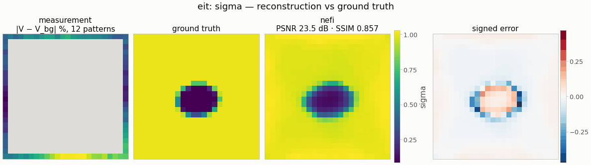

# `eit` — electrical impedance tomography

<!-- nf-summary:start -->
<div class="nf-summary" markdown>

| At a glance | |
|---|---|
| **Problem** | Electrical impedance tomography: conductivity from the boundary voltages of injected current patterns |
| **Unknown** | σ(x) ∈ [σ<sub>min</sub>, σ<sub>max</sub>] (log-parameterized bounded head), 32² on [−1, 1]² |
| **Physics** | −∇·(σ∇u) = 0 with Neumann current patterns; harmonic-mean finite volumes, Jacobi-PCG, implicit-function-theorem adjoint |
| **Measurement** | boundary potentials of 8 trigonometric current patterns (optional electrode gap model); data on a 2× grid in float64 |
| **Difficulty classes** | `single`, `multi`, `contrast` |
| **Baselines** | `grid` |
| **Metrics** | PSNR · SSIM · MSE · relative error · inclusion IoU |
| **Run** | `nefi run eit --smoke` · full: `nefi run configs/eit_full.yaml --device cuda` |



Gallery run (smoke preset: 24², 12 current patterns; 600 steps, 5.3 s on a CPU): PSNR 23.5 dB, inclusion IoU 0.94.

</div>
<!-- nf-summary:end -->

Recover the conductivity `σ(x) ∈ [σ_min, σ_max]` of a square body `[−1, 1]²` from the boundary
potentials produced by trigonometric current patterns (the Neumann-to-Dirichlet map; Calderón
1980, Cheney, Isaacson & Newell 1999):

```
−∇·(σ∇u_p) = 0 in Ω,    σ ∂u_p/∂ν = j_p on ∂Ω,    ∮ j_p = 0,    observe u_p|∂Ω,   p = 1..n_patterns
j_{2m} = A cos(2π(m+1)s/P),   j_{2m+1} = A sin(2π(m+1)s/P)        (s = arc length, P = perimeter)
```

```python
from nefi.instances.eit import EIT
out = EIT(n=24, n_patterns=12, contrast=(8, 12), hidden=128, depth=4, n_octaves=3,
          activation="relu", steps=(200, 400), lr=1e-2).run(seed=0)       # the smoke preset
out.metrics      # {"psnr", "ssim", "mse", "relative_error", "inclusion_iou"}
```
CLI: `nefi run eit --smoke`, `nefi run configs/eit_full.yaml --device cuda`,
`nefi bench configs/eit_full.yaml --methods neural,grid --classes all`.
Example: `python examples/eit.py --config configs/eit_smoke.yaml` → `runs/eit_smoke/eit.png`.

## Physics and discretization (`nefi.instances.eit.operator`)

* **Solver** — `EITOperator` is an `EllipticOperator` (see [physics_elliptic.md](../physics_elliptic.md)):
  harmonic-mean finite volumes (NeFTY Prop. 1), pure-Neumann Jacobi-PCG with the compatibility
  projection and zero-mean gauge, implicit-function adjoint, warm starts across optimization steps,
  all patterns solved as one batch.
* **Current injection** — `eit_boundary(domain, n_patterns, amplitude, electrodes, coverage)` walks
  the boundary faces counter-clockwise from `(x_lo, y_lo)`, assigns each face the *face-averaged*
  pattern (so the injected current is exact at every resolution and `∮ j = 0` holds to round-off)
  and adds `j/h_n` to the boundary cell's right-hand side (finite-volume flux balance).
  `electrodes = L > 0` switches to the **gap model** (Somersalo et al. 1992): `L` electrodes of
  relative coverage `electrode_coverage` carry `I_l = A (P/L) trig(ω s_l)` uniformly, gaps carry
  nothing, and only electrode cells are observed.
* **Observable** — for every boundary face the trace `u_face = u_cell + (h_n/2) j/σ_cell`
  (second-order extrapolation with the known flux). The traces are mapped by periodic arc-length
  interpolation onto the faces of the *native* measurement grid and averaged per strip cell with the
  observed boundary length as weight; potentials are referenced to their boundary-weighted mean
  (`∮ u = 0` gauge). Every curriculum resolution therefore predicts the same observable, and the
  measurement is never downsampled. Using cell values instead of traces would leave an `O(h)` bias
  of ~65 % of the inclusion signal at 16²; with traces the native model at the true σ reproduces the
  2×-finer data to 4 % of the inclusion signal (16²; 3 % at 32²).
* **Measurement** — `(n_patterns, n, n)` with `mask` = boundary strip (or electrode cells);
  unobserved entries are zero, so no interior potential leaks into the inversion.

## Data (inverse-crime guard)

`SupersampledObservationGenerator`: the same physics on a `supersample = 2`× finer grid in float64
(`tol = 1e-10`), observed on the native strip, plus Gaussian noise of `noise_std × max|V|` on the
observed entries; `fidelity_tag = "elliptic-fv-2x-float64"` vs the inversion's `"elliptic-fv"`.
Scenes (`EITScenes`, analytic ellipses with sub-cell area coverage, background `σ_bg = 1`):

| class | content |
|---|---|
| `single` | one conductive or resistive ellipse, contrast 3–6 |
| `multi` | 2–3 non-overlapping ellipses of either polarity |
| `contrast` | one ellipse with contrast 10–20 (where the harmonic mean matters most) |

## Inversion

* field: `NeuralField` with `LogBounded(σ_min, σ_max)` head (`log_param=True`, log-uniform
  conductivity) or `Bounded`; **ReLU** MLP with few Fourier octaves — for this smooth, severely
  ill-posed problem ReLU was decisively better than tanh (32², 16 patterns, 600 steps: PSNR 23.1
  vs 14.8 dB, SSIM 0.87 vs 0.40, inclusion IoU 0.94 vs 0);
* losses: masked `MSE` + isotropic `TV(σ)` (`tv = 1e-5`);
* curriculum: two stages; `n/2 → n` when `n/2 ≥ min_coarse` (= 12), otherwise both stages at `n`
  (LR decay and annealing restart per stage — in a seeded smoke A/B the restart gained 1.0 dB
  mean PSNR on EIT, better in 6/6 paired runs, and 0.5 dB on Darcy);
* baseline `grid`: free pixels with the same head, losses and curriculum (`grid_lr`).

## Metrics

`psnr`, `ssim`, `mse`, `relative_error` on σ, and `inclusion_iou`: half-maximum supports
(`|log σ/σ_bg| > ½ max`, each map at its own peak, conductive and resistive matched separately).

## Configuration (`EITConfig`)

| field | smoke | full | meaning |
|---|---|---|---|
| `n` | 24 | 64 | cells per axis on `[−half_width, half_width]²` |
| `n_patterns` | 12 | 16 | current patterns (frequencies 1…n_patterns/2) |
| `amplitude` | 1 | 1 | current density amplitude |
| `electrodes`, `electrode_coverage` | 0, 0.5 | 0, 0.5 | 0 = continuum model |
| `sigma_bg`, `sigma_min`, `sigma_max` | 1, 0.05, 20 | same | background and head bounds |
| `contrast`, `high_contrast`, `radius`, `center_radius`, `inclusion_gap`, `subsample` | (8, 12), (10, 20), (0.2, 0.4), 0.5, 0.1, 4 | (3, 6), rest same | scenes |
| `noise_std`, `supersample` | 1e-3, 2 | 1e-3, 2 | data |
| `tol`, `max_iter`, `precond`, `grad_mode`, `warm_start`, `check_every` | 1e-6, auto, jacobi, ift, true, 1 | same, `check_every` 8 | PDE solver |
| `hidden`, `depth`, `skip_at`, `n_octaves`, `activation` | 128, 4, 2, 3, relu | 256, 6, 3, 4, relu | field |
| `steps`, `lr`, `lr_decay`, `anneal_fraction` | (200, 400), 1e-2, 0.5, 0.5 | (1000, 3000), 5e-3, 0.5, 0.5 | curriculum |
| `tv`, `tv_eps`, `data_loss` | 1e-5, 1e-3, mse | same | losses |
| `grid_lr` | 0.05 | 0.05 | grid baseline |

Smoke result (seed 0, `single` — a resistive inclusion, σ ≈ 0.09 in σ_bg = 1 — 600 steps, the
gallery's budget at `--budget 0.1`; ≈ 6 s solve on a CPU, ≈ 10 ms per 24² step):
neural PSNR 23.5 dB / SSIM 0.86 / inclusion IoU 0.94 vs uniform 12.3 dB / 0.53 / 0; grid (same
objective and budget) 16.7 dB / 0.54 / 0.51. The smoke problem is sized to be informative: with
a 16² grid, 4 patterns and 150-200 steps the inclusion comes out as one blurry blob (16.5 dB,
IoU 0.46); 8 patterns give 21.3 dB / IoU 0.91, 16 patterns 23.9 dB / 0.91 at 1.3× the step cost.
Seed 1 (also resistive) gives 25.6 dB / IoU 0.81. Conductive inclusions of contrast ≈ 10 saturate the
boundary data (current already flows through a σ = 3 inclusion almost as through σ = 10): at this
budget they are located but blurred and strongly underestimated (seed 2, σ = 10.9: σ_max ≈ 2,
IoU 0.39).

Display: the raw patterns are smooth trigonometric profiles around the ring whatever the interior,
so the viewers' compact measurement panel (gallery tile, compare figure) shows
`EIT.difference_data` instead (`measurement_image` hook): per boundary cell, the RMS over the
patterns of `V − V_bg` (`V_bg` = prediction for the homogeneous body) in % of the RMS boundary
voltage — the difference-EIT signature, largest on the side nearest the inclusion (seed 0:
8.6-11.4 %, noise 0.4 %). Full measurement views and data-fit plots stay on the raw stack.
