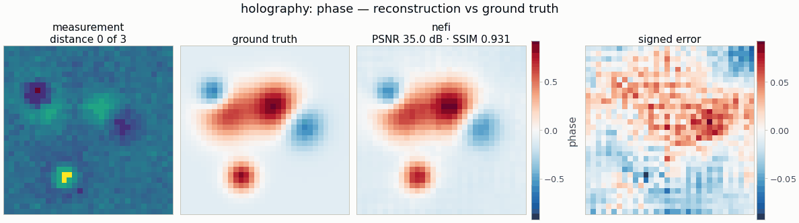

# `holography` — multi-distance inline phase retrieval

<!-- nf-summary:start -->
<div class="nf-summary" markdown>

| At a glance | |
|---|---|
| **Problem** | The phase of a thin transparent sample from inline holograms recorded at several distances |
| **Unknown** | phase φ (zero-mean bounded head: the global phase is invisible to intensities), 32² |
| **Physics** | thin-object transmission and band-limited angular-spectrum propagation with edge padding |
| **Measurement** | intensities at 3 distances + noise; data on a 2× grid in float64, intensities area-averaged onto the pixels |
| **Difficulty classes** | `smooth_phase`, `cells` |
| **Baselines** | `gerchberg_saxton` (multi-plane), `grid` |
| **Metrics** | PSNR · SSIM · RMSE (mean-subtracted) |
| **Run** | `nefi run holography --smoke` · full: `nefi run configs/holography_full.yaml` |



Gallery run (32², 400 steps, 0.6 s on a CPU): PSNR 35.0 dB.

</div>
<!-- nf-summary:end -->

Recover the phase `φ(x)` (rad) of a thin transparent sample (transmission `t = exp(iφ − a)` with
known constant absorption `a`, plane-wave illumination) from intensity images recorded at several
propagation distances `z_i`:

```
I_i(x) = | P_{z_i} t |²(x) + noise,     P_z = angular-spectrum propagator (band-limited)
```

```python
from nefi.instances.holography import Holography
inst = Holography(scene="cells", distances=(10.0, 25.0, 50.0))
out = inst.run(seed=0)
out.metrics                                   # mean-subtracted {"psnr", "ssim", "rmse"}
gs = inst.gerchberg_saxton(out.measurement)   # multi-plane Gerchberg–Saxton baseline
```
CLI: `nefi run holography --smoke`,
`nefi bench configs/holography_full.yaml --methods neural,gerchberg_saxton,grid`.
Example: `python examples/holography.py`.

## Physics and discretization

* **Operator** — `nefi.physics.optics.HolographyOperator`: thin-object transmission, zero-phase
  FFT propagation with the exact transfer function `exp(i2πz√(1/λ² − f²))`, evanescent waves
  dropped, Matsushima–Shimobaba band limit, **edge padding** ×2 (the sample sits in an infinite
  uniform background; zero padding would add an aperture). Output `(n_distances, n, n)`; the
  detector pitch equals the field grid spacing at every curriculum stage (coarse stages compare
  with area-averaged intensities through `downsample_obs`).
* **Data generation (inverse-crime guard)** — the phantom sampled on a 2× finer grid, propagated in
  float64 with its own (finer) transfer functions, intensities area-averaged onto the detector
  pixels (a pixel integrates intensity), then Gaussian noise (`noise_std` × max intensity). Tags:
  generator `angular-spectrum-2x-float64`, inversion `angular-spectrum-1x`.
* **Scenes** (`HolographyScenes`): `smooth_phase` (3-5 Gaussian bumps, ±, normalized to
  `phase_amplitude`), `cells` (2-4 smooth elliptical plateaus with denser nuclei).

## Ambiguities and metrics

Intensities are invariant to a global phase offset (`|P_z(e^{ic} t)|² = |P_z t|²`), so the offset
is fixed **in the model**: the phase head is `ZeroMean(Bounded(...))`
(`nefi.fields.ZeroMean`, `zero_mean = True`) — the reconstruction has zero spatial mean by
construction — and the phantoms are zero-mean too (`HolographyScenes(zero_mean=True)`; the offset
does not change the simulated intensities). Reconstruction and ground truth therefore share one
gauge and are directly comparable in every figure; before, the network's arbitrary drift left the
reconstruction ≈ 0.5 rad below the truth. The metrics still subtract the mean (`phase_psnr`,
`phase_ssim`, mean-subtracted RMSE; tested), so they are offset-invariant for any
parameterization (`zero_mean = False`, baselines). A single distance leaves the zeros of the
phase-contrast transfer function `sin(πλz|f|²)` (twin-image / low-frequency ambiguity); several
distances (default 10, 25, 50 μm at λ = 0.5 μm, 1 μm pixels) fill them.

## Prior, objective and curriculum

Neural field with a `ZeroMean(Bounded(−phase_bound, phase_bound))` head (default ±π) started at 0,
`fit` = relative intensity MSE, `tv` = isotropic TV on the phase, two-stage multiscale curriculum
`n/2 → n`.

## Configuration (`HolographyConfig`, defaults = smoke preset)

| field | default | meaning |
|---|---|---|
| `n`, `pixel_size`, `wavelength` | 32, 1.0 μm, 0.5 μm | detector grid and optics |
| `distances` | (10, 25, 50) μm | propagation distances |
| `scene`, `phase_amplitude`, `absorption` | smooth_phase, 1.0 rad, 0.0 | phantom |
| `noise_std`, `supersample` | 0.01, 2 | data generation |
| `pad_factor`, `pad_mode`, `band_limit` | 2.0, edge, true | propagation |
| `phase_bound`, `zero_mean` | π, true | head range; `ZeroMean` gauge (and zero-mean phantoms) |
| `hidden`, `depth`, `n_octaves` | 64, 4, 6 | neural field |
| `tv`, `steps`, `lr`, `lr_decay`, `grid_lr_mult` | 1e-4, (150, 250), 1e-2, 0.5, 10 | objective / optimization |
| `gs_iterations` | 100 | Gerchberg–Saxton baseline |

`PRESETS["full"]` / `configs/holography_full.yaml`: 128² at 0.5 μm, four distances 20-130 μm,
256 × 6 MLP, 1500 + 3500 steps, 300 GS iterations.

## Smoke results (CPU, seed 0; mean-subtracted phase)

| scene | zero phase | Gerchberg–Saxton | grid | neural field |
|---|---|---|---|---|
| smooth_phase (PSNR / SSIM) | 15.9 / 0.02 | 27.3 / 0.76 | 31.7 / 0.90 | 35.0 / 0.93 |
| cells | 15.4 / 0.02 | 28.0 / 0.73 | 32.9 / 0.88 | 28.0 / 0.78 |

(≈ 1 s per neural-field run on a CPU, 400 steps = the gallery budget; `smooth_phase` over
seeds 0-2: 35.0 / 36.0 / 33.3 dB.) The `ZeroMean` gauge does not change the objective — the fit
and TV are offset-invariant, so losses and parameter gradients agree to float32 rounding with and
without it — it only removes the arbitrary offset from the reconstruction; metric differences to an
unconstrained head are run-to-run (chaotic) variation, up to ±2 dB on `cells` at this budget.
Gerchberg–Saxton leaves a slowly varying phase ramp (the weakly constrained low spatial
frequencies); on the piecewise-flat `cells` the free grid fits the plateaus' sharp edges better
than the smooth MLP at this budget.

## Baselines

`grid` (free-pixel phase, same objective) and `gerchberg_saxton` (sequential multi-plane
projections with the operator's own propagation model, wrapped as a closed-form "direct" problem).
