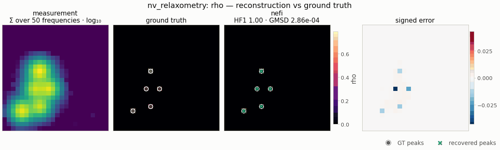

# NV relaxometry — NeTMY

<!-- nf-summary:start -->
<div class="nf-summary paper" markdown>

| At a glance | |
|---|---|
| **Problem** | Sparse spin sources and their local Larmor field from the magnetic-noise spectra of a widefield NV-center array — NeTMY, [arXiv 2605.13988](https://arxiv.org/abs/2605.13988) |
| **Unknown** | spin density ρ ≥ 0 (gated softplus, NeTMY Eq. 5) and Larmor field ω<sub>L</sub> on its support (Eq. 26); 64² pixels of 20 nm |
| **Physics** | tensor power-summed dipolar kernel ∗ ρ times a Lorentzian (F2, FFT); the coherent F1 for comparison |
| **Measurement** | noise spectra S(ω, r), 50 frequencies × 64², simulated by the source-side direct sum F3 (float64) + 1 % noise |
| **Difficulty classes** | `few` / `medium` / `many` sources × `close` / `medium` / `far` separation (8 classes) |
| **Baselines** | `grid` / `grid_f1` (Tikhonov under F2 / F1), `f1`, `f2` (the neural field under either operator) |
| **Metrics** | Hungarian F1 · sliced Wasserstein · GMSD · masked SSIM · MSE |
| **Run** | `nefi run nv_relaxometry --smoke` · paper scale: `nefi run configs/nv_relaxometry_paper.yaml --device cuda` |



Gallery run (smoke geometry: 24² grid, NV standoff of 3 pixels, 3–5 sources that merge in the measurement; 600 steps, 0.6 s on a CPU): Hungarian F1 1.00.

</div>
<!-- nf-summary:end -->

`nefi.instances.nv_relaxometry` implements **NeTMY** (Zhao, Zhong, Hu, de Leon, Allen-Blanchette,
*Neural Fields for NV-Center Inverse Sensing*, arXiv 2605.13988): recovering a sparse spin-source
density `ρ ≥ 0` and its local Larmor field `ω_L` from a single noisy magnetic-noise spectrum
`S_obs(ω, r)` read out by a widefield NV-center array at standoff `z0`. It is label-free and
amortization-free: a coordinate neural field is optimized per measurement through a differentiable
forward operator.

```
NVScenes ──► F3 direct simulator (float64) + 1 % noise ──► S_obs (50, 64, 64)
coords ─► annealed Fourier PE (K = 12) ─► MLP 5×320 tanh + skip ─► ρ = softplus(h)·σ(g)
                                                                 ω_L = 1{ρ > 0.3 max ρ}·Bounded(h_ω)
      ─► F2 = (P ∗ ρ)(r) · L(ω; ω_L(r)) ─► D + R_nm + R_ds + ℓ1 + TV ─► AdamW
curriculum 32² (3000 steps) → 64² (7000 steps) ─► energy-anchored scale correction (Eq. 30)
```

## Physics

* **Dipolar Green tensor** (Eq. 1/8), `R = (r − r_src, z0)`:
  `G_ia(R) = (μ0/4π)(3 R_i R_a − |R|² δ_ia)/|R|⁵`, with `μ0 = 4π × 10⁻⁷`.
* **Tensor power kernel** (F2, Eq. 2): `P(R) = Σ_a |G_az(R)|²`, which for a z-aligned NV has the
  closed form `(μ0/4π)² (|R|² + 3 z0²)/|R|⁸` (verified in the tests). Its FWHM is ≈ 0.87 z0, so at
  the paper geometry (20 nm pixels, z0 = 20 nm) the point-spread function is about one pixel wide,
  and `P(1 px)/P(0) = 5/64`.
* **F2** (tensor/incoherent, linear in ρ): `F2 = (P ∗ ρ)(r) · L(ω; ω_L(r))`.
* **F1** (scalar/coherent, quadratic in ρ): `F1 = ((G_zz ∗ ρ)(r))² · L(ω; ω_L(r))`.
* **F3** (Eq. 11, source-side direct sum): `F3 = Σ_s ρ(s) P(r − s) L(ω; ω_L(s))`, float64, no FFT.
* **Lorentzian** (Eq. 13): `L(ω; ω_L) = γ²/((ω − ω_L)² + γ²)`, γ = 0.5 GHz.

Units: `units="normalized"` (default) divides every channel by the peak of a z-aligned NV,
`g0 = 2(μ0/4π)/z0³`, so `max P = max |G_zz| = 1` at every grid resolution (the constant is
analytic, not grid-dependent). `units="physical"` evaluates SI values with domain lengths converted
by `length_scale` (1e-9: domain in nm). Kernels act on per-cell source weights, as in Eq. (11)
(no cell-area factor; all fidelities are normalized and the scale correction absorbs it).

Convolutions use `FFTConvolution` with zero padding and the full `2n − 1` kernel extent, so they
are exact linear (non-periodic) convolutions at every curriculum resolution.

## Package layout and API

| Module | Contents |
|---|---|
| `physics.py` | `MU0`, `dipolar_green_tensor(R)`, `DipolarKernels(z0, units, length_scale, nv_axis)` (`.channels/.power/.nv/.channel`, and `.power_fn()/.nv_fn()/.channel_fn(a)` kernel callables with the `FFTConvolution` signature `(spacing, shape, device, dtype)`), `power_kernel_fn`, `gzz_kernel_fn`, `channel_kernel_fn`, `lorentzian`, `frequency_grid` |
| `operator.py` | `NVOperator(domain, freqs, z0, gamma, mode="F2"\|"F1", units, ...)` — `{rho, omega_L}` → `(n_freq, H, W)`, `homogeneity` 1 (F2) / 2 (F1), `at_resolution`, `output_shape`; `NVDirectSimulator` (F3, `fidelity_tag="F3-direct-float64"`) |
| `losses.py` | `noise_map(S)`, `normalized_noise_map(S, "max"\|"mean")`, `DirectDensityLoss` (R_ds) |
| `scenes.py` | `NVScenes` (8 paper classes, analytic placement, any `shape`), `PAPER_CLASSES` |
| `data.py` | `NVDataGenerator` (noise relative to each sample's dynamic range), `downsample_spectrum` |
| `__init__.py` | `NVRelaxometryConfig`, `NVRelaxometry` (registered `"nv_relaxometry"`), `build_problem`, `make_problem`, `default_curriculum`, `METRICS` |
| `nefi/metrics/localization.py` | `gmsd`, `hungarian_f1`, `peak_positions`, `peak_match`, `sliced_wasserstein` (`"swd"`), `wasserstein2_1d` |

`NVRelaxometry` methods: `domain()`, `operator(mode)`, `direct_simulator()`, `scene_generator()`,
`data_generator()`, `field(seed)`, `losses(measurement)`, `build_problem(measurement, mode, seed)`,
`default_curriculum()`, `build_grid_problem(measurement, mode)`, `baselines()`
(`grid`, `grid_f1`, `f1`, `f2`), `metrics()`, `evaluate(result, gt)`, `run(seed, device,
scene_class)` and `compare(seed, scene_class, methods, step_scale)` (Tab. 1 on one sample in one
call).

Registry entries: instance `nv_relaxometry`; operators `nv_relaxometry` (F1/F2) and `nv_direct`
(F3); loss `nv_direct_density`; scene `nv_relaxometry`; metrics `gmsd`, `hungarian_f1`,
`sliced_wasserstein`/`swd`.

## Paper → code

| Paper item | Code | Config field(s) |
|---|---|---|
| Eq. (1)/(8) Green tensor | `physics.dipolar_green_tensor`, `DipolarKernels` | `z0`, `units`, `length_scale`, `nv_axis` |
| Eq. (2) F2, F1 | `operator.NVOperator(mode=...)` | `mode` |
| Eq. (9) FFT factorization exact for constant ω_L | `tests::test_f2_matches_f3_for_constant_larmor` | — |
| Eq. (11) F3 direct simulator | `operator.NVDirectSimulator` via `NVDataGenerator` | `data_operator` |
| Eq. (13) Lorentzian, App. A.7 | `physics.lorentzian` | `gamma`, `freq_range`, `n_freq` |
| App. A.8 χ robustness | `tests::test_f2_departs_from_f3_when_larmor_varies_within_kernel` | — |
| Eq. (3) canonical objective / App. E.2 Tikhonov | `NVRelaxometry.build_grid_problem` | `grid_*` |
| Eq. (5) gated softplus | `fields.GatedSoftplus` | — |
| Eq. (26) support-masked Larmor head | `fields.SupportMasked(Bounded(...), "rho", tau)` | `tau`, `larmor_band`, `larmor_fill` |
| Eq. (27) annealed PE, Tab. 5 | `fields.NeuralField` / `FourierFeatures` | `n_octaves`, `hidden`, `depth`, `skip_at`, `activation` |
| Tab. 5 optimizer | `OptimConfig` | `optimizer`, `weight_decay`, `grad_clip` |
| Tab. 6 two-stage schedule | `NVRelaxometry.default_curriculum` | `steps`, `lr`, `lr_decay`, `lr_min_ratio`, `coarse_factor`, `anneal_fraction` |
| Eq. (19) D, log-MSE on max-normalized noise maps | `losses.LogMSE(normalize="max", reduce_axes=(0,))` (term `log_mse`) | `w_log_mse`, `log_eps` |
| App. D.4 R_nm | `losses.NormalizedMSE(normalize="mean", reduce_axes=(0,))` (term `noise_map`) | `w_noise_map` |
| App. D.4 R_ds | `nv_relaxometry.losses.DirectDensityLoss` (term `direct_density`) | `w_direct_density` |
| Tab. 7 ℓ1 (two terms), anisotropic TV | `losses.L1` ×2 (`sparsity`, `l1`), `losses.TV(isotropic=False)` | `w_sparsity`, `w_l1`, `w_tv` |
| App. D.4 stage-2 rebalancing | `Stage.loss_weights` | `stage_loss_weights` |
| Eq. (30), Prop. 1, Eq. (21) scale correction | `solve.EnergyScaleCorrection("rho")` (uses `operator.homogeneity`) | `scale_correction` |
| App. E.1 scenes (8 classes), noise | `scenes.NVScenes`, `data.NVDataGenerator` | `scene`, `counts`, `separations`, `margin_z0`, `amp_range`, `noise_std` |
| App. E.3 GMSD / Hungarian F1 / SWD / MSE / masked SSIM | `metrics.localization`, `metrics.basic` | `gmsd_c`, `match_radius`, `peak_threshold`, `swd_projections` |
| Lemma 1 / (P1) | `tests::test_power_kernel_fourier_decay_lemma1` | — |
| (P2)+(P3) iter-0 centre bias | `tests::test_iter0_center_bias_signature` | — |

## Configuration (`NVRelaxometryConfig`)

Every number is a config field. The defaults are the paper settings and are spelled out in
`configs/nv_relaxometry_paper.yaml`.

| Group | Field | Default | Source |
|---|---|---|---|
| geometry | `n`, `spacing`, `z0` | 64, 20 nm, 20 nm | App. E.1 |
| physics | `gamma`, `larmor_band` | 0.5 GHz, [1.5, 2.5] GHz | App. A.7, E.1 |
| physics | `freq_range`, `n_freq` | [1.0, 3.0] GHz, 50 | E.1 gives 50 points; range = band ± 2γ (chosen here) |
| physics | `units`, `length_scale`, `nv_axis` | normalized, 1e-9, (0, 0, 1) | §3.1 |
| data | `data_operator`, `noise_std` | F3, 0.01 × dynamic range | §3.1, E.1 |
| data | `scene`, `counts`, `separations` | medium/medium, 1–3 / 4–8 / 9–15, see below | E.1 (as read here) |
| data | `amp_range`, `margin_z0`, `min_sep_px`, `source_width` | [0.5, 1], 3 z0, 2 px, 0 (single pixel) | chosen here |
| inversion | `mode` | F2 | §3.1 |
| field | `hidden`, `depth`, `skip_at`, `activation` | 320, 5 (+ output layer), 3, tanh | Tab. 5 |
| field | `n_octaves`, `tau`, `larmor_fill` | 12, 0.3, band centre | Eq. 27, Eq. 26 (fill: see below) |
| field | `out_init_scale`, `init_seed` | 0.1, 0 | near-uniform init; reproducibility |
| optimizer | `optimizer`, `weight_decay`, `grad_clip` | adamw, 1e-4, 1.0 | Tab. 5 |
| curriculum | `steps`, `lr`, `lr_decay` | (3000, 7000), 1e-3, 0.5 | Tab. 6 |
| curriculum | `lr_min_ratio`, `coarse_factor`, `anneal_fraction`, `restarts` | 0.01, 2, 1.0, 1 | Tab. 6 |
| curriculum | `anneal_reset` | true (β → 0 at every stage start) | Tab. 6 (see below) |
| curriculum | `stage_loss_weights` | `[None, {log_mse: 0, noise_map: 2.0}]` | App. D.4 |
| losses | `w_log_mse`, `w_noise_map`, `w_direct_density` | 2.0, 0.5, 0.1 | Tab. 7 |
| losses | `w_sparsity`, `w_l1`, `w_tv` | 1e-2, 1e-3, 1e-3 | Tab. 7 |
| losses | `w_spectrum` | 0 (off) | extension (per-frequency fit, identifies ω_L) |
| losses | `log_eps`, `log_eps_noise_mult` | auto, 1.0 | Eq. 19 (see below) |
| post / metrics | `scale_correction`, `match_radius`, `peak_threshold`, `swd_projections`, `gmsd_c` | true, 2 px, 5 %, 128, 0.0026 | Eq. 30, App. E.3 |
| Tikhonov | `grid_steps`, `grid_lr`, `grid_weight_decay`, `grid_l2`, `grid_tv`, `grid_init` | 5000, 5e-3 (Adam), 1e-5, 1e-3, 1e-3, 0.35 | App. E.2 |

### Choices where the paper is silent or ambiguous

* **Separation classes.** Nearest-neighbour distance of every source: close ∈ [2, 3) z0, medium ∈
  [3, 5) z0, far ≥ 5 z0 (`separations`). At 20 nm pixels one z0 is one pixel, so a literal
  "< 1 z0" class would put two sources in the same pixel. Two 3×3 local maxima need ≥ 2 px, which
  is also the Hungarian matching radius (≈ ½ w_psf, App. E.3). `close` scenes are clusters (each new
  source is placed within the band of an existing one); `far` scenes are uniform with a minimum
  distance. The paper's eight classes omit `many/medium`, but it is accepted.
* **Larmor fill outside the predicted support.** Eq. (26) writes 0 there. F2 evaluates the
  Lorentzian at the *readout* pixel, so a 0 fill multiplies the predicted spectrum around every
  source (outside the 0.3·max support) by `Σ_ω L(ω; 0)/Σ_ω L(ω; 2 GHz) ≈ 1/7`. In the runs reported
  here that lowered Hungarian F1 from 0.93 to 0.65 (32², six samples), so the default fill is the band centre.
  `larmor_fill: 0.0` reproduces the paper literally.
* **log-MSE constant.** Eq. (19) adds 1e-10 before the log. With additive noise, half of the
  background pixels of the observed noise map are ≤ 0 and would sit at log10(1e-10) = −10, so the
  loss would be dominated by noise. `log_eps: null` (default) uses 1e-10 for noiseless data and
  otherwise the noise level of the max-normalized noise map
  (`σ·√n_freq / max N_obs ≈ 2.7e-3` at 1 % noise). With 1e-10, HF1 is 0.84 instead of 0.93.
* **Depth.** Tab. 5 says "6 fully connected layers, hidden 320" and "≈ 4.5 × 10⁵ parameters".
  Five hidden layers plus the output layer give 444,163 parameters, which matches both statements;
  six hidden layers would give 5.5 × 10⁵.
* **Reductions.** L1 and TV are means over pixels (nefi convention), and TV uses unit grid steps
  (`use_spacing=False`, Eq. 3). Every data term is scale-invariant, so the absolute ρ scale drifts
  during optimization and is fixed only by the post-hoc energy correction.
* **β reset between stages.** Tab. 6 resets β to 0 at the start of
  stage 2. At β = 0 every Fourier band is gated off, so the MLP output collapses to a smooth
  function and the stage-1 support is lost. In one traced case all three sources were resolved
  at the end of stage 1, and the brightest one was never recovered after the reset.
  `anneal_reset: false` keeps all bands on after stage 1. On 10 samples (32², 500 + 1000 steps,
  5 classes × 2 seeds) it improved every aggregate: HF1 0.898 → 0.951, SWD 0.065 → 0.038,
  GMSD 0.070 → 0.039, MSE 5.7e-4 → 2.5e-4. It was better or equal on 9 of 10 samples. With the
  full paper budget the reset recovers (all three paper-scale samples below reach HF1 = 1). The
  default stays paper-faithful; use `anneal_reset: false` for short budgets.
* **Stage 2.** "Replace D by R_nm as the primary fidelity" → `{log_mse: 0, noise_map: 2.0}`.
  Keeping D in stage 2 performs the same in 32² runs (HF1 0.94 vs 0.93).
* **R_ds** is exact only for F1. Under F2 it is a heuristic support proxy, kept at weight 0.1.
* **Frequency grid** [1, 3] GHz with 50 points. Because every loss acts on frequency-summed maps,
  ω_L enters the paper objective only through `Σ_ω L(ω; ω_L)`, which varies by ≈ 8 % across the
  band. ω_L is therefore weakly identifiable (reported as `larmor_mae`). `w_spectrum > 0` adds a
  per-frequency fit.
* **Kernel extent / coarse stage.** The coarse stage evaluates F2 on the 32² grid (40 nm cells,
  kernel re-sampled) against the 2×2 area-averaged spectrum (`downsample_spectrum`; its noise std
  is halved accordingly).

## Running

Local (CPU, seconds):

```bash
python -m pytest -q tests/test_nv_relaxometry.py                 # 20 fast tests, ~5-15 s
python -m pytest -q -m slow tests/test_nv_relaxometry.py         # 32² budget test (≤ 90 s)
python examples/nv_relaxometry.py --config configs/nv_relaxometry_smoke.yaml
# -> runs/nv_relaxometry_smoke/few_close_seed0/{metrics.json,config.yaml,result_netmy.pt,nv_relaxometry.png}
```

Python API:

```python
from nefi.instances.nv_relaxometry import NVRelaxometry
inst = NVRelaxometry(n=32, hidden=128, depth=4, n_octaves=10, steps=(500, 1000))
out = inst.run(seed=0, scene_class="many/close", device="cpu")
print(out.metrics)                      # gmsd, hungarian_f1, swd, mse, masked_ssim, larmor_mae
tab1 = inst.compare(seed=0, scene_class="medium/medium", methods=("netmy", "f1", "grid", "grid_f1"))
```

CUDA server (paper settings, ~10k steps per sample; ~3.6 min on a 10-core CPU, much less on GPU):

```bash
python examples/nv_relaxometry.py --config configs/nv_relaxometry_paper.yaml --device cuda \
    --scene many/close --seed 0 --out runs/netmy_paper
# the Tab. 1 protocol: loop scenes × seeds; each call runs netmy/f1/grid/grid_f1 on one sample
for s in 0 1 2; do for c in few/close few/medium few/far medium/close medium/medium medium/far \
    many/close many/far; do python examples/nv_relaxometry.py \
    --config configs/nv_relaxometry_paper.yaml --device cuda --seed $s --scene $c; done; done
```

YAML layout: an `instance:` block (`type: nv_relaxometry` plus any `NVRelaxometryConfig` field,
buildable with `nefi.build("instance", cfg["instance"])`) and a `run:` block (`seed`, `device`,
`methods`, `out`). `--set key=value` overrides any field, and `--steps-scale` scales every
curriculum.

## Expected outputs

Validation (fast tests; numbers from this implementation):

| Check | Result |
|---|---|
| F2 (FFT) vs F3 (direct), constant ω_L, 64² | rel. error 2.5e-16 (float64 F2), 2.3e-7 (float32 F2) |
| F2 vs F3, per-source ω_L as in the benchmark data | 5.6e-2 (the inverse-crime gap the benchmark relies on) |
| F2 vs F3, χ = 0.1 / 0.3 / 1.0 / 1.08 (in-band sinusoidal ω_L, 64²) | 1.2e-3 / 4.2e-3 / 2.3e-2 / 2.6e-2 (paper, App. A.8: 2.6e-2 at χ ≈ 0.3, 1.6e-1 at χ ≈ 1.08, with its own χ definition) |
| Homogeneity F2 / F1 | max rel. deviation 4e-15 / 9e-13 |
| Lemma 1 | radial \|P̂(k)\| strictly decreasing; P̂(k)·e^{k z0}/(1 + k z0)³ ≤ P̂(0); tail log-slope ≈ −0.77/z0 |
| Iter-0 gradient, uniform ρ, F2 | centre/outer-ring 112× (32²), argmax at the grid centre (paper: 18.29×); under F1 0.33× (no centre bias) |
| Scale correction ρ⋆/3 | recovers ρ⋆ exactly (α = 3 under F2 and, by the √ rule, under F1) |

Smoke / gallery run (`configs/nv_relaxometry_smoke.yaml`): a deliberately **ill-posed** geometry.
The NV standoff is 3 pixels (z0 = 60 nm on a 24² grid of 20 nm pixels; paper: 1 pixel), so the
point-spread function is ≈ 2.6 px wide, and the scene class `few/close` is redefined for this
geometry (`separations: close = [1.0, 1.5) z0` = 3–4.5 px, `counts: few = 3–5`): the 3–5 sources
merge into one blob in the measured noise map (drawn log-scaled, `NVRelaxometry.viz_hints`) and
the inversion has to separate them. Because the observed map is blurred over 3 px, the
direct-density proxy R_ds — which pulls ρ² toward that map — is switched off
(`w_direct_density: 0`). At 40 + 60 steps (~1 s) Hungarian F1 over seeds 0–9 is 0.91, 0.86, 0.91,
0.8, 0.8, 0.75, 1.0, 0.83, 0.89, 0.89 (mean 0.86); at the gallery's 600 steps (`--budget 0.1`,
≈ 1–2 s) it is 1.0 on nine seeds and 0.91 on one (seed 0: every merged source recovered as a
single pixel, GMSD 3e-4). The Tikhonov grid baseline (200 steps) finds none of the merged
sources on seed 0 (Hungarian F1 0). At a 1-pixel standoff with `few/far` scenes the noise map
already shows every source as a separate dot, which is why the smoke preset uses the harder geometry.

Paper settings (`configs/nv_relaxometry_paper.yaml`: 64², 3000 + 7000 steps, 4.4e5-parameter
MLP, β reset, F3 data with 1 % noise), NeTMY under F2, seed 0:

| Scene | HF1 ↑ | SWD ↓ | GMSD ↓ | masked SSIM ↑ |
|---|---|---|---|---|
| few/far | 1.00 | 0.055 | 1e-4 | 1.000 |
| medium/medium | 1.00 | 0.006 | 5e-4 | 1.000 |
| many/close | 1.00 | 0.006 | 9e-4 | 1.000 |

On a 10-core CPU a paper-scale run takes ≈ 3.6 min (9 ms/step at 32², 27 ms/step at 64²).
Density MSE after scale correction is < 1e-4 in all three. The full 7000-step stage 2 recovers
from the β reset; the reset penalty above is a reduced-budget effect.

Reduced-budget cross-fidelity comparison (32², hidden 128, depth 4, K = 10, 500 + 1000 steps; F3
data; seed 0 on few/far, medium/medium, many/close):

| Method | HF1 ↑ | SWD ↓ | GMSD ↓ | MSE ↓ |
|---|---|---|---|---|
| NeTMY (F2) | 0.90 | 0.083 | 0.071 | 5e-4 |
| NeTMY (F1) | 0.40 | 0.159 | 0.236 | 5e-3 |
| Tikhonov (F2) | 0.92 | 0.129 | 0.090 | 1.8e-3 |
| Tikhonov (F1) | 0.14 | 0.194 | 0.191 | 1.1e-2 |

As in Tab. 1, every method improves when moving from F1 to F2, and NeTMY is best on SWD, GMSD and
MSE. At this geometry the PSF is about one pixel wide, which makes sparse scenes comparatively
easy, so free-density Tikhonov remains competitive on Hungarian F1.

## Known failure modes and limitations

From NeTMY App. E.10, all reproducible with this instance:

* **Cross-shaped artifacts on dense scenes** (many sources within w_psf; the (P4) anisotropic
  explanation). Mitigations: `nefi.losses.Laplacian` or isotropic TV (slightly worse MSE).
* **High-frequency leakage on small clusters** at full β = K (only ℓ1 plus the gate suppress
  it). Mitigations: raise `w_sparsity`, lower `n_octaves`, or use `anneal_fraction < 1`.
* **Centred-minimum trapping** from an unlucky initialization (≈ 5 % of samples in the paper). Use
  `restarts > 1` (best final data loss wins) or several seeds (`nefi.ensemble`).

Limitations of this implementation:

* ω_L is only weakly constrained by the paper's frequency-summed losses (see above).
* The ρ scale is unidentifiable during optimization. The energy correction is exact in the
  noiseless limit, but with noise it inherits `E_ε/E⋆` and any shape error (App. B.3).
* F3 builds dense `n_pix × n_src` blocks: sparse scenes cost milliseconds, a fully dense 64² ρ
  about 4 s on CPU (float64).
* `units: physical` puts the power kernel peak at ≈ 6e32 (SI, z0 = 20 nm). A dense O(1) density
  sums to ≈ 1e38 over a 50 × 64² spectrum, close to float32 overflow (3.4e38), and F1 grows as ρ².
  Use the normalized default, or run the solver in float64 (`Solver(dtype=torch.float64)`) or
  rescale ρ, when working in physical units.
* Tiny budgets (≤ 100 steps) need a larger learning rate than the paper (the smoke config uses
  0.02).
