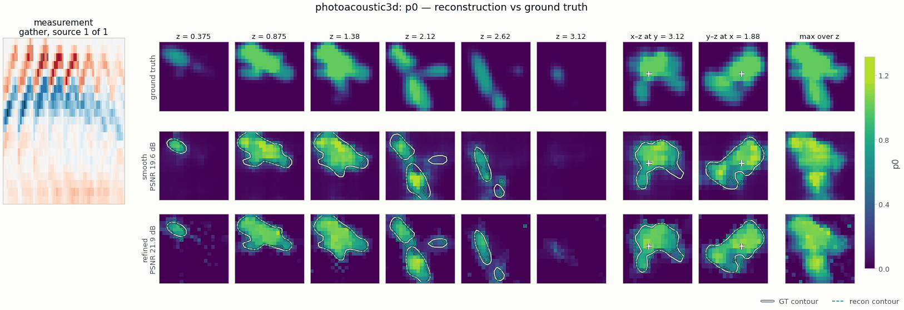

# `photoacoustic3d` — 3-D photoacoustic tomography from a planar sensor array

<!-- nf-summary:start -->
<div class="nf-summary volumetric" markdown>

| At a glance | |
|---|---|
| **Problem** | 3-D photoacoustic tomography from a planar sensor array on the top face (limited view) |
| **Unknown** | initial pressure p<sub>0</sub> ≥ 0 (softplus head), 48 × 48 × 32 voxels over 12 × 12 × 8 mm |
| **Physics** | 3-D wave equation with zero initial velocity: leapfrog, sponge layer, Gaussian sensor bandwidth |
| **Measurement** | pressure traces of 16 × 16 point sensors + 2 % noise; data on a 2× grid in float64 |
| **Difficulty classes** | `vessels`, `spheres` |
| **Baselines** | `time_reversal`, `grid` |
| **Metrics** | PSNR · slice SSIM · MSE |
| **Run** | `nefi run photoacoustic3d --smoke` · full: `nefi run configs/photoacoustic3d_full.yaml --device cuda` |



Gallery run (20 × 20 × 14, 8 × 8 sensors; 400 steps, 8.4 s on a CPU): PSNR 19.6 dB; edge refinement accepted, IoU 0.73 → 0.80. Rotate it in the [3-D showcase](../gallery/3d.md).

</div>
<!-- nf-summary:end -->

Recover the initial pressure `p0(x, y, z) ≥ 0` (the optical energy absorbed from a short laser
pulse) of a tissue slab from the pressure traces of a planar `n_sx × n_sy` array of point sensors on
its **top face**:

```
∂²p/∂t² = c² Δp,    p(x, 0) = p0(x),    ∂p/∂t(x, 0) = 0        (homogeneous, known c = 1.5 mm/µs)
y_s(t_j) = [h ∗ p](x_s, t_j) + n       (h: sensor bandwidth, Gaussian low-pass at sensor_fc)
```

A planar array sees the object from one side only (**limited view**): structures whose boundaries are
parallel to the viewing direction produce no signal on the array, and the classical time-reversal
image is blurred and streaked. The map `p0 ↦ y` is linear (`homogeneity = 1`).

```
PAT3DScenes (vessels | spheres) ─► leapfrog on a 2× grid (float64) + sensor low-pass ─► traces (n_sensors, n_t) + 2 % noise
coords ─► annealed Fourier PE (3-D) ─► MLP ─► Softplus ─► p0 ─► WaveInitialConditionOperator (3-D, sponge) ─► SensorBandwidth
       ─► MSE + λ·TV₃D ─► two-stage multiscale (½ res: 16× cheaper wave solves) ─► PSNR / slice-SSIM / MSE
```

```python
from nefi.instances.photoacoustic3d import Photoacoustic3D

inst = Photoacoustic3D(preset="smoke")       # 5 × 5 × 3.5 mm at 0.25 mm voxels, 8×8 sensors
out = inst.run(seed=0, device="cpu")
tr = inst.time_reversal(out.measurement)    # k-Wave-style time reversal (closed form)
```

CLI: `nefi run photoacoustic3d --smoke`, `nefi run configs/photoacoustic3d_full.yaml --device cuda`.
Example: `python examples/photoacoustic3d.py [--set scene=spheres]` writes `photoacoustic3d.png`
(depth slices, max-intensity projections over depth and in x-z of GT / NF / time reversal, and the
measured vs predicted trace gathers) under `runs/photoacoustic3d_smoke/`.

## Forward model

* `Photoacoustic3D.wave_operator()` — `nefi.physics.wave.WaveInitialConditionOperator` in 3-D:
  leapfrog in time with `p⁻¹ = p¹` (zero initial velocity), centered 2nd- (default) or 4th-order
  Laplacian as one `conv3d` per step, a **sponge** absorbing layer of `absorb_width` mm around the
  slab (the 3-D solver has no PML), CFL-limited substeps between the trace samples `dt_obs`, sensors
  sampled by trilinear interpolation at fixed physical positions and times — so the output
  `(n_sensors, n_t)` is resolution independent and every curriculum stage fits the same traces.
  Gradients: autodiff through the unrolled scheme (the discrete adjoint; `grad_mode="checkpoint"`
  for larger grids).
* `SensorBandwidth(inner, dt_obs, f_cutoff)` — the transducers' finite bandwidth, a zero-phase
  Gaussian low-pass `exp(−½ (f/f_c)²)` along time (zero-padded FFT). It is part of the physics of
  both the data generator and the inversion and band-limits the traces to what the grid propagates
  accurately: with 0.25 mm voxels the native-vs-2× model mismatch is 4.5 % of the peak trace for
  ideal sensors and 2.0–2.4 % at `f_c = 1 MHz` (1.4–1.7 % at 0.75 MHz; 1.0 % with the 4th-order
  stencil).

## Scenes and data

`PAT3DScenes` (physical mm, smooth tanh edges of `edge_width`, cell-averaged): `vessels` (2–4
random vessel trees — persistent random walks running mostly parallel to the skin with one branch
each — of radius 0.3–0.6 mm; the canonical PAT angiography target and a hard limited-view case) and
`spheres` (3–6 absorbing balls of radius 0.6–1.5 mm). **Inverse-crime guard**: the traces are
simulated on a 2× finer grid in float64 (`gen_order` stencil; `gen_order=4` adds a different stencil
at ≈ 5× the data-generation cost) with the same sensor response, plus 2 % relative noise
(`fidelity_tag = "wave-ic-o2-2x-float64-lp1.0"` vs `"wave-leapfrog-ic-o2-sponge-lp1"`).

## Configuration (`Photoacoustic3DConfig`) and presets

| field | default | smoke | meaning |
|---|---|---|---|
| `extent`, `grid` | (12, 12, 8) mm, (48, 48, 32) | (5, 5, 3.5), (20, 20, 14) | slab and grid (0.25 mm voxels in both) |
| `sound_speed` | 1.5 mm/µs | | homogeneous, known |
| `sensor_grid`, `sensor_span`, `sensor_depth`, `sensor_fc` | (16, 16), 0.9, 0.0, 1.0 MHz | (8, 8) | planar array on the top face |
| `t_max`, `dt_obs` | 12 µs, 0.25 µs | 5 µs | records |
| `order`, `absorbing`, `absorb_width`, `absorb_R`, `courant`, `grad_mode` | 2, sponge, 1.0 mm, 1e-3, 0.9, autograd | | solver |
| `noise_std`, `supersample`, `gen_order` | 0.02, 2, 2 | | data |
| `scene`, `vessel_radius`, `sphere_radius`, `edge_width`, `depth_range` | vessels, … | | scenes |
| `init_value`, `tv`, `tv_eps`, `l1` | 0.02, 1e-4, 1e-3, 0 | | prior |
| `hidden`, `depth`, `skip_at`, `n_octaves`, `activation` | 128, 4, 2, 5, tanh | 64, 3, 2, 4 | neural field |
| `steps`, `lr`, `lr_decay`, `anneal_fraction`, `min_coarse` | (300, 500), 1e-2, 0.5, 0.3, 8 | (150, 50), 2e-2 | curriculum |
| `grid_lr`, `tr_mode` | 5e-2, dirichlet | | baselines |

The smoke preset is a cropped field of view at the **same voxel size** as the full configuration, so
the wave physics per voxel (points per wavelength, CFL, sponge thickness) is identical; most of its
steps run on the coarse stage (16× cheaper: 8× fewer cells, 2× fewer time steps). Presets: `smoke`,
`spheres`, `default`. Configs: `configs/photoacoustic3d_smoke.yaml`,
`configs/photoacoustic3d_full.yaml` (48×48×32, 16×16 sensors, 750 + 1250 steps).

## Baselines (`Photoacoustic3D.baselines()`)

`grid` (free voxels, same objective) and `time_reversal` (closed form through the `DirectSolver`:
`nefi.physics.wave.time_reversal`, the k-Wave-style Dirichlet re-emission of the time-reversed
traces at the sensor cells, Treeby & Cox 2010; `tr_mode="adjoint"` gives the exact discrete adjoint /
back-projection instead), clipped to `p0 ≥ 0`.

## Validation (`tests/test_photoacoustic3d.py`, ≈ 6 s)

| check | result |
|---|---|
| forward cost (one CPU thread; 3-D wave, 2nd order) | smoke 20×20×14 (60 leapfrog steps): 41 ms forward, 127 ms forward + backward; 24×24×16 (72 steps): 76 / 212 ms; 48×48×32 (144 steps): 0.68 / 2.3 s |
| linearity `A(2a − 0.5b)`, exact adjoint `⟨Aa, y⟩ = ⟨a, Aᵀy⟩` (float64) | ≤ 1e-10, ≤ 1e-9 relative |
| sensor low-pass: zero phase in the passband, 4 MHz tone at `f_c = 1 MHz` | ≤ 0.05 / ≤ 1e-3 |
| scenes: `avg_pool(2× render) = native` | ≤ 1e-5 |
| native model error vs 2× data (noise-free, relative to the peak trace) | ≈ 2 % (asserted < 3.5 %) |
| time reversal | correlates with the ground truth (ρ > 0.3); `DirectSolver` result = closed form |

The 3-D forward stays far below the 1 s-per-call budget on CPU at 24×24×16 (76 ms), so the full
3-D version (rather than a thin-slab / 2-D-sensor fallback) is shipped.

Inversion (seed 0, smoke preset, 2 % noise; PSNR dB / SSIM):

| scene | time reversal | neural field (200 steps, ≈ 4 s on 4 threads) |
|---|---|---|
| vessels | 10.9 / 0.317 | **17.9 / 0.581** |
| spheres | 9.1 / 0.307 | **15.5 / 0.524** |

The neural field with TV recovers the vessel topology and the depth of the structures that time
reversal smears into a blob (limited view + band-limited sensors); the reconstruction is still
blurred at depth (limited view) and under-converged at the smoke budget (data loss ≈ 8× the noise
floor).

## Notes and limitations

* Homogeneous, known sound speed; no acoustic attenuation, no heterogeneous `c` (the solver supports
  a `c` map — joint `p0`/`c` recovery is a natural extension).
* Point sensors with a Gaussian low-pass (no directivity, no finite element size, no band-pass
  zero at DC).
* The 3-D sponge layer (1 mm ≈ 0.7 dominant wavelengths at 1 MHz) reflects a little; the data
  generator uses the same physical layer, so this is shared physics, not an inverse crime.
* Memory: `grad_mode="autograd"` stores every leapfrog state (≈ `n_steps × padded cells`); use
  `grad_mode: checkpoint` for 96³-class grids.
