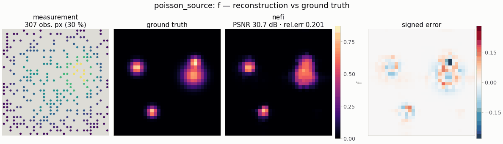

# `poisson_source` — source recovery for the Poisson equation (elliptic PDE)

<!-- nf-summary:start -->
<div class="nf-summary" markdown>

| At a glance | |
|---|---|
| **Problem** | The source of the Poisson equation from sparse, boundary or full observations of the potential |
| **Unknown** | source f ≥ 0 (softplus head), 64² |
| **Physics** | −κΔu = f with Dirichlet boundaries, solved exactly by a spectral (DST) solver — a hard constraint, never a residual |
| **Measurement** | potential u on a random 10 % of the pixels (default), a boundary strip or everywhere; data by finite differences on a 2× grid in float64 |
| **Difficulty classes** | `blobs`, `points`, `smooth` |
| **Baselines** | `grid`, `deep_decoder` |
| **Metrics** | PSNR · MSE · relative error |
| **Run** | `nefi run poisson_source --smoke` · full: `nefi run configs/poisson_source_full.yaml` |



Gallery run (smoke preset: 32², 30 % of the potential observed; 600 steps, 0.6 s on a CPU): PSNR 30.7 dB, all three sources found.

</div>
<!-- nf-summary:end -->

Recover a non-negative source `f` on the unit square from noisy observations of the potential `u`

```
-κ Δu = f  in Ω = [0, extent]²,     u = 0 on ∂Ω,
```

observed on a sparse random subset of pixels (`obs_fraction`, default 10 %), on a boundary strip
(`boundary_width` cells) or everywhere. The PDE is a *hard constraint*: the unknown is `f` and `u`
is always the exact discrete solution (NeFTY §4.2 design principle), never a soft residual.

```python
from nefi.instances.poisson_source import PoissonSource
inst = PoissonSource(n=64, scene="points", obs_mode="boundary")
out = inst.run(seed=0)
out.metrics                   # {"psnr", "mse", "relative_error"}
```
CLI: `nefi run poisson_source --smoke`, `nefi run configs/poisson_source_full.yaml`.
Example: `python examples/poisson_source.py [--set obs_mode=boundary --set scene=smooth]`.

## Differentiable spectral solver (`nefi.instances.poisson_source.operator`)

On the cell-centered grid `x_i = (i + ½) h` with Dirichlet conditions on the cell faces, the
Laplacian's eigenfunctions `sin(mπx/L)` sampled at the cell centers form the **DST-II** basis, so

```
u = IDST-II( DST-II(f) / λ ),   λ_{m,l} = κ [(mπ/Lx)² + (lπ/Ly)²]      (spectrum="continuous")
```

`dst2`/`idst2` (and the node-centered `dst1`/`idst1`) are implemented with real FFTs of odd
extensions (`torch.fft.rfft`/`irfft`; no scipy in the differentiable path, device-agnostic,
batched, any axis; they match `scipy.fft.dst(type=2|1) / 2` to 1e-15). `PoissonOperator` returns the
full `u` grid, is linear (`homogeneity = 1`), works in 1-3 D and caches eigenvalues per
resolution; `laplacian(u)` applies the inverse map. `spectrum="fd"` uses the eigenvalues
`(4/h²) sin²(mπh/2L)` of the 5-point Laplacian with antisymmetric ghost cells and therefore
reproduces the finite-difference solution exactly.

## Observations, masks and coarse stages

The operator predicts `u` everywhere; the `Measurement.mask` selects the observed pixels, so the
data term is a masked mean (unobserved pixels carry `data = 0` and are ignored). Coarse curriculum
stages use `masked_downsample` (installed as `InverseProblem.downsample_obs`): the coarse datum is
the mean of the *observed* fine pixels in a cell and the coarse mask is the observed *fraction*
(a weight), instead of thresholding an area-averaged binary mask — which would discard most cells
of a 10 % random mask.

## Data generation (inverse-crime guard) and scenes

`PoissonDataGenerator` solves the PDE with an **independent discretization**: a sparse 5-point
finite-difference system on a 2× finer grid in float64 (`fd_poisson_solve`, scipy SuperLU), area-
averages `u` to the native grid, draws the mask with the scene's numpy generator and adds relative
Gaussian noise (`fidelity_tag = "poisson-fd-2x-float64"`; the inversion operator is tagged
`"poisson-dst-continuous-1x"`). Scenes (`SourceScenes`, cell-averaged, maximum ≈ 1, interior
`[0.2, 0.8]²`): `blobs` (2-4 compact Gaussians), `points` (3-6 near-point sources of width
`point_cells` native cells), `smooth` (broad overlapping blobs).

## Prior, objective and curriculum

Neural field with a `Softplus` (non-negative) or `Identity` head; `data` = masked
**relative MSE** (`‖pred − obs‖² / ‖obs‖²` over observed pixels — scale-free, because `u` is
orders of magnitude smaller than `f`; `data_loss="mse"` for the plain masked MSE), `l1` and
isotropic `tv` on `f`. Source recovery is the most ill-conditioned of the three imaging instances
(`(−Δ)⁻¹` damps frequency `k` by `1/k²`), so first-order methods converge slowly: the default
curriculum is 1000 + 2000 steps (with full, low-noise data 450 steps give PSNR 23.3 dB / relative
error 0.47, 2000 steps 32.0 dB / 0.17 at 32²).

## Configuration (`PoissonSourceConfig`)

| field | default | meaning |
|---|---|---|
| `n`, `extent`, `conductivity` | 64, 1.0, 1.0 | grid, side length, `κ` |
| `spectrum` | `continuous` | eigenvalues of the inversion solver: `continuous` \| `fd` |
| `scene`, `point_cells` | `blobs`, 0.8 | `blobs` \| `points` \| `smooth`; point-source width |
| `obs_mode`, `obs_fraction`, `boundary_width` | `random`, 0.1, 3 | `random` \| `boundary` \| `full` |
| `noise_std` | 0.01 | relative to `max |u|` |
| `supersample` | 2 | FD data-generation grid factor |
| `head`, `init_value` | `softplus`, 0.05 | `softplus` \| `identity` |
| `data_loss` | `relative_mse` | `relative_mse` \| `mse` |
| `l1`, `tv`, `tv_eps` | 1e-3, 1e-4, 1e-3 | regularizers |
| `hidden`, `depth`, `skip_at`, `n_octaves`, `activation` | 128, 4, 2, 6, tanh | neural field |
| `steps`, `lr`, `lr_decay`, `anneal_fraction` | (1000, 2000), 1e-2, 0.5, 1.0 | curriculum |
| `grid_lr` | 5e-2 | grid baseline |
| `dd_lr`, `dd_width`, `dd_stages` | 5e-3, 64, 5 | Deep Decoder baseline |

Configs: `configs/poisson_source_smoke.yaml` (32², 30 % random observations, 200 + 400 steps,
~1-2 s CPU; also the gallery preset), `configs/poisson_source_full.yaml` (64², 10 %, 2000 + 4000
steps).

The smoke preset changes the *prior*, not only the size: a **ReLU** field (`activation: relu`)
with a faster annealing ramp (`anneal_fraction: 0.5`) and a stronger TV (`tv: 5e-4`). With the
full config's tanh field and `anneal_fraction = 1` the compact blobs only become representable at
the very end of each stage and the weakest one is never found in a few hundred steps — the
optimizer, not the objective, is the bottleneck (the free TV grid with the identical objective
recovers it). Over seeds 0-3 the smoke preset gives 30.7 / 29.0 / 28.4 / 28.2 dB (relative error
0.20-0.28) with every blob recovered.

## Baselines (`PoissonSource.baselines()`)

`grid` (free source pixels, same objective) and `deep_decoder`; any other kind via
`nefi.baselines.baseline_problem` (all keep the mask-aware `downsample_obs`).

## Validation

`tests/test_poisson_source.py` (≈ 12 s). Measured values:

| check | result |
|---|---|
| DST-I / DST-II vs `scipy.fft.dst / 2`, round trips, any axis | ≤ 1e-12 |
| analytic eigenfunction `f = 2π² sin(πx) sin(πy)` → `u = sin(πx) sin(πy)` (n = 32/64/128) | relative error 3.8e-16 / 2.6e-16 / 2.5e-16 (also for extent 2, κ = 0.5) |
| `spectrum="fd"` vs scipy sparse 5-point FD | 1.4e-14 relative |
| continuous spectrum vs FD, n = 16 / 32 / 64 | 1.3e-2 / 3.5e-3 / 8.8e-4 (second order) |
| `torch.autograd.gradcheck` through the solver | passes |
| masked MSE: values at unobserved pixels (data or prediction) | no effect on the loss |

Inversion (seed 0, `blobs`, 1 % noise; baselines at the same step budget):

| setting | neural field | grid | Deep Decoder |
|---|---|---|---|
| 32², 10 % observed, tanh, 450 steps | 22.23 dB / rel. err 0.531 (3.9 s) — 2 of 3 blobs | 23.27 / 0.471 (1.3 s) | 21.63 / 0.569 |
| 32², smoke (30 % observed, ReLU, 600 steps) | **30.65 / 0.201** (≈ 1 s) — all 3 blobs | 27.96 / 0.274 | 25.01 / 0.385 |
| 64², 1000 + 2000 steps (10 %) | 27.57 / 0.315 (185 s*) | 29.96 / 0.239 (20 s*) | 32.08 / 0.187 (233 s*) |

(* wall-clock on a CPU, indicative only.) Source recovery through the smoothing
`(−Δ)⁻¹` rewards strongly smoothing parameterizations: at the full config the Deep Decoder's
global low-pass `G_θ` fits the compact blobs best and the TV grid beats the tanh neural field;
with no explicit prior the grid is still regularized by early stopping (`docs/baselines.md`). The
smoke preset's ReLU field with a short annealing ramp reverses the ranking at 32². Single seed
per row — use `nefi bench` for CIs and the `points` / `boundary` regimes.

## Notes and limitations

* Homogeneous Dirichlet conditions on a rectangle only (the DST diagonalizes exactly that); other
  boundary conditions need DCT variants or an iterative solver (`nefi/operators/pde`).
* Constant conductivity; a spatially varying `κ(x)` turns this into the Darcy/EIT-type coefficient
  problem.
* With boundary-strip observations the problem is severely ill-posed (only the far field of the
  sources is seen); expect depth/size ambiguity rather than sharp recovery.
