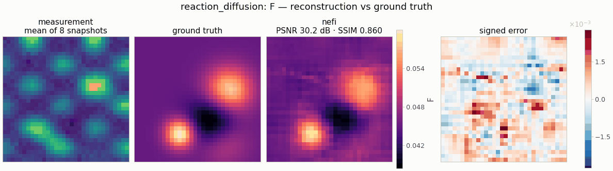

# `reaction_diffusion` — Gray–Scott feed-rate inversion

<!-- nf-summary:start -->
<div class="nf-summary" markdown>

| At a glance | |
|---|---|
| **Problem** | The spatially varying feed rate of a Gray–Scott system from a few snapshots of both species |
| **Unknown** | feed-rate field F(x) ∈ [F<sub>min</sub>, F<sub>max</sub>], 32² |
| **Physics** | Gray–Scott reaction–diffusion: conservative Laplacian, explicit Euler hitting the observation times exactly |
| **Measurement** | u and v at t = 25, 50, 75, 100 (8 × 32²) + noise; data with 4× smaller time steps in float64 |
| **Difficulty classes** | `blobs`, `stripes` |
| **Baselines** | `grid` |
| **Metrics** | PSNR · SSIM · relative error |
| **Run** | `nefi run reaction_diffusion --smoke` · full: `nefi run configs/reaction_diffusion_full.yaml` |



Gallery run (32², 250 steps, 4.3 s on a CPU): PSNR 30.2 dB.

</div>
<!-- nf-summary:end -->

Recover a spatially varying feed rate `F(x)` of the Gray–Scott system (Pearson 1993 units) from a
few snapshots of both species:

```
u_t = D_u Δu − u v² + F(x)(1 − u),     v_t = D_v Δv + u v² − (F(x) + k) v
data: (u, v)(t_i) for t_i ∈ obs_times  →  (n_times · 2, n, n) + noise
```

```python
from nefi.instances.reaction_diffusion import ReactionDiffusion
inst = ReactionDiffusion(scene="stripes")
out = inst.run(seed=0)
out.metrics                                    # {"psnr", "ssim", "relative_error"}
```
CLI: `nefi run reaction_diffusion --smoke`, `nefi run configs/reaction_diffusion_full.yaml`.
Example: `python examples/reaction_diffusion.py`.

## Physics and discretization

* **Operator** — `nefi.physics.reaction_diffusion.ReactionDiffusionOperator`: conservative
  flux-form Laplacian with zero-flux (Neumann) boundaries, explicit Euler, `dt_sim = dt/m` with the
  smallest `m` meeting `dt (D_max Σ4/h² + F_max + k + 1) ≤ 2` (so snapshots at `t = 25, 50, 75, 100`
  are hit exactly at every curriculum resolution). Known analytic initial condition
  (`GrayScottIC`: `u0 = 1 − 0.5g`, `v0 = 0.25g`, `g ∈ [0.5, 1]` a smooth cosine pattern) — it keeps
  the whole domain away from the trivial state `(1, 0)`, where `F(1 − u) = 0` and `F` would be
  unobservable. Each pixel's `F` influences a neighbourhood of radius ≈ √(2Dt) (≈ 3-6 cells over
  the observation window) — a nonlinear, diffusively coupled parameter-to-observable map.
* **Data generation (inverse-crime guard)** — the same model with 4× smaller time steps in float64
  (the O(dt) Euler error differs by ≈ 0.8 % of the data), optional 2× grid refinement
  (`supersample`), relative Gaussian noise. Tags: generator `gray-scott-substep4-float64`,
  inversion `gray-scott-euler`.
* **Scenes** (`ReactionDiffusionScenes`): `blobs` (2-4 Gaussian perturbations of ±`F_amplitude`),
  `stripes` (smoothed square-wave stripes of random orientation and period 0.35-0.55 L).

Regime choice: with `k = 0.06`, regions with `F ≲ 0.04` relax to the trivial state within ≈ 200
time units and later snapshots carry no information about them, while long windows become
chaotic; the window `t ≤ 100` keeps the map smooth and informative for `F ∈ [0.03, 0.06]`.

## Prior, objective and curriculum

Neural field with a `Bounded(F_min, F_max)` head started at `F_background`; `fit` = relative MSE on
all snapshots, `tv` = isotropic TV on `F`; two-stage multiscale curriculum `n/2 → n` (coarse stages
simulate on the coarse grid and compare with area-averaged snapshots).

## Configuration (`ReactionDiffusionConfig`, defaults = smoke preset)

| field | default | meaning |
|---|---|---|
| `n`, `extent` | 32, 0.64 | grid, domain side (h = 0.02) |
| `scene`, `F_background`, `F_amplitude` | blobs, 0.045, 0.015 | phantom |
| `F_min`, `F_max` | 0.02, 0.07 | head range (and stability bound) |
| `k`, `Du`, `Dv` | 0.06, 2e-5, 1e-5 | known parameters |
| `dt`, `obs_times`, `observe` | 1.0, (25, 50, 75, 100), (u, v) | time axis and observables |
| `boundary`, `ic_modes` | neumann, (2, 3) | boundary condition, initial pattern |
| `noise_std`, `gen_substeps`, `supersample` | 0.01, 4, 1 | data generation |
| `grad_mode`, `checkpoint_every` | autograd, None | gradient memory |
| `hidden`, `depth`, `n_octaves` | 64, 4, 6 | neural field |
| `tv`, `steps`, `lr`, `lr_decay`, `grid_lr_mult` | 1e-4, (100, 150), 1e-2, 0.5, 10 | objective / optimization |

`PRESETS["full"]` / `configs/reaction_diffusion_full.yaml`: 128² over 2.56 (same h), six snapshots
up to t = 200, checkpointed gradients, 256 × 6 MLP, 1500 + 3500 steps.

## Smoke results (CPU, seed 0)

| scene | uniform `F_background` | grid | neural field |
|---|---|---|---|
| blobs (PSNR / rel. error) | 15.7 / 0.076 | 26.9 / 0.021 | 30.2 / 0.014 |
| stripes | 7.6 / 0.27 | 15.0 / 0.11 | 20.0 / 0.064 |

(≈ 4 s per neural-field run on a CPU.)

## Baselines

`grid` (free-pixel `F`, same objective and curriculum, LR × `grid_lr_mult`).

## Variants

`ReactionDiffusionOperator(unknown="k")` recovers the kill rate; `unknown="Du"` a spatially varying
diffusivity (conservative `∇·(D_u∇u)` with harmonic-mean faces). `observe=("u",)` restricts the
data to one species (harder).
