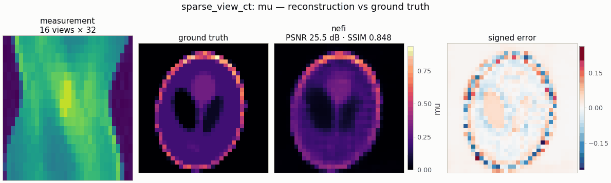

# `sparse_view_ct` — sparse-view parallel-beam CT

<!-- nf-summary:start -->
<div class="nf-summary" markdown>

| At a glance | |
|---|---|
| **Problem** | Sparse-view (or limited-angle) parallel-beam computed tomography |
| **Unknown** | attenuation μ ∈ [0, 1] (bounded head), 64² |
| **Physics** | differentiable Radon transform: all views in one `grid_sample`, physical line integrals |
| **Measurement** | sinogram of 20 views over 180° + 1 % noise; data on a 2× finer image grid in float64 |
| **Difficulty classes** | `shepp`, `blobs`, `piecewise` |
| **Baselines** | `fbp` (filtered back-projection), `grid` (+ TV), `deep_decoder` |
| **Metrics** | PSNR · SSIM · MSE |
| **Run** | `nefi run sparse_view_ct --smoke` · full: `nefi run configs/sparse_view_ct_full.yaml` |



Gallery run (32², 16 views, 450 steps, 0.4 s on a CPU): PSNR 25.5 dB.

</div>
<!-- nf-summary:end -->

Recover an attenuation map `μ ∈ [0, 1]` on the unit square from `n_views` (default 20) noisy
parallel-beam projections over 180° (or `angle_range` degrees for limited-angle CT):

```
y_θ(s) = ∫ μ(s e_θ + t e_θ⊥) dt + n,     θ ∈ {0, π/V, ..., (V−1)π/V}
```

```python
from nefi.instances.sparse_view_ct import SparseViewCT
inst = SparseViewCT(n=64, n_views=20, scene="piecewise")
out = inst.run(seed=0)
fbp = inst.fbp(out.measurement)          # classical reference on the same sinogram
```
CLI: `nefi run sparse_view_ct --smoke`, `nefi run configs/sparse_view_ct_full.yaml`.
Example: `python examples/sparse_view_ct.py [--set n_views=12 --set scene=piecewise]`.

## Differentiable Radon transform (`nefi.instances.sparse_view_ct.radon`)

`RadonOperator(domain, n_views, field="mu", angles=None, angle_range=π, det_per_pixel=1,
samples_per_pixel=1)` rotates the image with `F.grid_sample` (bilinear, `align_corners=False`,
zero outside the field of view) for all views at once and sums along the ray direction:
`p_θ(u_b) = Δt Σ_a μ(R_θ(u_b, v_a))` in normalized coordinates, with `Δt` the physical ray step,
so the sinogram holds **physical line integrals**. Conventions: axis 1 = x (grid-sample width),
axis 0 = y; the detector axis is `(cos θ, sin θ)`; `θ = 0` gives column sums. It is linear
(`homogeneity = 1`), batched over leading dims, and `at_resolution(shape)` keeps
`det_per_pixel`, so `n_det` scales with the curriculum grid (coarse data are area-averaged over
detector bins, which is consistent because each bin is a line integral).

* `op.adjoint(y)` — exact adjoint of this discretization (autograd VJP).
* `backproject(y, angles, n, width)` / `op.backproject(y)` — classical *pixel-driven*
  back-projector (1-D linear interpolation at `u = x cos θ + y sin θ`), an independent
  discretization of `Rᵀ` scaled by `Δt · n_t n_det / n²`.
* `fbp(sinogram, angles, filter="ramp", n=None, width=1.0, circle=False)` / `op.fbp(...)` —
  filtered back-projection `(π/V) Σ_θ q_θ(x cos θ + y sin θ)`, `q = (h ⊛ p)/τ` with the Kak &
  Slaney discrete ramp `h` (Kak & Slaney 1988, Eq. 61-62), zero-padded to ≥ 2 `n_det`, and optional
  `shepp-logan` / `cosine` / `hann` apodization.

Device note: PyTorch has no MPS kernel for `grid_sampler_2d_backward`; use CPU or CUDA (MPS is
never auto-selected; `PYTORCH_ENABLE_MPS_FALLBACK=1` also works).

## Data generation and scenes

Inverse-crime guard: the data generator uses the same Radon physics on a **2× finer image grid
with 2 detector bins per fine pixel** (4 sub-bins per native bin) in float64, area-averages the
sinogram onto the native detector and adds relative Gaussian noise
(`fidelity_tag = "radon-2x-float64"`; the inversion operator is tagged
`"radon-<n>px-1det-1spp"`). Scenes (`CTScenes`, inside the inscribed circle, cell-averaged):
`shepp` (modified Shepp-Logan table with random global scale/rotation/shift and random per-ellipse
axes, centers, angles, intensities), `blobs` (smooth Gaussian sums), `piecewise` (random constant
ellipses/rectangles painted in a body ellipse — sharp edges where TV pays off).

## Prior, objective and curriculum

Neural field with a `Bounded(0, 1)` head (NeFTY Eq. 6; `softplus` optional), MSE on the sinogram,
isotropic TV (NeFTY Eq. 22) and optional ℓ1, two-stage multiscale curriculum (NeTMY Tab. 6).
TV weights are much smaller than in deconvolution because the sinogram MSE at the noise level is
~1e-5 while TV of an edge in physical-gradient units is O(1-10): `tv = 1e-5` (sweep: 5e-4 → 18.0
dB, 1e-4 → 21.5, 2e-5 → 26.6, 1e-5 → 28.1 dB / SSIM 0.91, 5e-6 → 28.4 / 0.88).

## Configuration (`SparseViewCTConfig`)

| field | default | meaning |
|---|---|---|
| `n`, `extent` | 64, 1.0 | image size, physical side |
| `n_views`, `angle_range` | 20, 180.0 | number of views, angular coverage in degrees |
| `det_per_pixel`, `samples_per_pixel` | 1.0, 1.0 | detector bins and ray samples per pixel |
| `scene` | `shepp` | `shepp` \| `blobs` \| `piecewise` |
| `noise_std` | 0.01 | relative Gaussian sinogram noise |
| `supersample`, `data_det_per_pixel` | 2, 2.0 | data-generation grid factor and bins per fine pixel |
| `head`, `init_value` | `bounded`, 0.1 | `bounded` (`Bounded(0, 1)`) \| `softplus` |
| `tv`, `tv_eps`, `l1` | 1e-5, 1e-3, 0 | regularizers |
| `hidden`, `depth`, `skip_at`, `n_octaves`, `activation` | 128, 4, 2, 7, tanh | neural field |
| `steps`, `lr`, `lr_decay`, `anneal_fraction` | (400, 800), 1e-2, 0.5, 1.0 | curriculum |
| `fbp_filter`, `fbp_clip` | `ramp`, true | FBP filter; clip FBP to the head range |
| `grid_lr` | 5e-2 | grid baseline |
| `dd_lr`, `dd_width`, `dd_stages` | 5e-3, 64, 5 | Deep Decoder baseline |

Configs: `configs/sparse_view_ct_smoke.yaml` (32², 16 views, ~4 s CPU),
`configs/sparse_view_ct_full.yaml` (64², 20 views, 1200 + 2400 steps).

## Baselines (`SparseViewCT.baselines()`)

`grid` (free pixels + the same TV objective), `fbp` (closed form through `DirectSolver`, reported
with the same metrics) and `deep_decoder`. Any other kind is one call away:
`baseline_problem(inst.build_problem(m), "gaussian_splat" | "admm" | "lbfgs")`.

## Validation

`tests/test_sparse_view_ct.py` (≈ 10 s). Measured values (64², float64):

| check | result |
|---|---|
| `θ = 0` projection vs. column sum × Δt | max abs error 0.0 |
| centered disk (r = 0.25): per-view mass / max variation | 1.0e-3 / 5.2e-3 relative; peak chord 0.508 (exact 0.5) |
| adjoint: `⟨Rx, y⟩` vs `⟨x, backproject(y)⟩`, smooth non-negative fields, 20 draws | ≤ 1e-4 relative (30 views), < 5e-5 (180 views); signed fields ≤ 7e-4 of `‖Rx‖‖y‖` |
| adjoint: autograd `op.adjoint` | 1e-15 relative |
| FBP of a full-view (180) noiseless Shepp-like sinogram | PSNR 25.0 dB (ramp), 24.1 dB (Shepp-Logan) |
| FBP with 20 views (noiseless) | 20.2 dB |
| linearity `R(2.5a − 0.7b) = 2.5Ra − 0.7Rb` | 1e-12 |

Inversion (seed 0, `shepp`, 1 % noise; PSNR dB / SSIM):

| setting | FBP | neural field | grid + TV | Deep Decoder |
|---|---|---|---|---|
| 32², 16 views, smoke (450 steps) | 22.72 / 0.804 | 25.48 / 0.848 (3.6 s) | 27.48 / 0.931 (1.1 s) | 27.19 / 0.896 |
| 64², 20 views, 300 + 600 steps | 21.15 / 0.559 | 28.39 / 0.919 (34 s) | 29.07 / 0.934 (3.8 s) | 30.26 / 0.922 |

All iterative methods remove most of the FBP streaking; with the same TV objective the free grid
and the Deep Decoder are at least as good as the neural field in this linear, well-sampled-in-
detector setting (single seed; use `nefi bench` for CIs and per-class results).

## Notes and limitations

* Parallel-beam geometry only (fan/cone beam would need a different sampling grid).
* The rotation-based projector is bilinear; for high-accuracy work use `det_per_pixel` /
  `samples_per_pixel` > 1 (costlier) — the data generator already does.
* Poisson (photon-count) sinogram noise is not modeled (Gaussian only).
