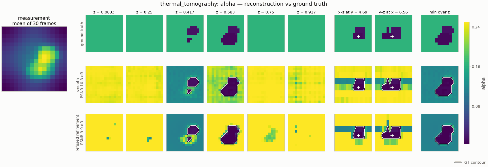

# Thermal tomography — NeFTY

<!-- nf-summary:start -->
<div class="nf-summary paper" markdown>

| At a glance | |
|---|---|
| **Problem** | Volumetric thermal diffusivity of a slab from its front-surface temperature after a laser flash (pulsed-thermography NDE) — NeFTY, [arXiv 2603.11045](https://arxiv.org/abs/2603.11045) |
| **Unknown** | α(x, y, z) ∈ [α<sub>min</sub>, α<sub>max</sub>] (bounded sigmoid, NeFTY Eq. 6); 64 × 64 × 16 at paper scale |
| **Physics** | implicit-Euler finite-volume heat equation with harmonic-mean faces; discrete-adjoint gradients ([heat solver](../physics/heat.md)) |
| **Measurement** | 100 surface frames × 64², simulated by an independent explicit substepped solver (float64) |
| **Difficulty classes** | `homogeneous`, `layered` bulk with 1–4 defects (ellipsoids, cylinders, boxes) |
| **Baselines** | `grid` (Grid Opt.), `pinn_soft` (soft-constrained PINN), `ppt`, `tsr` (thermography heuristics) |
| **Metrics** | IoU · Edge F1 · PSNR · SSIM · MSE, plus 2-D IoU / Dice and 2.5-D depth metrics |
| **Run** | `nefi run thermal_tomography --smoke` · paper scale: `nefi run configs/thermal_tomography_paper.yaml --device cuda` |



Gallery run (smoke preset 16 × 16 × 6, 30 frames; 600 steps, 6.1 s on a CPU): defect IoU 0.98. The low PSNR (10.8 dB) is a bulk bias from model error; the edge refinement was refused.

</div>
<!-- nf-summary:end -->

`nefi.instances.thermal_tomography` implements **NeFTY** (Zhong, Hu, Zheng, Sood, Allen-Blanchette,
*Neural Field Thermal Tomography*, arXiv 2603.11045): label-free recovery of the volumetric thermal
diffusivity `α(x, y, z)` of a slab from the transient **front-surface** temperature after a laser
flash (pulsed-thermography non-destructive evaluation). The PDE is a hard constraint: at every
optimization step the candidate field is pushed through a differentiable implicit-Euler heat solver,
and gradients come from its **discrete adjoint** at trajectory-sized memory.

```
ThermalScenes (App. E.1) ─► ExplicitHeatSimulator (forward Euler, N_sub substeps, float64) ─► T̂ (100, 64, 64)
coords ─► annealed Fourier PE (K = 12, no raw x) ─► MLP 10×512 ReLU, skip at 4 ─► α = α_min + (α_max − α_min) σ(f)
      ─► HeatOperator: L(α) harmonic faces, A(α) = I − Δt L(α), 50 Jacobi sweeps/step, adjoint gradients
      ─► surface MSE + λ·TV(α) (Eq. 22) ─► Adam 5e-5, ×0.1 / 1000 steps, 10 000 steps, annealing over 2 500
      ─► metrics (MSE, PSNR, SSIM, IoU@0.03, Edge F1) + surface-fit PSNR + App. H 2-D / 2.5-D projections
```

## Quick start

```python
from nefi.instances.thermal_tomography import ThermalTomography

inst = ThermalTomography(preset="smoke")          # 16×16×6, 30 frames, 150 steps (≈ 4 s CPU)
out = inst.run(seed=0, device="cpu")
print(out.metrics)   # mse, psnr, ssim, iou, edge_f1, iou_2d, dice_2d, depth_*, surface_psnr(_init), ...
```

```bash
python examples/thermal_tomography.py --config configs/thermal_tomography_smoke.yaml   # PNGs in runs/
python examples/thermal_tomography.py --config configs/thermal_tomography_smoke.yaml --baseline grid
nefi run thermal_tomography --smoke --plot                                             # via the CLI
python examples/thermal_tomography.py --config configs/thermal_tomography_paper.yaml --device cuda
                                               # paper scale (the paper config compiles the sweeps)
```

The example writes `alpha_slices.png` (GT / recovered / |error| per depth slice),
`surface_frames.png` (observed / re-simulated / residual), `projections.png` (App. H masks and depth
maps), `loss.png`, `metrics.json`, `config.yaml` and `result.pt`.

## Physics (NeFTY §3.1, App. A)

* **Diffusivity form** (Eq. 1–2): `∂_t T = ∇·(α∇T)` with `α = k/(ρC_p)` on `Ω \ Σ`; the
  distributional heat-capacity term on defect interfaces is dropped (App. A.2), so NeFTY solves for a
  single effective field `α`.
* **Harmonic-mean faces** (Prop. 1): continuity of the effective flux `−α∂_n T` across a face between
  constant cells gives `ᾱ_{i+1/2} = 2α_iα_{i+1}/(α_i + α_{i+1})`, dominated by the insulating side
  (App. A.4). `face_mode="arithmetic"` is the leaky ablation (Tab. 3 "HM").
* **Initial / boundary conditions** (App. A.5), with temperatures shifted by the ambient (App. D.2):
  * synthetic: Gaussian post-flash `T0 = A exp(−r_xy²/2w_xy²) exp(−z²/2w_z²)`, periodic lateral faces,
    adiabatic front and back faces;
  * real PVC: near-uniform flash `T0 = A exp(−z²/2w_z²)`, convective Robin back face
    `n·(α∇T) = −hT`, lateral periodic or adiabatic.

  Initial conditions are stored as exact **cell averages** (erf integrals), so the deposited heat is
  identical at every resolution (a point-sampled `w_z = 0.1` flash loses ~9 % of its heat at 4 z-cells
  and ~80 % at 2), which keeps coarse multiscale stages and supersampled data consistent. `A`, `w_xy`,
  `w_z` are not reported in the paper (defaults `100, 2.5, 0.2`; a surface range of ≈ 90 is consistent
  with the Tab. 7 surface PSNRs; `w_z = 0.2` rather than `0.1` because the thinner layer roughly
  triples the model error of implicit Euler relative to the defect signal, see "Inverse-crime
  guard").
* **Ill-posedness** (Prop. 2, Cor. 1): singular values of the linearized map decay algebraically, so
  the neural-field prior, frequency annealing and TV are all load-bearing.

## Discretization (NeFTY §4.2, App. D.2) — `nefi/operators/pde/stencil.py`

* **Grid convention**: the unknown lives on the trailing `ndim` axes, the **last axis is depth `z`**,
  and the observed surface is the first slice `T[..., 0]`. 2-D `(x, z)` and 3-D `(x, y, z)` slabs are
  supported; leading dims of `T` are batch dims.
* **Operator** (Eq. 7): `[L(α)T]_i = Σ_d Δ_d⁻² (ᾱ_{i+1/2}(T_{i+1} − T_i) − ᾱ_{i−1/2}(T_i − T_{i−1})) − β_i T_i`.
  Implemented with `torch.roll` on precomputed face conductances `a = ᾱ/Δ²` (computed once per
  forward from `α`, reused by all `N_t × K` inner iterations); fully autodiff-compatible and
  device-agnostic.
* **Boundary conditions** (`BoundarySpec`, one kind per axis):
  `"periodic"` — circular wrap; `"neumann"` — zero conductance on the boundary face, exactly equivalent
  to the replicate padding of App. D.2 (zero cross-face increment); `"robin"` (last axis only) —
  adiabatic front face and back-face sink `β = h/Δz` from the finite-volume flux balance (App. D.2).
* **Implicit Euler** (Eq. 8): `A(α)T^{n+1} = T^n`, `A = I − ΔtL(α)`. `A` is symmetric, has unit
  row-sum excess `A_pp − Σ|A_pq| = 1 + Δtβ_p ≥ 1` (strict diagonal dominance) and is SPD with
  `λ_min(A) ≥ 1` — all checked numerically on dense matrices in the tests for periodic, adiabatic and
  Robin boundaries.
* **Inner solvers** (`linear_solvers.py`): `jacobi(apply_A, diag, b, x0, iters)` — Eq. (24),
  warm-started from the previous frame; the operator uses the algebraically identical fused sweep
  `x ← D⁻¹b + Σ_j W_j ⊙ shift_j(x)`. `conjugate_gradient(apply_A, b, x0, tol, max_iter)` —
  Jacobi-preconditioned CG. At the paper spacing and `Δt` the Jacobi contraction is ≈ 0.84–0.89 per
  sweep; `K = 50` gives a relative error of 3.0e-6 on the sharpest right-hand side (the first post-flash
  step) and 3.0e-5 accumulated over 100 frames (float64, vs. CG at 1e-13).
* **Substeps** (`implicit_substeps`, default 1 = paper): `m` implicit steps of `Δt/m` per frame.

## Discrete adjoint (NeFTY §4.3, App. D.3) — `nefi/operators/pde/adjoint.py`

`ImplicitEulerAdjoint` is a `torch.autograd.Function`:

* **forward** runs the recurrence without autograd and saves only the detached trajectory
  `T^1..T^{n_last}` (`O(N_g N_t)`, via `save_for_backward`, so `torch.autograd.graph.save_on_cpu`
  can offload it to host memory);
* **backward** runs `A μ^n = μ^{n+1} + ∂ℓ^n/∂T^n`, `μ^{N_t+1} = 0` (Eq. 10 / 26) backwards in time
  with the *same* inner solver (`Aᵀ = A`), injecting the frame gradients at the surface, and returns
  `dJ/dα = Δt Σ_n (μ^n)ᵀ ∂(L(α)T^n)/∂α` (Eq. 11 / 27) and `dJ/dT^0 = μ^1` (initial-condition
  sensitivity, App. D.3). Steps after the last observed frame are skipped (their `μ` vanishes).
* **gradient assembly**: `μᵀL(α)T = −Σ_faces a_f(α)(Δ_fμ)(Δ_fT) − Σβμ T` is bilinear, so the default
  `adjoint_assembly="fused"` accumulates `S_f = Σ_n (Δ_fμ^n)(Δ_fT^n)` during the sweep and
  back-propagates through the face conductances `a_f(α)` **once** (this contains the harmonic-mean
  derivative `∂ᾱ/∂α_i = 2α_{i+1}²/(α_i + α_{i+1})²`). `"per_step"` runs one small autograd VJP of
  `α ↦ L(α)T^n` per step — the literal Eq. (27); both agree to 1e-13.

`HeatOperator(grad_mode=...)` selects `"adjoint"` (default), `"autograd"` (back-propagation through
the unrolled inner solver — the reference) or `"checkpoint"` (`torch.utils.checkpoint` per time
step). The adjoint differentiates the *exactly solved* recurrence (App. D.2 treats `T^(K)` as the
exact state), whereas autograd differentiates the truncated `K`-sweep map; the two differ by
`O(ρ^K)` with `ρ` the Jacobi contraction (≈ 1e-3 relative for `K = 10` on the smoke grid, ≤ 1e-6 for
converged solves). Saved-tensor accounting (test `test_adjoint_memory_is_trajectory_sized`, float32 grids):

| mode | saved tensors | 64×64×16, K = 50: N_t = 50 (Tab. 4 setting) / N_t = 100 |
|---|---|---|
| adjoint | `(N_t + 1)·N_g` (trajectory + α) | 13.4 MB / 26.5 MB (paper Tab. 4: 21.9 MB) |
| checkpoint | ≈ `9.6·N_t·N_g` + one step's recomputation | 0.13 GB / 0.25 GB, + 0.16 GB |
| autograd | ≈ `12·K·N_t·N_g` | 7.9 GB / 15.7 GB (paper Tab. 4: 18.6 GB) |

`compile_solver=True` (`HeatOperator(compile=True)`) runs the gradient-free Jacobi sweeps of the
adjoint forward/backward through `torch.compile` (bit-identical; 3.2× faster per solve on a
CPU after a ~30 s one-time compile; `compile_mode="reduce-overhead"` adds CUDA graphs, with
the solve output cloned out of the graph pool — untested on CUDA). It is **on in
`configs/thermal_tomography_paper.yaml`** (one-time compile of tens of seconds) and off in the code
default, so CPU / MPS / tests stay eager.

Eager sweeps use a flat padded layout (`stencil_backend="auto"`, see
[performance](../performance.md)): one gather refills the periodic ghost cells and six `addcmul`
run on contiguous views — 7 kernels per sweep instead of 12 with `torch.roll`, same numbers to
float rounding, 2.3× faster smoke steps on CPU, 4.5× less memory in `grad_mode="autograd"`.
`solver="chebyshev"` (opt-in) accelerates the same sweeps with the Chebyshev semi-iteration
(Gershgorin bound, no host sync): ≈ 20 iterations match the error of the paper's 50 Jacobi sweeps
at the Tab. 5 time step (12–13 vs 20 on the smoke grid).

## Inverse-crime guard (NeFTY §5.1, App. E.1)

Data are generated by `ExplicitHeatSimulator` (`fidelity_tag="explicit-substepped-float64"`), which
shares no time-stepping or boundary code with the inversion operator: ghost cells by circular /
replicate padding, flux-difference divergence, forward Euler with
`N_sub = max(10, ⌈Δt/Δt_stable × 2⌉)`, `Δt_stable = Δx_min²/(2Dα_max)` substeps per frame
(16 / 24 / 31 at the paper grid for α_max = 0.1 / 0.15 / 0.2), float64. Optional
`sim_supersample` simulates on a finer grid and area-averages.

**Model mismatch is real and large at the paper's settings.** Implicit Euler at one step per camera
frame under-resolves the fast through-thickness decay of the thin post-flash layer: for the paper
grid with `w_z = 0.1` the surface mismatch against the substepped explicit data is ≈ 10 % (relative
rms) in frame 1, 2.8 % in frame 10 and 0.3 % in frame 90, i.e. ≈ 40 % of the rms defect signal of a
two-defect test scene (`w_z = 0.2`, the default: 14 %; `w_z = 0.1` skipping the first 5 frames: 13 %).
For the paper preset (seeds 0–2) the model-error floor — the surface MSE of the ground truth
re-simulated by the inversion operator — is 0.18–0.21 at `w_z = 0.1` and 0.07–0.09 at `w_z = 0.2`,
against an initial uniform-field MSE of 0.46–13.6 (mostly set by the bulk value): at `w_z = 0.1` the
defect signal of some scenes barely exceeds the model error. Check this ratio first when paper-scale
results are poor. The inversion compensates by inflating `α` near the front face (visible in
`alpha_slices.png`) and slightly in the bulk (smoke preset:
`+0.02` median bias at `Δt = 0.1`, `+0.04` at `Δt = 0.2`). Knobs: `implicit_substeps` (error `O(Δt/m)`),
`first_frame` (drop the earliest frames), `flash_width_z`. Because even the ground truth
re-simulated by the inversion operator stays at the model-error floor (≈ 46 dB surface PSNR at
`w_z = 0.1`, ≈ 50 dB at `w_z = 0.2`, surface range ≈ 90), the ≈ 82 dB of Tab. 7 is not reproducible
under this inverse-crime guard; the smoke runs reach 37–45 dB.

## Instance (`nefi/instances/thermal_tomography/`)

* `ThermalTomography(cfg=None, preset=None, **overrides)` — registered as `"thermal_tomography"`;
  presets `"paper"` (defaults), `"layered"`, `"smoke"` (`PRESETS`).
* `field()` — `NeuralField(3, {"alpha": Bounded(α_min, α_max, init_value=α_init)}, hidden=512,
  depth=10, skip_at=4, activation="relu", n_octaves=12, include_input=False)` (2.44 M parameters,
  as in Tab. 9).
* `losses()` — `{"data": MSE(), "tv": TV("alpha", isotropic=True, eps=1e-6, periodic_axes=(0, 1))}`,
  weights `{data: 1, tv: 1e-3}`. TV follows Eq. (22): lateral periodic forward differences, zero `δz` on
  the last slice, physical spacing, **mean** reduction. Convention: the paper writes the data term as
  a sum over `M·N_Γ` surface samples and TV as a volume integral; with per-element means the
  equivalent weight would be `λ|Ω|/(M N_Γ) ≈ 2.4e-7`. nefi keeps the mean/mean form with `λ = 1e-3`
  (temperatures in units of the flash amplitude `A = 100`), which makes TV active at the converged
  data-misfit level; tune `tv_weight` when changing `flash_amplitude` (MSE scales with `A²`).
* `default_curriculum()` — single stage (paper): Adam, `lr 5e-5`, step decay ×0.1 every 1000 steps,
  10 000 steps, annealing over the first 2 500 (`anneal_fraction = 0.25`), no weight decay, no
  clipping. `n_stages > 1` gives a coarse-to-fine curriculum (`at_resolution` rebuilds spacing and the
  initial condition; `surface_downsample` area-averages the frames laterally).
* `baselines()["grid"]` — Grid Opt. (App. F.2): `GridField` + the same bounded head, solver, adjoint,
  TV and schedule, initialized at the bulk guess (`grid_lr`, `grid_steps` override).
* `baselines()["pinn_soft"]` — soft-constrained PINN (Eq. 4, App. F.1, `pinn.py`): a tanh temperature
  surrogate `T_φ(x, t)` is the problem's *operator* (`SoftPINNSurface`, its parameters are optimized
  with the field), the α network is NeFTY's field, and the losses are the scale-normalized surface MSE,
  the PDE residual `∂_tT_φ − α_θΔT_φ − ∇α_θ·∇T_φ` at `pinn_collocation` random space-time points
  (autograd derivatives) and the initial-condition misfit. Weights are fixed (`pinn_lambda_pde`,
  `pinn_lambda_ic`) instead of GradNorm. Since the predicted frames do not depend on `θ`,
  `∇_θ L_data ≡ 0` — the §3.3 decoupling, verified in the tests: on the smoke measurement the data
  loss drops 33× in 150 steps while `α_θ` stays uniform (std 0.0025, IoU 0, Edge F1 0).
* `make_measurement(seed, scene_class)` — draws a scene, simulates it with the explicit simulator,
  adds optional noise (`noise_std`, relative; the paper's synthetic data are noise-free) and stores the
  bulk field, defect mask and scene parameters in `measurement.meta`.
* `evaluate(result, gt, measurement=None)` — `mse`, `psnr` (range `α_max − α_min`), `ssim`
  (slice-wise along z), `iou` (`α < 0.03`), `edge_f1`; App. H projections `iou_2d`, `dice_2d`,
  `depth_abs_rel`, `depth_rmse`, `depth_delta1`; with the measurement also `surface_psnr` /
  `surface_mse` of the recovered field's re-simulation and `surface_psnr_init` of the initial uniform
  field (data-fit-paradox diagnostic, §5.2 / App. G.2).

**Scenes** (`ThermalScenes`, App. E.1): classes `homogeneous` (bulk `U(0.1, 0.2)`) and `layered`
(3–4 strata along z, independent bulk values); 1–4 ellipsoid / cylinder (circular, axis along z) / box
defects with `α ~ U(0.005, 0.015)` at random depths, laterally wrapped on periodic slabs. Parameters are
drawn first and rasterized analytically at any `shape`. Defect sizes/depths are not given in the
paper (`defect_radius_range`, `defect_half_thickness_range`, `defect_depth_range`).

**Projections** (`projection.py`, App. H.3): `defect_mask_2d` (depth-averaged deficit
`[1 − ᾱ/α_base]_+ > 2σ̂`) and `depth_map_25d` (median depth of the flagged voxels of each masked
pixel). `α_base` may be a scalar, a depth profile or `None` (label-free estimate: lateral median per
depth slice). Deviation: the noise floor `σ̂ = 1.4826·MAD` is computed from the **signed** deficit;
the MAD of the clipped deficit (the literal text, `mad_of="clipped"`) collapses to ~0 whenever more
than half of the pixels are sound, flagging about half of them (shown in the tests).

**Metrics** (`nefi/metrics/segmentation.py`): `iou_below`, `edge_f1` (gradient magnitude thresholded
at 50 % of the GT maximum, precision/recall within a `dilate`-voxel tolerance band), `abs_rel`,
`depth_rmse`, `delta_threshold` (Eigen et al.), `radial_power_spectrum`, `field_gradient_magnitude`,
`binary_dilation`.

## Paper → config → code

| Paper item | Value | Config field | Code |
|---|---|---|---|
| Domain `L × L × H` (Tab. 5) | 10 × 10 × 1 | `extent` | `ThermalTomography.domain` |
| Grid `N_x × N_y × N_z` (Tab. 5) | 64 × 64 × 16 (Δx = 0.156, Δz = 0.0625) | `grid` | `Domain.spacing` |
| Time step `Δt`, frames `N_t` (Tab. 5) | 0.05, 100 | `dt`, `n_frames` (`first_frame`, `frame_stride`) | `HeatOperator(dt, n_steps, obs_frames)` |
| Implicit Euler (Eq. 8) | 1 step / frame | `implicit_substeps` | `adjoint.rollout` |
| Jacobi iterations `K` (Eq. 24, Tab. 5) | 50 | `jacobi_iters` (`solver` = jacobi / chebyshev / cg, `cg_tol`, `cg_max_iter`, `stencil_backend`) | `adjoint.solve_step`, `stencil.ImplicitSystem.jacobi_sweeps` |
| Face coefficient (Prop. 1) | harmonic | `face_mode` | `stencil.face_coefficients` |
| Bounds `(α_min, α_max)` (Eq. 6, Tab. 5) | (0.003, 0.25) | `alpha_min`, `alpha_max` | `fields.Bounded` |
| Lateral / front-back BCs (App. A.5) | periodic / adiabatic | `bc_lateral`, `bc_back`, `robin_h` | `stencil.BoundarySpec` |
| Initial condition (App. A.5) | Gaussian flash | `initial`, `flash_*` | `heat.GaussianFlash`, `heat.UniformFlash` |
| Discrete adjoint (Eq. 10–11, 25–27) | — | `grad_mode`, `adjoint_assembly` | `adjoint.ImplicitEulerAdjoint` |
| `torch.compile` (App. D.2) | on | `compile_solver`, `compile_mode` | `adjoint._compiled_sweeps` |
| Bulk / defect α (App. E.1) | U(0.1, 0.2) / U(0.005, 0.015) | `alpha_base_range`, `alpha_defect_range` | `scenes.ThermalScenes` |
| Defects / strata (App. E.1) | 1–4 / 3–4 | `n_defects`, `n_layers`, `defect_*` | `scenes.ThermalScenes` |
| Substeps (App. E.1) | max(10, ⌈Δt/Δt_stable·2⌉) | `sim_min_substeps`, `sim_substep_safety` | `heat.explicit_substeps` |
| Data engine (§5.1, App. E.1) | independent explicit | `sim_face_mode`, `sim_supersample`, `noise_std` | `heat.ExplicitHeatSimulator` |
| MLP depth / width / skip / activation (Tab. 5) | 10 / 512 / 4 / ReLU | `depth`, `hidden`, `skip_at`, `activation` | `fields.NeuralField` |
| Encoding bandwidth `N` (Eq. 20) | 12 | `n_octaves`, `include_input` | `fields.FourierFeatures` |
| Frequency annealing (Eq. 21) | over 2 500 steps | `anneal_steps` | `Stage.anneal_fraction` |
| Optimizer (Tab. 5) | Adam, 5e-5, ×0.1 / 1000, 10 000 steps | `optimizer`, `lr`, `lr_schedule`, `lr_step_size`, `lr_gamma`, `steps` | `default_curriculum` |
| TV weight / smoothing (Eq. 22, Tab. 5) | 1e-3 / 1e-6 | `tv_weight`, `tv_eps` | `losses.TV(isotropic=True)` |
| IoU threshold (App. E.2) | τ = 0.03 | `iou_tau` | `metrics.iou_below` |
| Edge F1 (App. G.5) | 50 % of GT max | `edge_threshold`, `edge_dilate` | `metrics.edge_f1` |
| 2-D mask / 2.5-D depth (App. H.3) | 2σ̂ MAD rule, spatial median | `projection_k` | `projection.defect_mask_2d`, `depth_map_25d` |
| Grid Opt. (App. F.2) | same schedule | `grid_lr`, `grid_steps` | `baselines()["grid"]` |
| Soft PINN (Eq. 4, App. F.1) | T_φ 5 × 128, N_c = 24 576, Adam 1e-3, 22 000 it. | `pinn_*` | `baselines()["pinn_soft"]`, `pinn.py` |
| Gaussian variance test (App. I) | slope 2α | — | `tests/test_heat_solver.py::test_gaussian_variance_growth` |

## Validation (tests)

`tests/test_heat_solver.py` (~20 s) and `tests/test_thermal_tomography.py` (~15 s):

* **Gaussian variance growth** (App. I, Eq. 30–32): α = 0.1, 64×64×8 periodic/adiabatic slab,
  Δt = 0.05, 100 frames, K = 50: surface-moment slope error 0.42 % (< 1 %; the residual is the
  first-order time error of the surface slice, 0.09 % at Δt = 0.01); the volume moment grows by exactly
  `2αΔt` per step (rel. error 2.6e-7), and a z-uniform 2-D Gaussian is exact to 1e-6.
* **Adjoint** (6×6×4, 5 frames, float64, CG at 1e-14): adjoint (fused and per-step) and checkpoint
  gradients match unrolled autograd to ≈ 3e-13 (periodic, adiabatic, Robin); Jacobi (K = 200) to 2e-15;
  `torch.autograd.gradcheck` passes for a random quadratic loss w.r.t. `α` and `T0`, and for the full
  Jacobian including the initial frame; `dJ/dT0 = μ¹` reaches a learnable initial-condition module.
* **Harmonic vs arithmetic** (1:20 insulating layer): the heat rate into the layer is 5.5× smaller and the
  heat behind it after 30 steps < ½ of the arithmetic case; identical for uniform α.
* **Linear solvers**: A symmetric (dense check), SPD, diagonally dominant for all BCs; Jacobi (K = 50) vs
  CG 3e-6 per solve at the paper spacing; CG residual strictly decreasing (with/without preconditioner).
* **Boundaries**: periodic + adiabatic conserve heat to 1e-11 (CG) / 1e-6 (Jacobi) and wrap
  symmetrically; the Robin back face loses heat strictly monotonically; `h = 0` recovers conservation.
* **Multiscale**: `at_resolution` keeps Δt / frames / BCs, rebuilds spacing and `T0`;
  `output_shape` matches; `Measurement.resampled` / `surface_downsample` equal the lateral 2×2 average.
* **End to end** (smoke preset, seed 0, 3.8 s on one CPU core): IoU 0.97 (uniform start: 0), PSNR 16.6 dB,
  SSIM 0.54, Edge F1 1.0, surface PSNR 45.1 dB vs 21.6 dB for the initial uniform field. Over seeds
  0–4: IoU 0.26–0.97 (mean 0.50), PSNR 15.1 dB; layered scenes (seeds 0–1): IoU 0.46–0.47. The slow
  test (seeds 0–1 × 200 steps, ≈ 37 s) reaches IoU 0.98 / 0.25 and asserts a mean ≥ 0.2. Grid Opt.
  on the same seed-0 measurement (`--baseline grid`): IoU 0, PSNR 14.1 dB, surface PSNR 31.5 dB
  (paper Tab. 1: IoU 0.04).
* **Paper network / optimizer proxy** (not a test; 10 × 512 ReLU MLP, Adam 5e-5 with ×0.1 / 1000,
  paper scene and flash on a reduced 32×32×8 grid, 50 frames of 0.1, 600 steps, seed 0): IoU 0.33,
  PSNR 14.5 dB, Edge F1 0.63, surface PSNR 56.6 dB vs 38.3 dB for the uniform start (lr 5e-4:
  IoU 0.45); ≈ 1.4 s/step on 2 CPU threads, dominated by the MLP.

## Running: CPU vs CUDA server

* **CPU**: use the smoke preset/config (≈ 9 ms per step, 21 ms before the flat stencil).
  Tiny stencil ops are overhead bound: `torch.set_num_threads(1)` is fastest (the example sets
  `--threads 1`). Forward + adjoint at 64×64×16, 20 frames, K = 50 on a CPU: 268 ms
  (`torch.roll`, 1 thread) / 454 ms (4 threads) → 197 / 246 ms (flat) → 90 ms (flat + Chebyshev
  K = 20, 1 thread). Paper scale on CPU remains impractical (≈ 1 s per step for the heat solve
  single-threaded + several s for the 10 × 512 MLP on 65 536 points).
* **CUDA server**: `configs/thermal_tomography_paper.yaml` with `--device cuda` (it sets
  `compile_solver: true`; the registered instance `--set preset=paper` needs
  `--set compile_solver=true`). Memory: ≈ 30 MB for the adjoint trajectory plus the MLP activations on
  65 536 points (a few GB; the paper reports 4.3 GB peak). Time (estimated, not measured here): each
  optimization step runs 2 × 100 × 50 = 10⁴ Jacobi sweeps; eager PyTorch launches ~12 kernels per
  sweep (≈ 0.6–1 s per step, 2–3 h per specimen); with `compile_solver=true` each sweep fuses into
  ≈ 1 kernel (≈ 0.1 s per step, ≈ 15–20 min per specimen; the paper reports 57.5 ms/step,
  9.6 min). `solver="cg"` needs fewer matvecs than 50 Jacobi sweeps per solve (2.3× faster forward on
  CPU) but performs host syncs for its tolerance test (`cg_tol=0` runs a fixed count without syncs).

## Real data: pulsed thermography recordings (NeFTY §5.3, App. H)

`nefi/instances/thermal_tomography/realdata.py` turns a recorded surface sequence into a problem
without touching the simulator:

```python
from nefi.instances.thermal_tomography import ThermalTomography
from nefi.instances.thermal_tomography.realdata import (
    PhysicalScales, load_frames, measurement_from_frames, config_for_frames, pvc_overrides,
    physical_depth_map,
)
from nefi.instances.thermal_tomography.projection import defect_mask_2d, depth_map_25d
import nefi

frames = load_frames("data/pvc/specimen_07.npy")           # (n_t, H, W), any units, local file
meas, meta = measurement_from_frames(frames, dt=1 / 50, pre_flash_frames=5,
                                     resample_to=(64, 64), max_frames=100)
scales = PhysicalScales(alpha_phys=1.2e-7, L0=0.1, thickness=0.005,
                        t_total=meta["t_total_phys"])       # PVC: 100 mm footprint, 5 mm thick
cfg = config_for_frames(meas, scales, nz=16, base=ThermalTomography(preset="paper").config_dict(),
                        **pvc_overrides(scales, robin_h=0.05, lateral="neumann"))
problem = ThermalTomography(cfg).build_problem(meas)
result = nefi.invert(problem, device="cuda")
alpha = result.fields["alpha"]                              # unitless (Fourier number)
mask = defect_mask_2d(alpha, scales.fourier_number)         # App. H.3 MAD rule
depth_mm = physical_depth_map(depth_map_25d(alpha, ...), scales, "mm")
```

The unitless solver evolves in `(t / t_total, x / L0)` with `α_sim = α_phys · t_total / L0²`
(the Fourier number), so the same solver parameters serve micron/microsecond and
centimetre/second specimens; `PhysicalScales` converts fields, times and depths both ways.
`pvc_overrides` applies the three App. H.2 adaptations (near-uniform front-face flash, convective
Robin back face, lateral Neumann boundaries on crops) and brackets the diffusivity around the bulk
value. No dataset is bundled — the PVC-Infrared / PVC-Depth benchmarks (Wei et al. 2023) must be
downloaded separately and pointed to by path. The Robin coefficient and the flash amplitude are
calibrated per setup (App. H.2); `noise_std="auto"` estimates the camera noise for discrepancy
stopping.

## Failure modes and limitations

* **Shallow defects near the flash (App. G.7)**: surface data are weakly sensitive to the back-face
  diffusivity, and the optimizer can place a spurious low-α layer along the back face that is
  consistent with the surface decay. Lateral 2-D masks stay correct, depth metrics suffer. Remedies
  suggested by the paper: stronger back-face priors, back-face thermograms, depth-adaptive TV.
* **Front-face inflation from model mismatch** (see "Inverse-crime guard"): expect elevated α in the
  first depth slices; use `implicit_substeps` / `first_frame` to reduce it.
* **High contrast**: the 1:20 defect contrast of App. E.1 keeps `A` well conditioned; at air-like
  contrasts (> 1:1000) Jacobi stalls — switch to `solver="cg"` (App. J).
* **Soft-PINN baseline** is minimal: fixed loss weights (no GradNorm), no SPINN / Causal-PINN / DCGD
  variants (App. C.3 argues they share the same decoupling).
