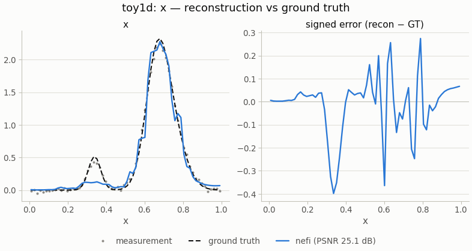

# `toy1d` — 1-D blurred-signal recovery

<!-- nf-summary:start -->
<div class="nf-summary" markdown>

| At a glance | |
|---|---|
| **Problem** | A non-negative 1-D signal from its Gaussian-blurred, noisy observation — the tutorial and CI instance |
| **Unknown** | x(t) ≥ 0 on [0, 1] (softplus head), 128 samples |
| **Physics** | FFT Gaussian blur with σ = 0.02 in physical units, rebuilt at every curriculum resolution |
| **Measurement** | 128 blurred samples + 1 % noise, simulated on a 4× finer grid in float64 and area-averaged |
| **Difficulty classes** | `bumps`, `spikes`, `mixed` |
| **Baselines** | `grid` |
| **Metrics** | PSNR · MSE · relative error |
| **Run** | `nefi run toy1d --smoke` · `nefi run configs/toy1d.yaml --plot` |



Gallery run (64 samples, 180 steps, 0.6 s on a CPU): PSNR 25.1 dB.

</div>
<!-- nf-summary:end -->

`toy1d` is the five-second instance: recover a non-negative 1-D signal `x(t)` on `[0, 1]` from its
Gaussian-blurred, noisy observation. It is small enough for continuous integration and the
tutorials, yet it exercises every core mechanism of nefi — a neural field with annealed Fourier
features, a softplus head, an FFT convolution rebuilt at every resolution, a two-stage multiscale
curriculum, TV / ℓ1 regularization and an inverse-crime-safe data generator.

```
bumps | spikes | mixed ─► Gaussian blur on a 4× finer grid (float64), area-averaged ─► y (128) + 1 % noise
coords ─► annealed Fourier PE ─► MLP ─► Softplus ─► x ─► FFTConvolution(σ = 0.02) ─► MSE + λ·TV (+ μ·ℓ1)
       ─► two-stage multiscale (64 → 128 samples) ─► PSNR / MSE / relative error
```

```python
import nefi
from nefi.instances.toy1d import make_problem

problem, gt, meas = make_problem(n=128, seed=0)      # (InverseProblem, ground truth, Measurement)
result = nefi.invert(problem, device="cpu", seed=0)
print(nefi.metrics.psnr(result.fields["x"], gt["x"]))
```

CLI: `nefi run toy1d [--scene spikes] [--plot]`, `nefi bench toy1d --methods neural,grid --n 4
--seeds 0,1,2`, `nefi diagnose toy1d`, `nefi autotune toy1d --smoke`. The full walk-through, with
the output of every command, is the [quickstart tutorial](../tutorials/01_quickstart.md).

## Configuration (`Toy1DConfig`)

| field | default | meaning |
|---|---|---|
| `n` | 128 | samples on `[0, 1]` |
| `sigma` | 0.02 | Gaussian blur standard deviation, in physical units |
| `noise_std` | 0.01 | noise relative to the clean signal's maximum |
| `scene` | `bumps` | `bumps` (smooth), `spikes` (sparse), `mixed` |
| `supersample` | 4 | the data generator's grid refinement (inverse-crime guard) |
| `hidden`, `depth`, `n_octaves` | 64, 4, 6 | neural field width, depth and Fourier bands |
| `steps` | (300, 600) | steps of the coarse and the fine stage |
| `tv`, `l1` | 1e-4, 0 | regularization weights |

`configs/toy1d.yaml` spells the configuration out and `configs/toy1d_smoke.yaml` is the CI-sized
version used by `--smoke` and the gallery.

## What it is used for

* **Tutorials** — [quickstart](../tutorials/01_quickstart.md), [diagnostics](../tutorials/05_diagnostics.md)
  and [benchmarking](../tutorials/06_benchmarking.md) all start here.
* **Tests** — the core solver, the CLI, batching, compilation and the auto-tuner are checked on it.
* **Performance** — the batched solver reaches 8.4× the per-problem throughput of sequential
  solving on a CPU at batch 64 ([Performance](../performance.md#throughput-batched-multi-measurement-solving)).
* **A cautionary benchmark** — on this smooth, well-conditioned linear problem, at the gallery's
  short budget, the free grid beats the neural field (32.9 ± 4.2 dB against 22.0 ± 5.5 dB,
  [Gallery · Performance](../gallery/performance.md#benchmark-in-one-command)); the
  representation prior pays off on harder operators ([Limitations and caveats](../guides/limitations.md#neural-field-versus-grid-on-linear-problems)).
