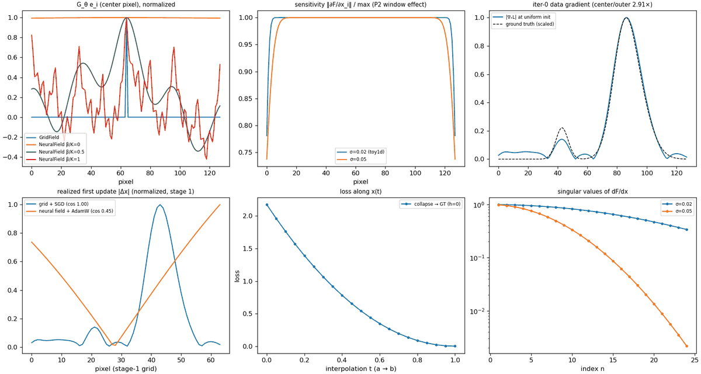

# 5 · Diagnostics: why a method works (or fails)

Papers about per-measurement inversion live or die by *explaining* their results: why free-pixel
solvers collapse to the center, why annealing helps, why a good data fit can hide a wrong field.
nefi turns those explanations into library functions. Every diagnostic takes an
`InverseProblem`, works for **any** field and operator through autograd (forward-mode JVPs with
double-backward and finite-difference fallbacks, so even custom adjoint operators work), and
returns plain tensors / dataclasses.

```python
from nefi import diagnostics as D
report = D.diagnose(problem, gt=gt)             # at initialization; add result=... after solving
print(report.to_markdown())                      # findings + paper reference numbers + readings
report.save("runs/diag")                         # diagnostics.md / .json / _tensors.pt
```

```bash
nefi diagnose toy1d            # the same from the CLI (--solve: diagnose at the solution, --plot)
python examples/diagnostics_demo.py              # the figure below
```



*toy1d (n = 128): filter-kernel rows of a grid vs a neural field at three annealing levels;
sensitivity for two blur widths; the iter-0 data gradient; realized first updates; the loss along
a straight path; singular-value decay for two blur widths.*

| diagnostic | measures | paper reference | nefi on toy1d / NV |
|---|---|---|---|
| `sensitivity_map` | `‖∂F/∂x_i‖` per pixel | NeTMY Eq. 23, (P2) | edge pixels 22–26 % less visible (toy) |
| `iter0_gradient` | `∇ₓL` at a uniform init + center/outer ratio | NeTMY §5.3: **18.29×**, peak at center | NV 64², F2: **14.3×** (peak r = 0.13); F1: 0.24× |
| `energy_barrier` | loss along `(1−t)x_a + t x_b` | NeTMY Fig. 4b: **h ≈ 1.12** at t = 0.20 (F2) | 0 for convex toy losses |
| `center_mass_ratio` | mass in a central disk | NeTMY Fig. 4c: 0.00 … 0.223 | uniform baseline 0.071 (2-D) |
| `filter_kernel_row` | row of `G_θ = J_θ J_θᵀ` | NeTMY Lemma 2, Eq. 32–39 | grid 1 px; neural 128 → 21 → 7 px (β/K = 0, ½, 1) |
| `realized_update` | `|Δx|` after 1 step vs `|∇ₓL|` | NeTMY App. E.5: **1.6× vs 18.29×** | grid+SGD: cos 1.000, damping 1.000 |
| `effective_bandwidth` | highest active Fourier band | NeTMY Eq. 37 | 0 → 2 → 16 cycles (toy, K = 6) |
| `singular_values` | top-k σ of `dF/dx` | NeFTY Prop. 2 (`σ_n ≲ n^(-1/3)`), NeTMY Lemma 1 | σ₂₄/σ₁ = 0.34 (σ = 0.02) vs 0.0022 (σ = 0.05) |
| `hessian_condition_number` | `κ(∇²L)` on a small ansatz | NeTMY Fig. 5: **κ_F2 = 931, κ_F1 = 301,139** | — |
| `data_fit_paradox` | data PSNR next to field metrics | NeFTY App. G.2: PINN **63 dB** surface at IoU 0.01 | toy: 38 dB data, 28 dB field, RMSE/σ ≈ 1.2 |

## Sensitivity: what does the instrument see?

```python
s = D.sensitivity_map(problem)                      # Hutchinson-style estimate, 32 probes
s_exact = D.sensitivity_map(problem, exact=True)    # one JVP per pixel (small grids)
D.center_to_outer_ratio(s)                          # mean |s| in a central disk / outer ring
```

The column norm `‖∂F/∂x_i‖ = sqrt((JᵀJ)_ii)` says how strongly pixel `i` influences the
measurement (NeTMY Eq. 23). Estimators: `method="output"` (default) averages `(Jᵀu)²` over
Rademacher probes `u` in measurement space — reverse-mode only, non-negative, with a relative error
≈ `sqrt(2/n_probes)` independent of the operator's blur width; `method="hutchinson"` averages
`v ⊙ JᵀJ v` (jvp then vjp) over field-space probes; `exact=True` computes every column.

Read it as:

* **window center bias (P2)** — on a finite window, the footprint of an edge pixel is truncated, so
  edge pixels are less visible and the raw data gradient points toward the center (panel 2: the
  wider the blur, the wider the low-sensitivity border);
* **depth decay** — in heat conduction the sensitivity of deep voxels is orders of magnitude below
  the surface (on the `thermal_tomography` smoke problem nefi measures a max/min ratio of ≈ 280),
  the pointwise counterpart of NeFTY App. B.4;
* **a trust mask** — report low-confidence where `s` is small (NeFTY's limitations section asks for
  exactly this); combine with seed ensembles (`nefi.solve.ensemble`).

Pass `fields=` to linearize at another point (e.g. the ground truth or a result) and `field=` to
differentiate with respect to another field.

## The iteration-0 gradient: what does a free-pixel solver do first?

```python
g = D.field_gradient(problem, fields=None, terms="data")   # raw ∇ₓL at any field values
sig = D.iter0_gradient(problem)                            # at a uniform initialization
sig.ratio, sig.peak_index, sig.peak_radius, sig.center_mass
```

A free-density solver (Tikhonov, ADMM, a `GridField`) executes `∇ₓL` verbatim. NeTMY §5.3 shows
that under the physically faithful operator F2 the very first gradient already peaks at the grid
center with a center/outer ratio of 18.29× — before any structure has formed — because the window
bias (P2) and the max-normalization peak coupling of the log-MSE (P3, Eq. 24) compound. nefi
reproduces the signature on the `nv_relaxometry` instance at the paper resolution (64², scene
`many/close`, seed 0):

| inversion operator | iter-0 center/outer ratio | peak location |
|---|---|---|
| F2 (tensor, physical) | **14.3×** | r = 0.13 (near the center) |
| F1 (scalar, coherent) | 0.24× | r = 1.35 (a corner) |

A large ratio with a central peak predicts **centered collapse** for free-pixel solvers; the
remedy is a parameterization that does not execute this gradient verbatim (below), restarts, or a
mean-normalized fidelity (`NormalizedMSE("mean")`, NeTMY's R_nm).

`center_mass_ratio(x, radius_fraction=0.15)` is the fraction of `Σ|x|` inside a central disk of
diameter 30 % of the side. Compare with `uniform_center_mass(shape)` (0.071 in 2-D, 0.30 in 1-D):
NeTMY reports 0.00 (NeTMY) < 0.064 < 0.081 < 0.153 < 0.223 (Tikhonov) after 200 iterations, and an
ADMM aggregate rising from 0.55 to 0.78 from F1 to F2.

## Energy barrier: can descent escape?

```python
eb = D.energy_barrier(problem, fields_a=collapsed, fields_b=gt, n=21)
eb.height, eb.t_max, eb.monotone, eb.loss          # NeTMY F2: h ≈ 1.12 at t = 0.20
```

The loss along the straight line from a state `a` (e.g. a centrally collapsed iterate of a grid
solver) to `b` (the ground truth). A positive `height = max_t L(t) − L(0)` means a gradient method
sitting at `a` must climb to move toward the truth along this path; NeTMY finds `h ≈ 1.12` under F2
and a monotone profile under F1. For a convex loss (linear operator + MSE + TV, panel 5) the height
is always 0. To reproduce Fig. 4b you need a *collapsed* iterate: run a free-pixel baseline
(`inst.baselines()["grid"]`) and check `center_mass_ratio` of its result first — at a 200-step
budget nefi's Tikhonov baseline on NV `many/close` reaches only 0.093 (uniform: 0.069), i.e. it has
not collapsed yet and shows no barrier; the barrier is a property of the collapse basin.

## The filtering view: `G_θ = J_θ J_θᵀ`

```python
row = D.filter_kernel_row(problem, pixel="center", progress=1.0)   # G_θ e_i, field-shaped
D.kernel_spread(row)                                               # main-lobe half-max width (px)
```

A gradient step on the parameters θ of a field `x = f_θ` changes the field by (NeTMY Lemma 2)

```text
Δx ≈ −η J_θ J_θᵀ ∇ₓL = −η G_θ ∇ₓL
```

so the realized update is the raw gradient **filtered** by the positive semidefinite kernel `G_θ`.
`filter_kernel_row` computes one row matrix-free — a VJP (`J_θᵀ e_i`, one backward pass) followed by
a JVP through the field module. For a `GridField` the row is a delta (`G_θ = I`, width 1 px):
the raw gradient, including the center bias, is executed verbatim. For a `NeuralField` it is a
smooth, spatially coupled kernel whose width shrinks as the annealing opens higher Fourier bands
(panel 1: 128 → 21 → 7 px at β/K = 0, ½, 1 on toy1d) — the low-pass behaviour of Eq. 38–39 at
small β, and the reason a sharp center spike in `∇ₓL` is not executed as a singular update.
`D.effective_bandwidth(field, progress)` reports the highest active band `B_β` (Eq. 37).

## Realized update vs raw gradient

```python
ru = D.realized_update(problem)                 # one real optimizer step on a copy of the field
ru.delta_ratio, ru.grad_ratio, ru.damping, ru.alignment
D.realized_update(grid_problem, optimizer="sgd")   # Lemma 2 setting: vanilla step
```

The field module is deep-copied and stepped once exactly as the solver would (stage resolution,
loss weights, learning rate and annealing progress at step 0, the curriculum's optimizer, gradient
clipping); the step is taken in float64 so the tiny update is not lost to rounding. `alignment` is
the cosine between `Δx` and `−∇ₓL`, `damping` the ratio of the center/outer ratios. Reference
points: NeTMY App. E.5 measures a realized ratio of 1.6× against 18.29× for the raw gradient
(≈ 11× damping). In nefi, a grid with SGD gives `alignment = 1.000, damping = 1.000` (verbatim, as
Lemma 2 predicts); the toy neural field gives `alignment = 0.45` and damping 15.9. The markdown
report also prints the paper-style damping (iter-0 data-gradient ratio ÷ realized ratio).

## Singular values: how ill-posed is it?

```python
sv = D.singular_values(problem, k=24, n_iter=60)                  # non-increasing, float64
sv, vecs = D.singular_values(problem, k=8, return_vectors=True)   # right singular vectors
```

Lanczos with full reorthogonalization on `JᵀJ`, each product a JVP then a VJP — matrix-free, so
it works for 3-D PDE operators. The decay of `σ_n` is the operator-theoretic statement of
ill-posedness: NeFTY Prop. 2 proves `σ_n ≲ n^(-1/3)` for the linearized heat map on a slab (and
Cor. 1: the pseudo-inverse amplifies noise along the n-th mode by `1/σ_n`); NeTMY Lemma 1 bounds the
dipolar kernel's spectrum by `e^(-k z0)`. Panel 6: tripling the blur width moves σ₂₄/σ₁ from 0.34 to
0.0022. The right singular vectors show which field patterns the measurement can see (the rest
must come from the prior). On toy1d the top singular value matches `max |FFT(kernel)|` = 1 to
0.2 %, and all top values match a dense SVD to 1e-3 (`tests/test_diagnostics.py`).

## Hessian conditioning on an ansatz

```python
def gaussian(p, r):                       # ρ(r; A, σ) = A exp(−‖r − c‖²/2σ²), p = (log10 A, σ)
    return 10 ** p[0] * torch.exp(-((r - 0.5) ** 2).sum(-1) / (2 * p[1] ** 2))

fn = D.ansatz_objective(problem, gaussian)          # loss as a function of 2 numbers
kappa = D.hessian_condition_number(fn, [0.0, 0.1])  # at a minimum of fn
evals, H = D.hessian_spectrum(fn, [0.0, 0.1])
```

NeTMY App. E.8 evaluates the log-MSE on the α-RuCl3 data with a Gaussian density ansatz and finds
`κ_F2 = 931` (a parabolic bowl) vs `κ_F1 = 301,139` (a degenerate valley along `A²σ² = const`,
because `Γ ∝ A²` under F1). Use it to compare operators or losses on a physically meaningful
low-dimensional slice. Evaluate at a minimum (an indefinite Hessian is flagged) and use float64
(`problem.to(dtype=torch.float64)`) for large κ.

## The data-fit paradox

```python
fit = D.data_fit_paradox(result, problem, gt)
fit["data_psnr"], fit["field_psnr"], fit["discrepancy_ratio"]
```

NeFTY App. G.2: the soft-constrained PINN fits the surface thermograms at ≈ 63 dB while its
volumetric IoU is 0.01 — a good data fit does not imply a correct field when the forward map is
strongly smoothing. Always report measurement-space fit *next to* field-space metrics.
`discrepancy_ratio = RMSE / σ` (when the noise level is known) should approach 1 (Morozov); well
below 1 means the solver fits noise — use `Curriculum(discrepancy_tau=1.0)` to stop there.

## Pathology → signature → diagnostic → remedy

| pathology | signature | diagnostic | remedies in nefi |
|---|---|---|---|
| (P1) frequency suppression | fast singular-value decay; fine detail unrecoverable | `singular_values`, `sensitivity_map` | annealed `FourierFeatures`, multiscale `Curriculum`, TV / Laplacian priors |
| (P2) window center bias | edge pixels less visible; centered raw gradient | `sensitivity_map`, `iter0_gradient` | neural field (`G_θ` smoothing), restarts, padding the domain |
| (P3) max-normalization coupling | peak self-reinforcement, energy barrier | `iter0_gradient`, `energy_barrier`, `center_mass_ratio` | `NormalizedMSE("mean")` companion, gated heads, annealing |
| (P4) merging / joint ambiguity | cross artifacts, arbitrary background parameters | `filter_kernel_row`, `singular_values` (right vectors) | `SupportMasked` heads, `Laplacian` / isotropic TV, [FAQ](../faq.md) |
| soft-constraint decoupling | high data PSNR, near-constant field | `data_fit_paradox` | hard physics (an `Operator`, never a residual penalty) |
| inverse crime | optimistic benchmarks | `bench.check_inverse_crime` | independent `DataGenerator` ([tutorial 3](03_new_forward_operator.md)) |

## Plots

`nefi.diagnostics.plots` (matplotlib optional, pyplot-free so it is safe on servers):
`plot_report(report)`, `plot_sensitivity`, `plot_filter_kernels`, `plot_energy_barrier`,
`plot_singular_values`, `plot_history`, `plot_result`, `show_field` (1-D line, 2-D image, 3-D mid
slice) and `save_figure(fig, path)`.

## Cost

| diagnostic | operator calls |
|---|---|
| `sensitivity_map` | 1 forward + `n_probes` VJPs (Hutchinson: + `n_probes` JVPs); exact: 1 JVP per pixel |
| `singular_values` | `n_iter` × (JVP + VJP) |
| `iter0_gradient`, `field_gradient` | 1 forward + 1 backward |
| `energy_barrier` | `n` forwards |
| `realized_update` | 2 forwards + 1 backward |
| `filter_kernel_row` | no operator call (field only) |

JVPs use forward-mode AD when the operator supports it; otherwise the double-backward trick; as
a last resort central finite differences (with a warning). `diagnose()` computes the sensitivity
exactly up to 1024 pixels and records every failure in `report.errors` instead of raising.
